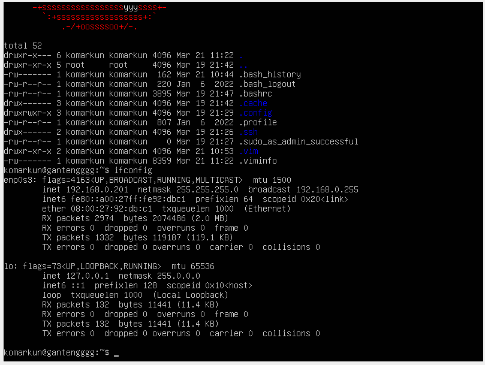
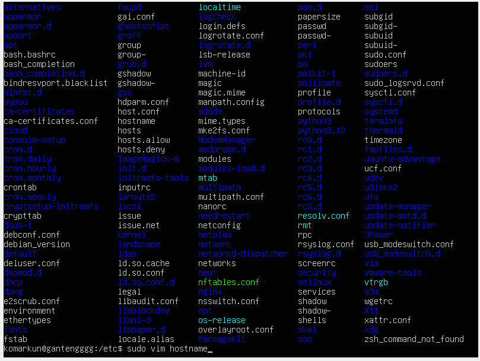
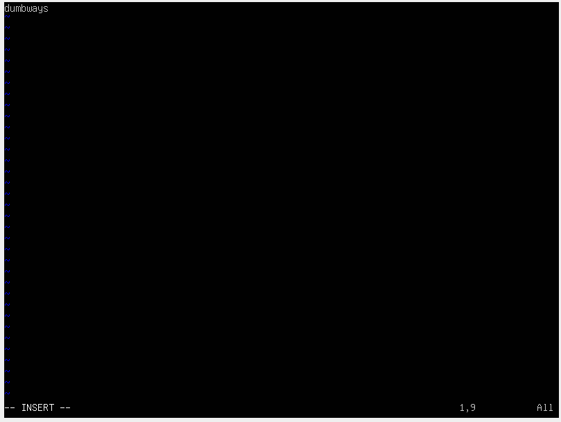
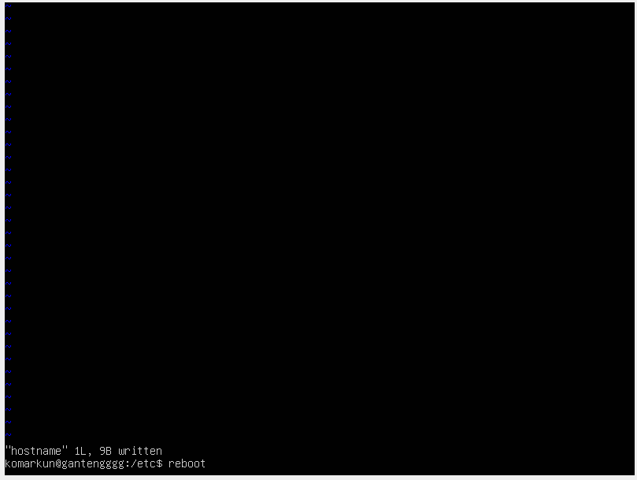
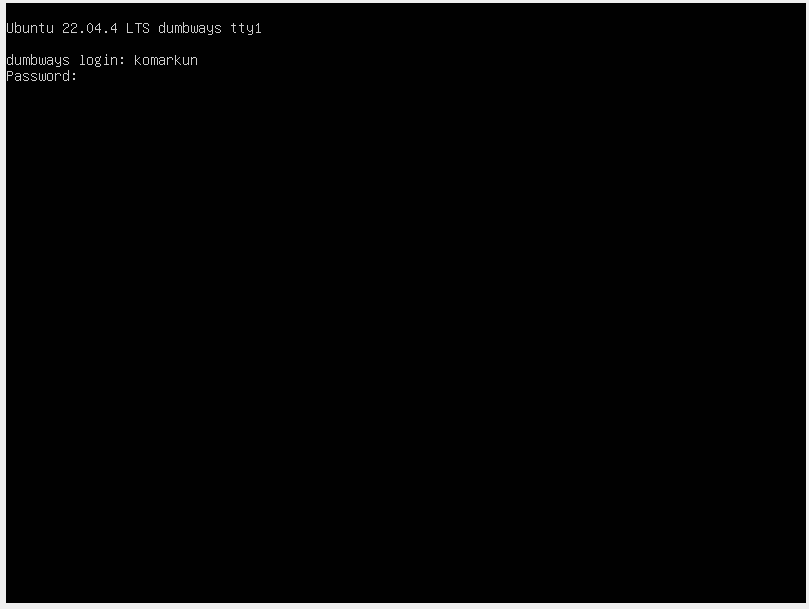
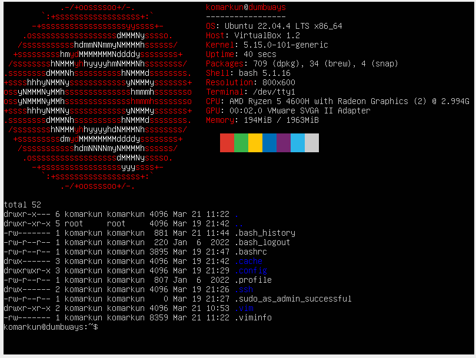
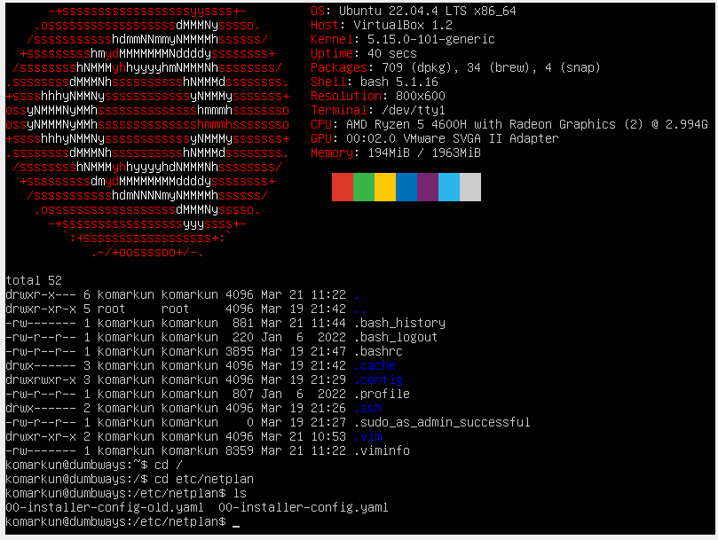
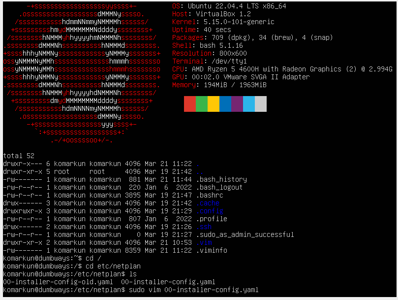
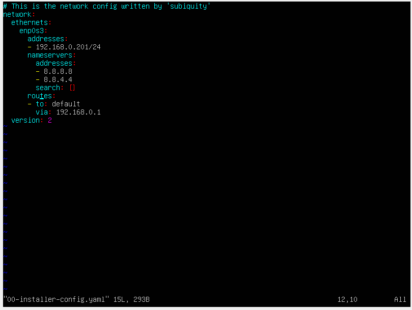
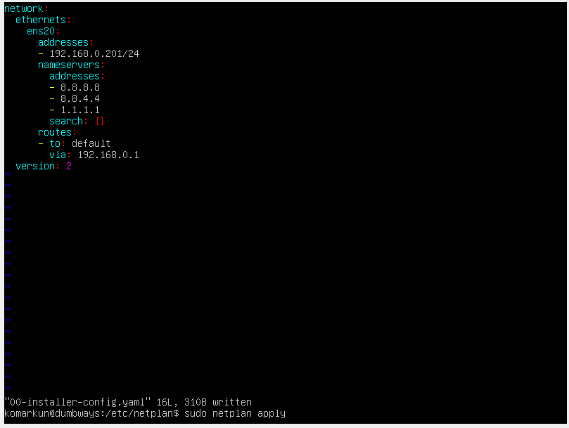

# Challenge

## 1. Rubah nama hostname menjadi "dumbways"

Step BY step

- Gunakan perintah cd /etc untuk pergi ke directory etc lalu ketik ls buat menampilkan
  
- Gunakan perintah sudo vim hostname untuk mengedit hostname
  
- Ganti nama hosname yg tadinya ganteng jadi dumways
  
- masukan perintah reboot di terminal agar perubahan jalan
  
- Login kembali dan disini hostname sudah berubah
  
- Selesay maybeee
  

## 2. Buat network adapter baru dengan nama ens20 dan gunakan IP yang sama

Step BY step

- gunakan perintah cd /etc/netplan lalu ls
  
- gunakan perintah cp untuk mengcoppy file lama atau bisa dengan membuat file baru dengan perintah touch
  
- edit configurasi .yaml menggunakan perintah sudo vim / nano dll
  
- ganti aja enp02s ke ens20 biar garibet lah atau buat file baru aja
  
- apply dengan perintah sudo netplan apply dan reboot
