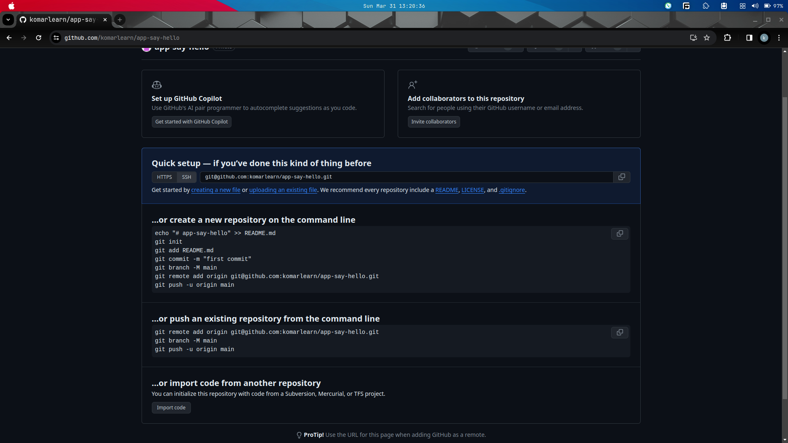
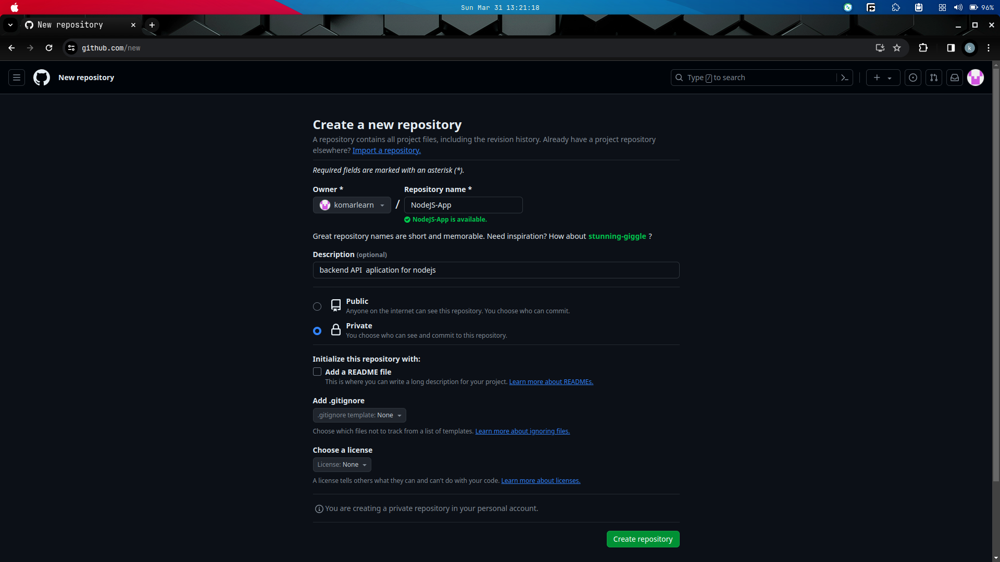
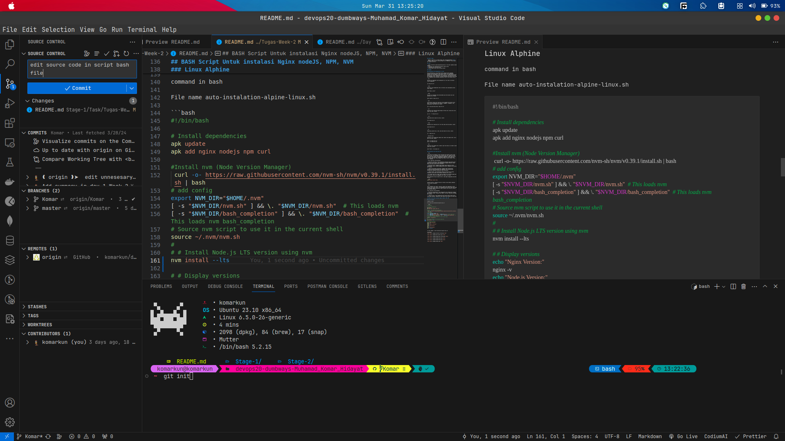
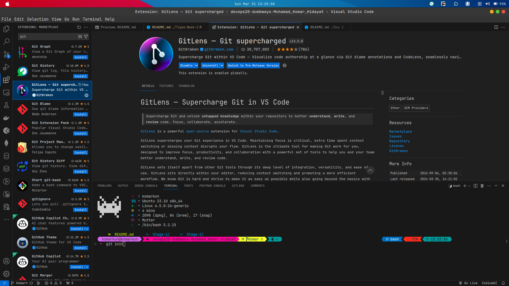

# Sumary Version Controll System

```
GIT is a tool of version Control System

GUTHUB is place for storing all the code to public ETC
```

## EXAMPLE REAL USE CASE

1. Setting up Git:

- Install Git on your local machine if not already installed:

```bash
sudo apt-get update
sudo apt-get upgrade
sudo apt-get install git   # For Debian/Ubuntu
```

- Configuring Git:

Set up your name and email address:

```bash
git config --global user.name "Your Name"
git config --global user.email "youremail@example.com"
```

- Creating a Git Repository:

Initialize a new Git repository in your project directory:

```bash
cd /path/to/your/project
git init
```

- Adding Files:

Add files to the staging area for versioning:

```bash
git add .
```

- Committing Changes:

Commit the staged changes to the repository:

```bash
git commit -m "Initial commit"
```

- Connecting to GitHub:

Create a new repository on GitHub.
Link your local repository to the remote GitHub repository:

```bash
git remote add origin https://github.com/yourusername/repository.git
```

- Pushing Changes:

Push your commits to the remote repository:

```bash
git push -u origin master
```

- Pulling Changes:
  Pull changes from the remote repository to your local machine:

```bash
git pull origin master
```

- Cloning a Repository:

Clone an existing repository from GitHub to your local machine:

```bash
git clone https://github.com/username/repository.git
```

- Branching:

Create a new branch for developing a feature or fixing a bug:

```bash
git checkout -b new_branch_name
```

- Merging:

Merge changes from one branch into another (e.g., merging a feature branch into the main branch):

```bash
git checkout main
git merge feature_branch
```

- Viewing History:
  View commit history:

```bash
git log
```

# GOD LEVEL








