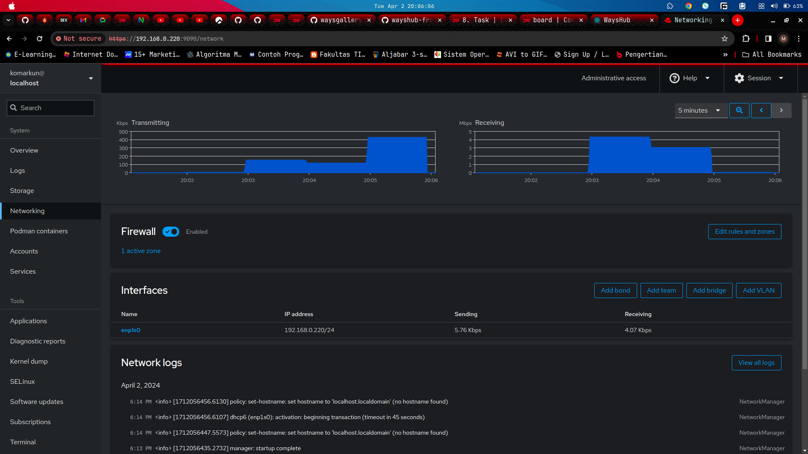
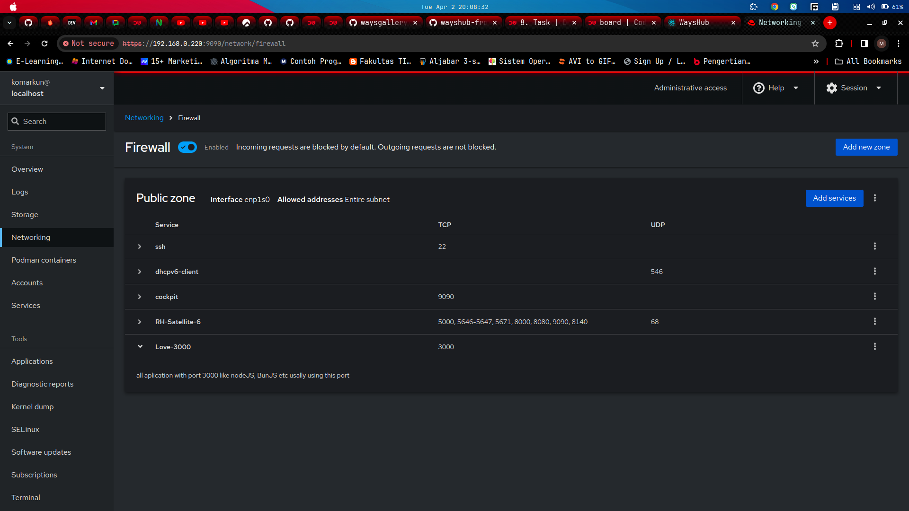
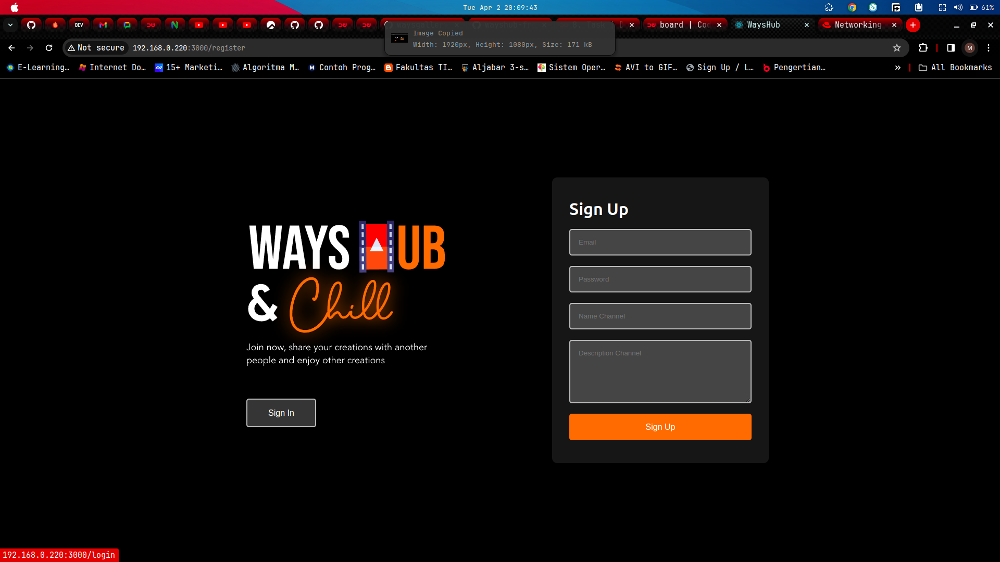
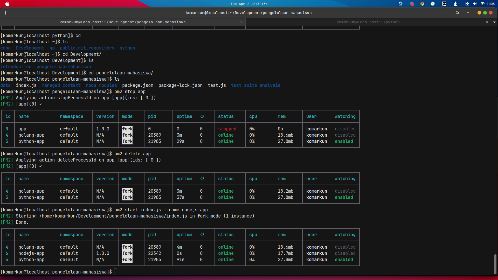
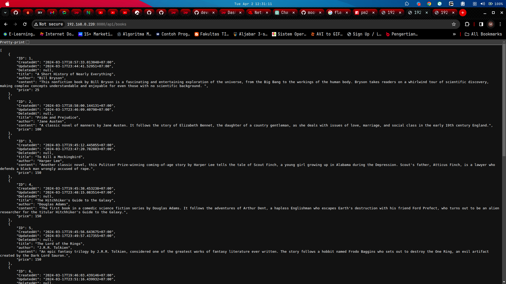

# Task :

1. Perbandingan antara Monolith & Microservices
2. Deploy Aplikasi wayshub-frontend (NodeJS)
3. Deploy Golang & Python dengan menampilkan nama masing-masing

Repository
`https://github.com/dumbwaysdev/wayshub-frontend`

Cara Run Aplikasi :
`npm run start`

# Jawaban

## 1. Perbandingan antara Monolith & Microservices

Monolit dan (Microservices) adalah dua pendekatan yang berbeda dalam merancang dan mengembangkan perangkat lunak. Berikut adalah perbandingan antara keduanya:

### Struktur dan Arsitektur:

- Monolit:

Biasanya aplikasi monolit terdiri dari satu kode sumber tunggal yang dikompilasi dan dijalankan bersama. Semua komponen aplikasi, seperti basis data, logika bisnis, dan antarmuka pengguna, terdapat dalam satu aplikasi tunggal.

- Microservices:

Microservices adalah arsitektur yang membagi aplikasi menjadi serangkaian layanan independen yang berdiri sendiri. Setiap layanan mikro memiliki tugas atau fungsi tertentu dalam aplikasi, dan mereka berkomunikasi melalui jaringan, biasanya menggunakan protokol HTTP atau pesan yang terkait.

### Skalabilitas:

- Monolit:

Skalabilitas aplikasi monolit dapat menjadi lebih rumit karena Anda perlu menambahkan lebih banyak instance dari seluruh aplikasi, yang mungkin tidak efisien.

- Microservices:

Dalam Microservices, Anda dapat melakukan skalabilitas secara independen untuk setiap layanan. Ini memungkinkan Anda untuk menambahkan atau menghapus instance layanan tertentu sesuai dengan kebutuhan, memberikan fleksibilitas dalam manajemen beban dan pengelolaan sumber daya.

### Pengembangan dan Pemeliharaan:

- Monolit:

Pengembangan pada aplikasi monolit bisa menjadi lebih rumit karena semua bagian aplikasi terkait satu sama lain. Perubahan pada satu bagian dapat mempengaruhi bagian lain, yang memerlukan koordinasi dan pengujian yang lebih ketat.

- Microservices:

Dengan Microservices, pengembangan dapat lebih terdesentralisasi dan terdistribusi. Tim dapat bekerja secara independen pada layanan yang berbeda, memungkinkan pengembangan yang lebih cepat dan pemeliharaan yang lebih sederhana.

### Ketergantungan Antara Layanan:

- Monolit:

Ketergantungan antara komponen dalam aplikasi monolit biasanya lebih tinggi karena semuanya dijalankan dalam satu proses.

- Microservices:

Dalam Microservices, setiap layanan biasanya memiliki ketergantungan yang lebih rendah karena mereka berdiri sendiri. Namun, ini juga bisa menjadi tantangan dalam manajemen ketergantungan antar layanan.

### Kesalahan dan Isolasi:

- Monolit:

Kesalahan dalam satu bagian aplikasi monolit dapat berdampak pada keseluruhan aplikasi.

- Microservices:

Dengan Microservices, kesalahan dalam satu layanan cenderung tidak mempengaruhi layanan lainnya karena mereka berjalan secara terpisah. Namun, memerlukan manajemen yang cermat terhadap kesalahan dan penanganan pemulihan.

### Kinerja dan Efisiensi:

- Monolit:

Dalam beberapa kasus, aplikasi monolit dapat menjadi lebih efisien dalam hal kinerja karena komunikasi antar komponen biasanya lebih cepat dalam proses tunggal.

- Microservices:

Karena setiap layanan berdiri sendiri, ada overhead tambahan dalam komunikasi antar layanan, yang dapat mempengaruhi kinerja secara keseluruhan. Namun, dengan skalabilitas yang tepat, ini bisa diatasi.

## 2. Deploy aplikasi WaysHub frontend only

### Step By Step

## clone repository from github pastinya

## 3. Deploy Golang and python

## pake pm2 mantapp djiwaa

