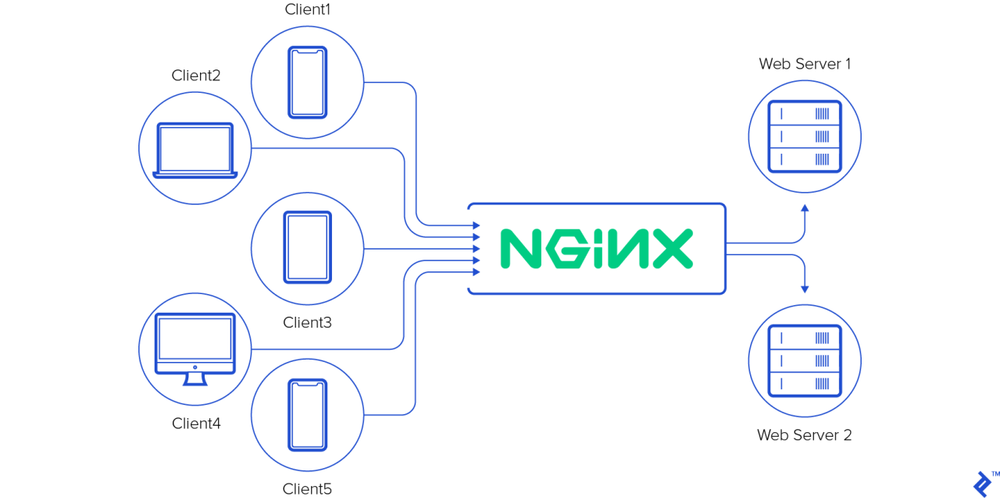

# Task :

1. Jelaskan apa itu Web server dan gambarkan bagaimana cara webserver bekerja.
2. Buatlah Reverse Proxy untuk aplilkasi yang sudah kalian deploy kemarin. (wayshub), untuk domain nya sesuaikan nama masing" ex: alvin.xyz .
3. Jelaskan apa itu load balance.
4. implementasikan loadbalancing kepada aplikasi wayshub yang telah kalian gunakan.

# Jawaban

## 1. Web server (NGINX)

web server adalah tools yang bertanggung jawab untuk mengelola permintaan HTTP dari klien, seperti web browser, dan memberikan respons yang sesuai, biasanya dalam bentuk halaman web, gambar, atau data lainnya. Web server menerima permintaan dari klien, memprosesnya, dan mengirimkan kembali halaman web yang diminta atau sumber daya lainnya.

Cara kerja umum dari sebuah web server:

Web server menerima permintaan HTTP dari klien melalui protokol TCP/IP.
Server menafsirkan permintaan tersebut dan menemukan sumber daya yang diminta.
Sumber daya tersebut kemudian dikirimkan kembali kepada klien sebagai respons HTTP.
Respons tersebut kemudian ditampilkan di web browser klien.

## 2. Reverse Proxy (NGINX)

Reverse proxy adalah sebuah server perantara yang menerima permintaan REQ dari klien dan mengarahkannya ke server yang sesuai dengan kebutuhan. reverse proxy menyembunyikan sumber daya di belakangnya dari klien. Ini umumnya digunakan untuk meningkatkan kinerja, keamanan, dan keterandalan sebuah situs web dengan mendistribusikan beban lalu lintas dan menyediakan beberapa lapisan keamanan.

Implementtasi deploy aplikasi wayshub di server nama domain ala ala komarkun.xxx

## 3. Load balancing

Load balancing adalah teknik distribusi lalu lintas di antara beberapa server backend untuk meningkatkan kinerja, meningkatkan ketersediaan, dan memastikan keandalan aplikasi. Tujuan utamanya adalah untuk mencegah satu server menjadi bottleneck dengan mendistribusikan beban kerja secara merata di antara beberapa server backend. Ini juga dapat membantu dalam menangani lonjakan lalu lintas dan memastikan ketersediaan layanan yang tinggi.

## 4. Implementasi load balancing
