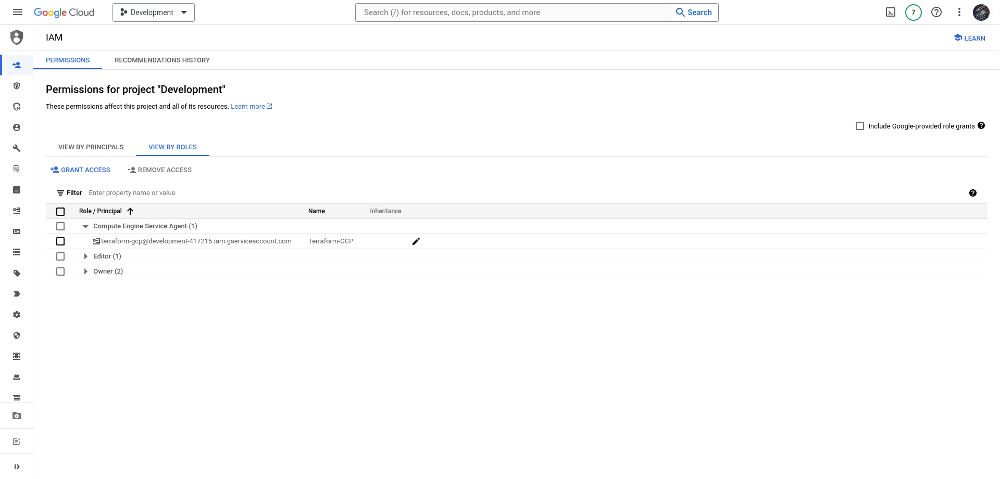
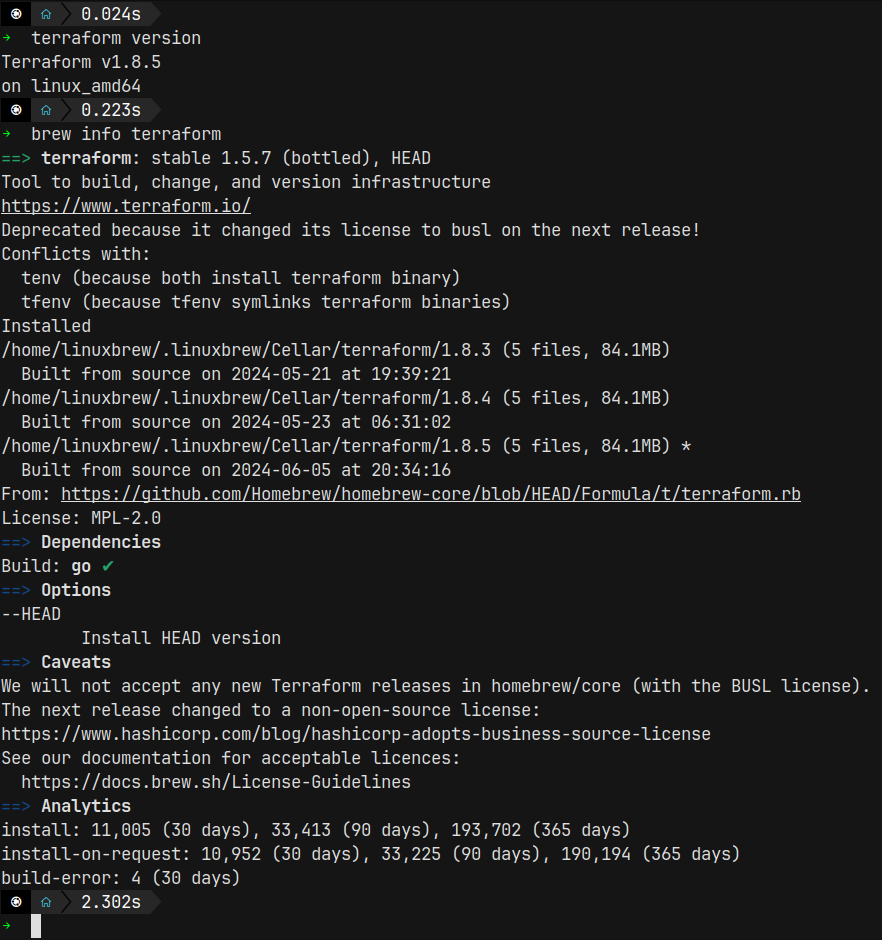
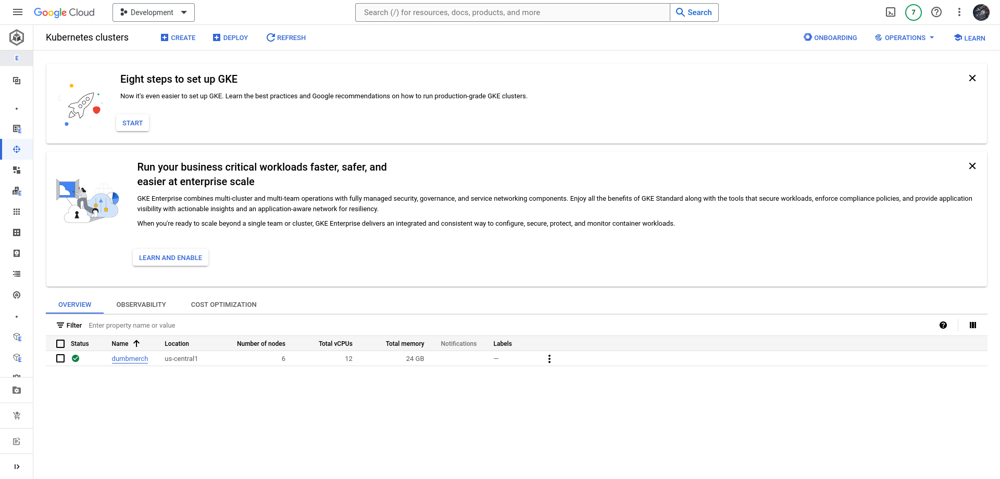
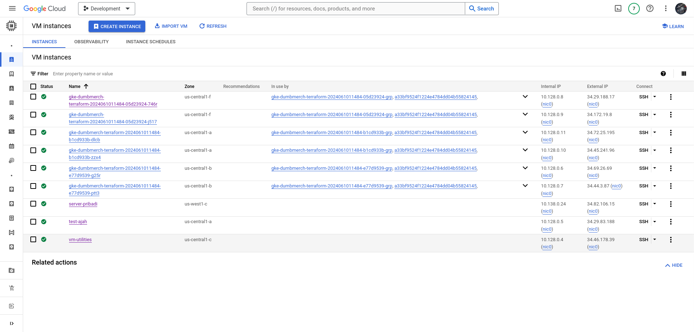
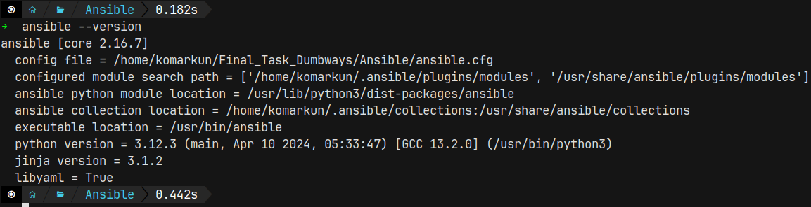
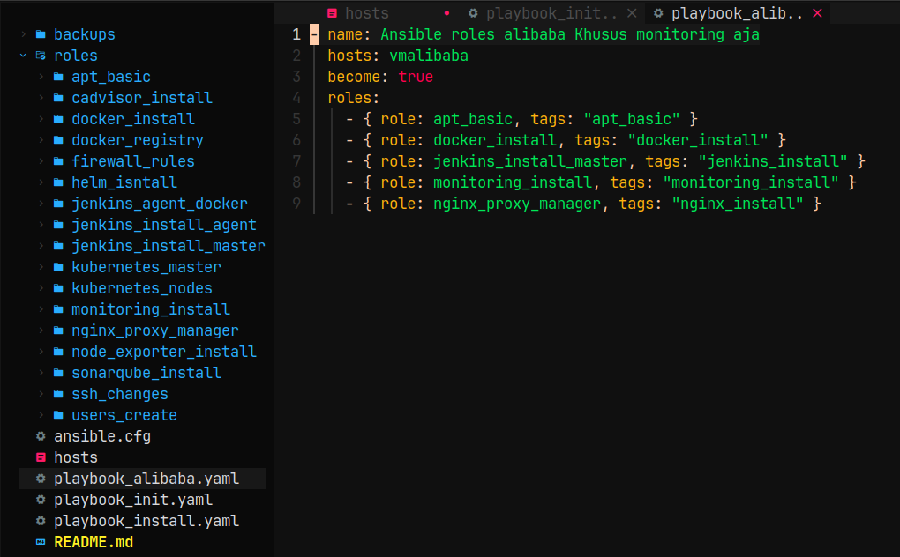
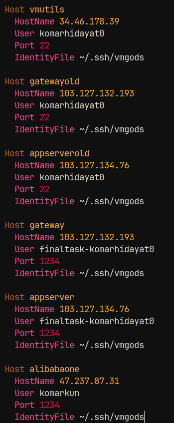
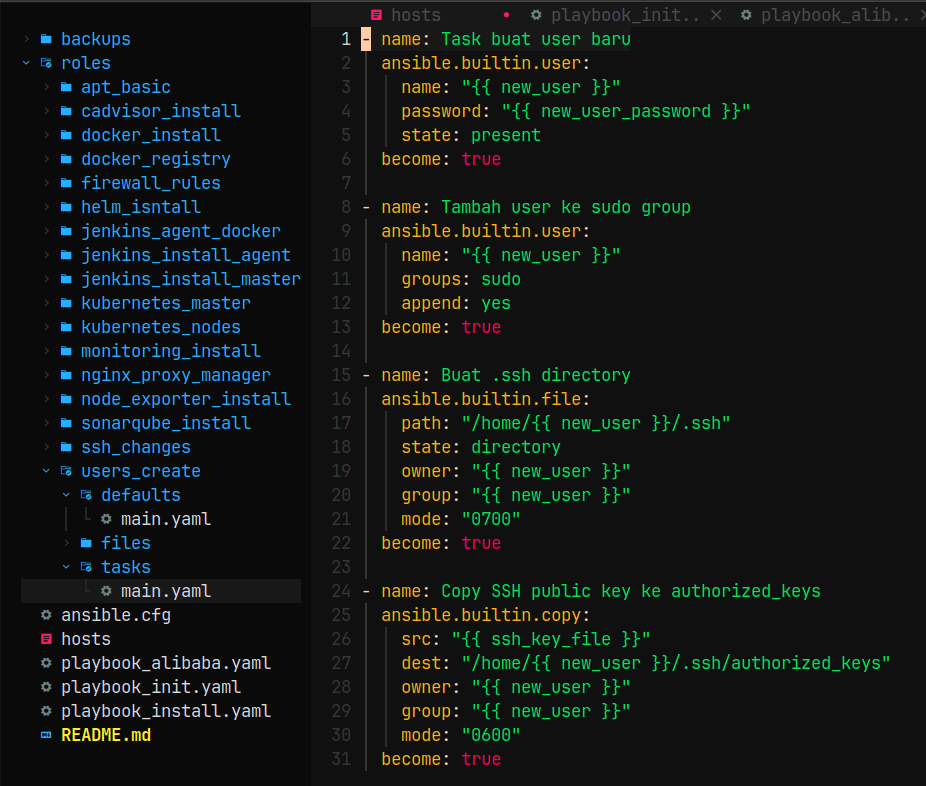
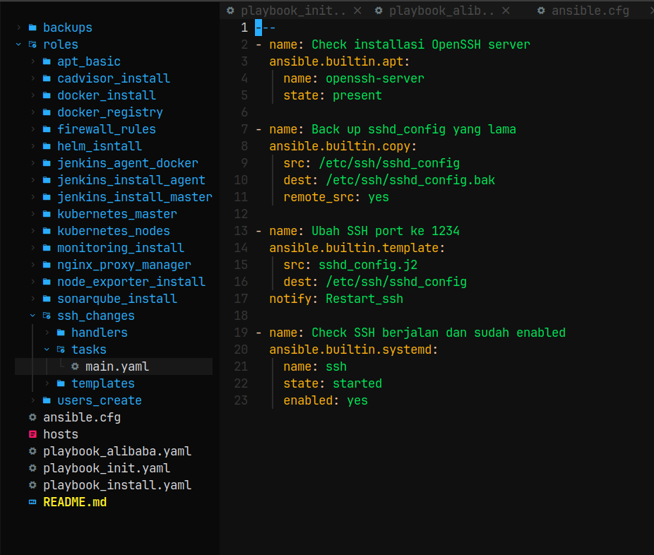
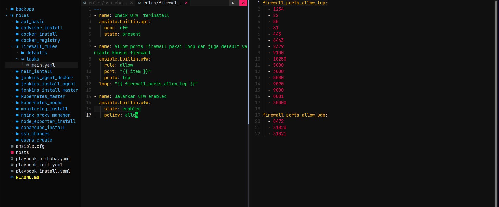

# Provisioning

**Requirements**

- Local machine w/ Ansible & Terraform
- Biznet GIO NEO Lite Servers
  - Appserver - 2 CPU, 2GB RAM
  - Gateway - 1 CPU, 1GB RAM

**Instructions**

- Attach SSH keys & IP configuration to all VMs
- Server Configuration using Ansible:

[ *All Servers* ]

- Docker Engine
- Node Exporter

[ *Appserver* ]

- git repo (dumbmerch)
- Prometheus & Grafana

[ *Gateway* ]

- NGINX/Apache2/Lightspeed
- Reverse Proxy
- Wildcard SSL Certificate

# Terraform

## Terraform for Google Kubernetes Engine In Google cloud

1. Buat akun google dan pastikan sudah punya billing yang aktif untuk membuat virtual machine secara GUI langsung di google nya dan wajib punya saldo minimal trial $300 USD


2. Buat service account di menu AM & admin di goocgle cloud dan download credential nya yaitu berupa file dengan extensi JSON yang berisikan data untuk kita bisa menggunakan semua service di google cloud nya.



3. Pastikan terraform sudah terinstall di local machine kita.



4. Buat directory structure untuk terraform nya


provider.tf

```tf
provider "google" {
  credentials = file(var.gcp_svc_key)
  project = var.gcp_project
  region = var.gcp_region
}
```

network.tf

```tf
resource "google_compute_network" "network_dumbmerch" {
  name = "network-dumbmerch"
}

resource "google_compute_firewall" "allow_http" {
  name    = "allow-http"
  network = google_compute_network.network_dumbmerch.name

  allow {
    protocol = "tcp"
    ports    = ["80"]
  }

  source_ranges = ["0.0.0.0/0"]
}

resource "google_compute_firewall" "allow_https" {
  name    = "allow-https"
  network = google_compute_network.network_dumbmerch.name

  allow {
    protocol = "tcp"
    ports    = ["443"]
  }

  source_ranges = ["0.0.0.0/0"]
}

```

variable.tf

```tf
variable "gcp_svc_key" {}

variable "gcp_project" {
  description = "Project_id google cloud"
  type        = string
}

variable "gcp_region" {
  description = "The region cluster"
  type        = string
  default     = "us-central1"
}

variable "cluster_name" {
  description = "Name Kubernetes cluster"
  type        = string
  default     = "dumbmerch"
}

variable "node_count" {
  description = "Jumlah nodes di the cluster"
  type        = number
  default     = 2
}

variable "node_machine_type" {
  description = "Machine type nodes"
  type        = string
  default     = "e2-medium"
}
```

main.tf

```tf
resource "google_container_cluster" "my-cluster" {
  name     = var.cluster_name
  location = var.gcp_region

  remove_default_node_pool = true
  initial_node_count       = 1
  deletion_protection = false

  network = google_compute_network.network_dumbmerch.name
}

resource "google_container_node_pool" "primary_nodes" {
  cluster    = google_container_cluster.my-cluster.name
  location   = var.gcp_region
  node_count = var.node_count

  node_config {
    machine_type = var.node_machine_type
    disk_size_gb = 25

    oauth_scopes = [
      "https://www.googleapis.com/auth/cloud-platform",
    ]
  }
}
```

Janalankan perinatah terraform nya

```
 $ terraform init
 $ terraform validate
 $ terrafrom plan
 $ terraform apply
```




# Ansible

## Server Configuration for ansible

1. Install ansible terlebih dahulu dan saya disini pakai homebrew sama seperti terraform jadi tinggal lihat dokumentasi homebrew.



2. buat directory structure ansible



3. SSH host di semua server



roles ansible create user



roles ansible Ubah SSH port dari 22 ke 1234



roles ansible create firewall rules


