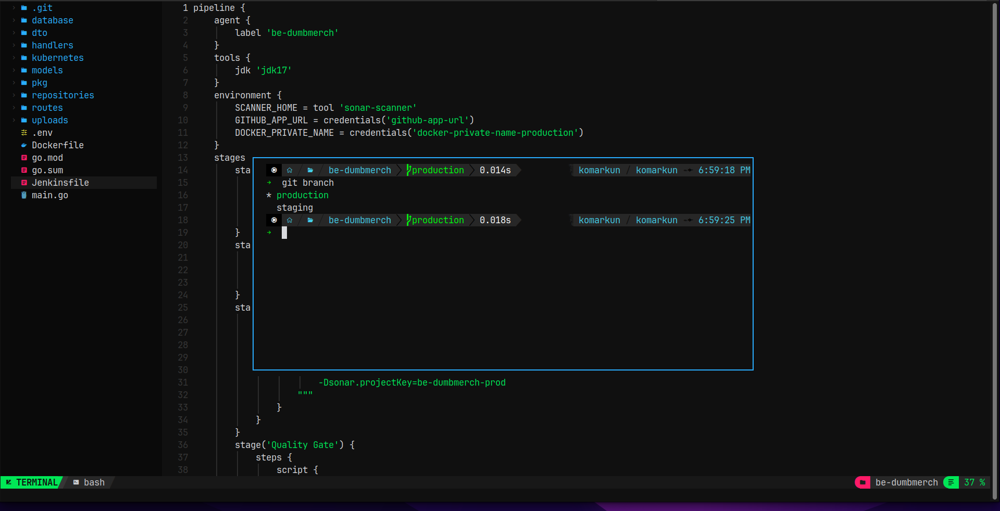
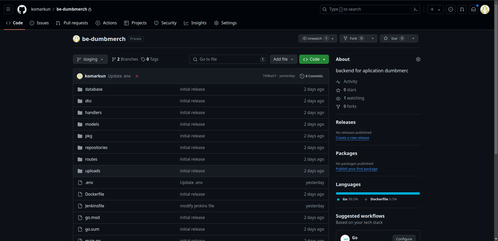
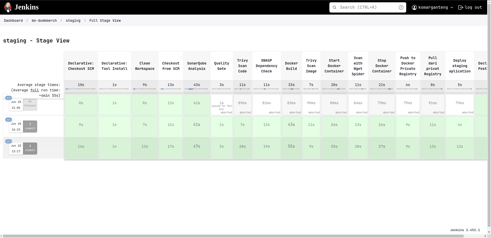
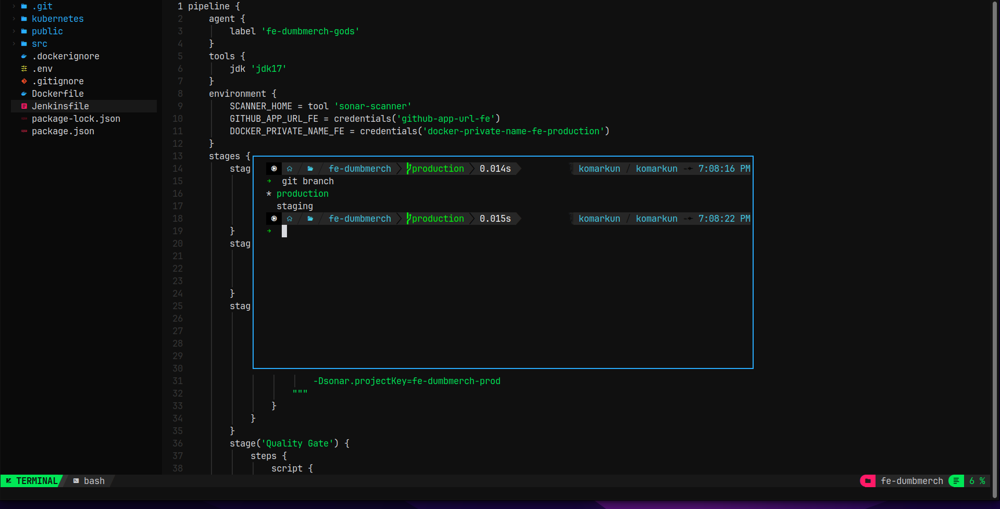
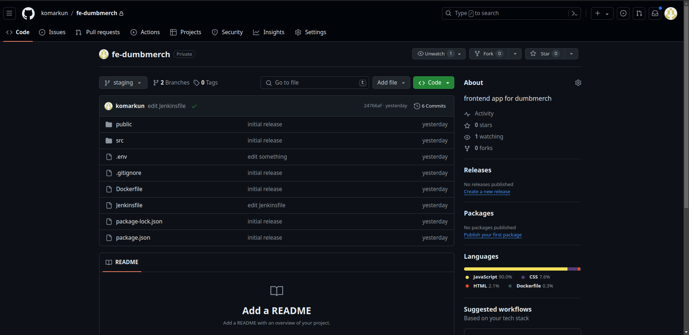
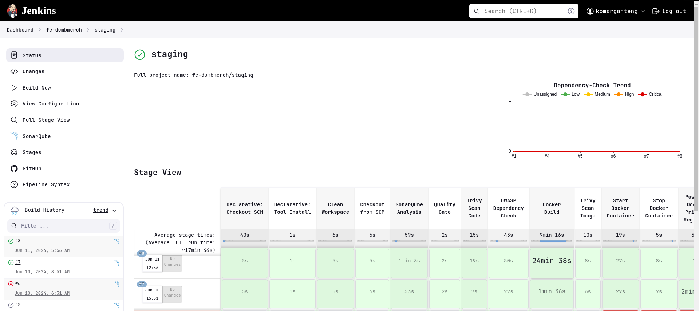

# Repository

**Requirements**

- Personal Github/GitLab accounts (must be private)
- Frontend : [fe-dumbmerch](https://github.com/demo-dumbways/fe-dumbmerch)

  - NodeJS v16.x or above
  - Create .env file for FE+BE Integration (REACT_APP_BASEURL) https://api.ade.studentdumbways.my.id/api/v1

- Backend : [be-dumbmerch](https://github.com/demo-dumbways/be-dumbmerch)
  - Golang v1.16.x or above
  - Modify .env file for DB Integration

**Instructions**

- Create a repository on Github or Gitlab
- **Private** repository access
- Set up 2 branches
  - Staging
  - Production
- Each Branch have their own CI/CD

# Backend

Brach (Staging & Production)

Github Private

CICD multibranch (Jenkins)

# Frontend

Branch (Staging & Production)

Github Private

CICD multibranch (Jenkins)

