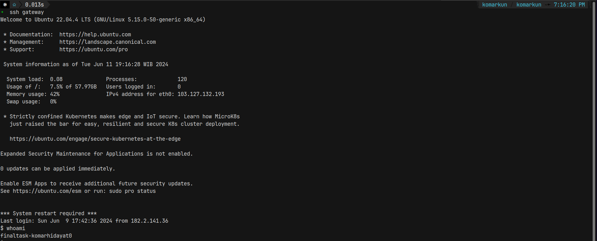
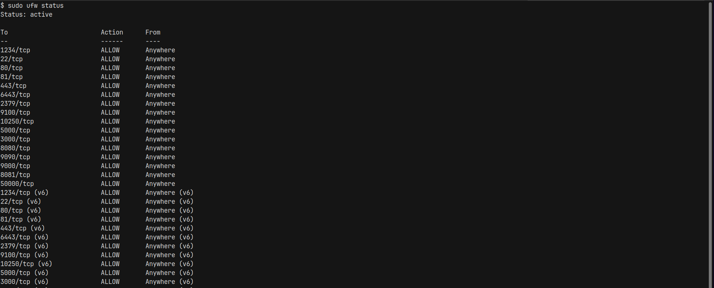
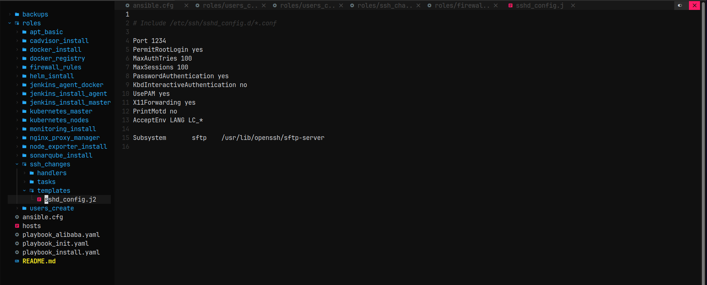

# Server

**Requirements**

- 1 SSH keys max.
- SSH Config.
- Ubuntu 22.04 lts

**Instructions**

- Create new user `finaltask-$USER`
- Server login with SSH key and Password
- Create a working **SSH config** to log into servers
- Only use **1 SSH keys** for all purpose (Repository, CI/CD etc.)
- UFW enabled with only used ports allowed
- Change ssh port from (22) to (1234)

# New User 'finaltask-komar'

jalankan ansible playbook roles spesifik untuk create user

periksa user yg sudah dibuat dengan perintah whoami

## server login dengan ssh key dan password

saat menjalankan ansible-playbook crate user sudah include di dalamnya untuk membuat ssh login dengan password dan juga dengan ssh keys.

## 1 SSh keys untuk semua

nama ssh private keys yang digunakan cukup satu saja untuk login ke semua vm

## UFW enable

jalankan ansible playbook untuk mengenable firewall dan mengatur hanya beberapa saja yang aktif

cek kembali di vm nya

## Change Port 22 ke 1234

jalankan ansible playbook untuk membuat ssh port yang default nya 22 ke 1234

