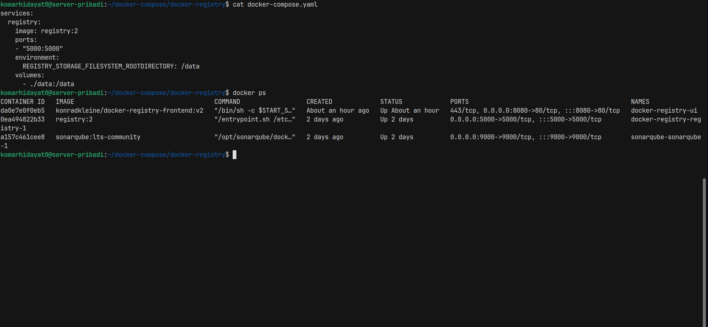
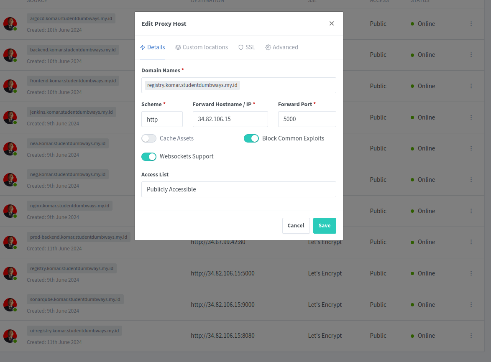
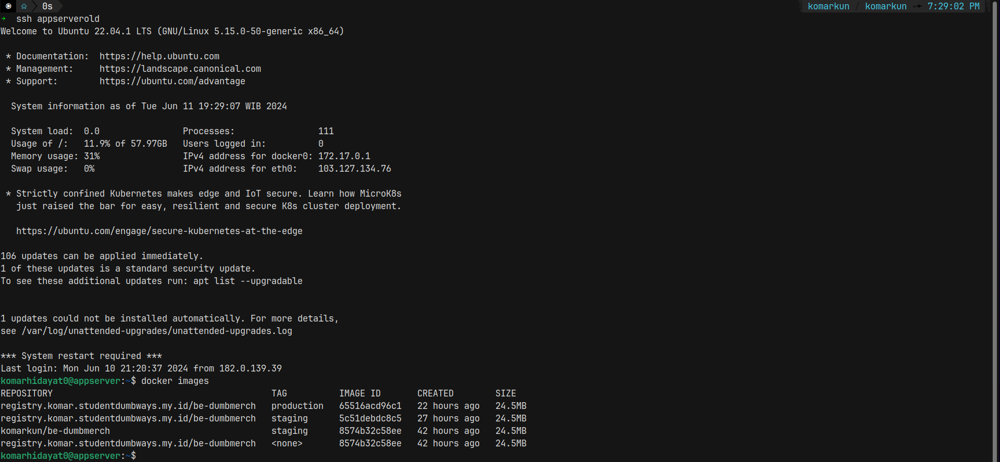

# Docker Private Registry

**Requirements**

- Docker Registry Private

## Install docker registry nya dulu dan pastikan berjalan di port 5000



## Buat nginx reserve proxy



## Tinggal beri nama sesuai registry dan push

```
docker tag registry.komar.studentdumbways.my.id

docker push registry.komar.studentdumbways.my.id
```


