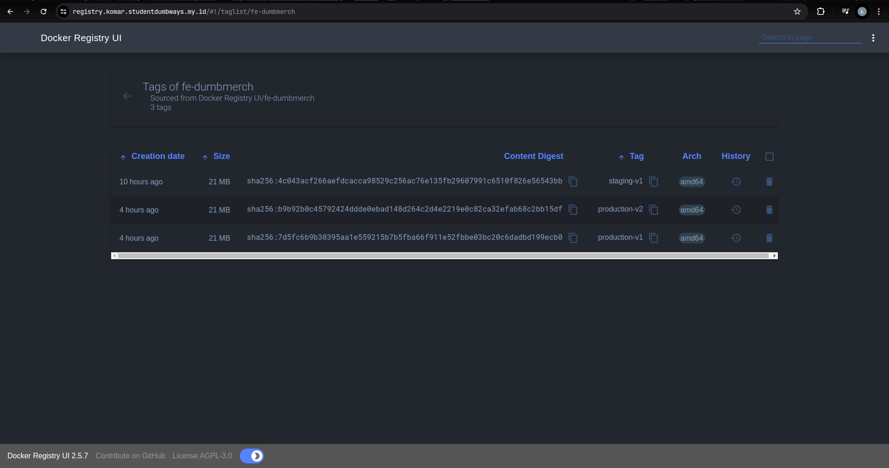

# Docker Private Registry

**Requirements**

- Docker Registry Private

## Buat Configurasi Docker Compose

Tree

```
.
└── docker_registry/
    ├── auth/
    │   └── Dockerfile
    └── docker-compose.yaml
```

Configurasi Dockerfile berisi custom command untuk menjalankan installasi dan melakukan perintah htpasswd untuk mengeneratekan password

```Dockerfile
FROM registry:2

RUN apk add --no-cache apache2-utils

RUN mkdir /auth

RUN htpasswd -bnB user pass > /auth/htpasswd

```

Configurasi docker-compose.yaml dibawah ini sudah termasuk docker Private Registry dan docker registry UI

```yaml
services:
  registry:
    build: ./auth/
    container_name: registry_docker
    restart: always
    ports:
      - "5000:5000"
    volumes:
      - ./data:/var/lib/registry
    environment:
      REGISTRY_AUTH: htpasswd
      REGISTRY_AUTH_HTPASSWD_REALM: basic-realm
      REGISTRY_AUTH_HTPASSWD_PATH: /auth/htpasswd
      REGISTRY_HTTP_HEADERS_Access-Control-Allow-Origin: "[https://registry.komar.studentdumbways.my.id]"
      REGISTRY_HTTP_HEADERS_Access-Control-Allow-Methods: "[HEAD,GET,OPTIONS,DELETE]"
      REGISTRY_HTTP_HEADERS_Access-Control-Allow-Credentials: "[true]"
      REGISTRY_HTTP_HEADERS_Access-Control-Allow-Headers: "[Authorization,Accept,Cache-Control]"
      REGISTRY_HTTP_HEADERS_Access-Control-Expose-Headers: "[Docker-Content-Digest]"
      REGISTRY_STORAGE_DELETE_ENABLED: "true"

  registry-ui:
    image: joxit/docker-registry-ui
    container_name: registry_ui
    ports:
      - "8080:80"
    environment:
      - REGISTRY_TITLE=Docker Registry KomarGanteng
      - NGINX_PROXY_PASS_URL=http://registry:5000
      - DELETE_IMAGES=true
      - SHOW_CONTENT_DIGEST=true
      - SHOW_CATALOG_NB_TAGS=true
      - CATALOG_MIN_BRANCHES=1
      - CATALOG_MAX_BRANCHES=1
      - TAGLIST_PAGE_SIZE=100
      - REGISTRY_SECURED=false
      - CATALOG_ELEMENTS_LIMIT=1000
    depends_on:
      - registry
```


## Buat nginx reserve proxy


setelah web server di aktifkan kita bisa cek di browser dengan memasukan username dan password yang sudah dibuat.


Untuk melakukan perintah docker seperti pada umumnya kita wajib memberikan nama secara lengkap atau kita bisa memberikan docker tag agar kita bisa menjalankan perintah docker nya.
Contoh:

```
# Penamaan yang sesuai
# registry_url/nameapp:tags
# registry.komar.studentdumbways.my.id/bedumbmerch:v1

# contoh docker tag supaya nama sesuai
docker tag alpine:latest registry.komar.studentdumbways.my.id/alpine:latest

# Untuk bisa push image ke registry wajib login ke private registrynya
docker login registry.komar.studentdumbways.my.id -u user -p pass

# contoh push docker ke private registry
docker push registry.komar.studentdumbways.my.id/alpine:latest

# contoh pull docker dari private registry
docker pull registry.komar.studentdumbways.my.id/alpine:latest

```



