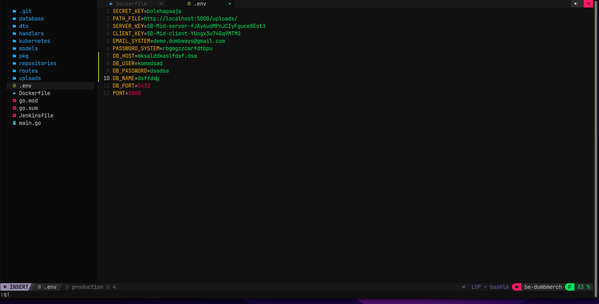

# Deployment

**Requirements**

- Deployments on top Docker
- Frontend : [fe-dumbmerch](https://github.com/demo-dumbways/fe-dumbmerch)
- Backend : [be-dumbmerch](https://github.com/demo-dumbways/be-dumbmerch)

**Instructions**

[ *Database* ]

- App database using _PostgreSQL_
- Deploy postgresql on top docker
- Set the volume location in `/home/$USER/`
- Allow database to remote from another server

[ *Application* ]

- Create a Docker image for frontend & backend
- Staging: A lightweight docker image (as small as possible)
- Production: Deploy a production ready app
- Building Docker image on every environment using docker multistage build
- Create load balancing for frontend and backend

## Database Setup menggunakan Elephant Postgres SQL untuk Staging

set up databasenya dan taruh di .env nya untuk golang

