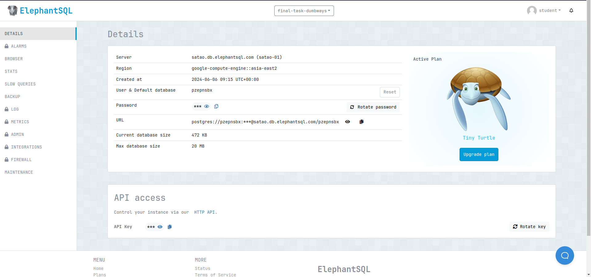
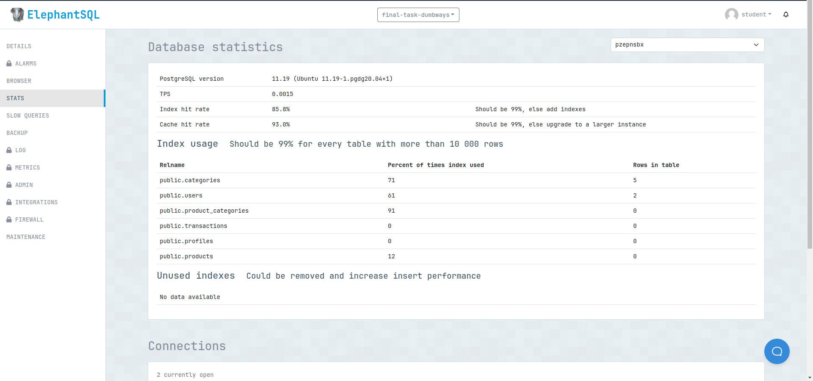
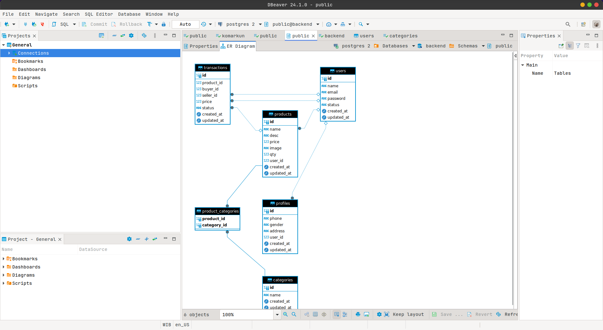
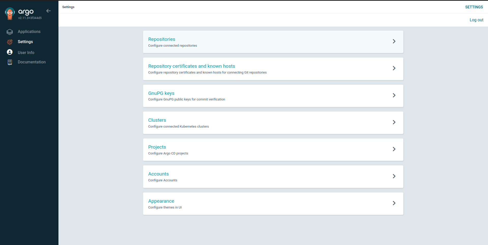
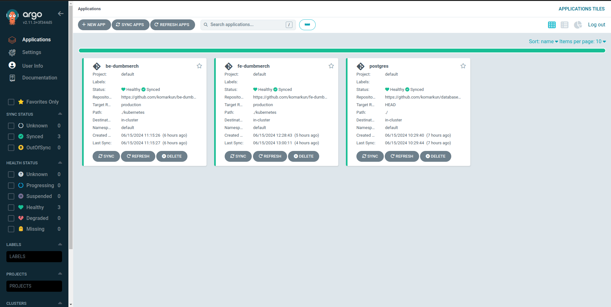
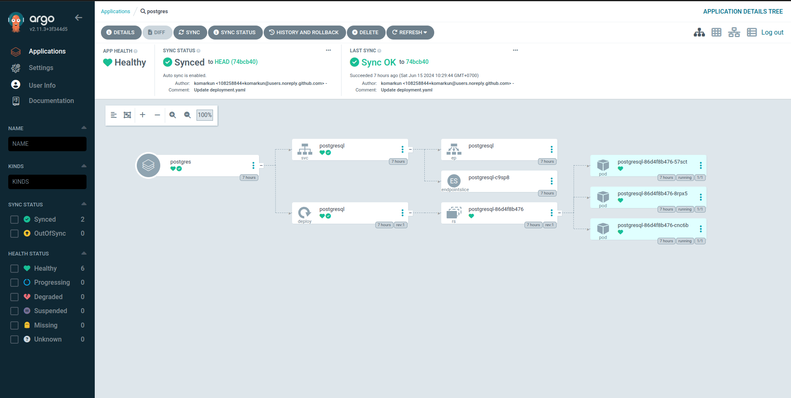
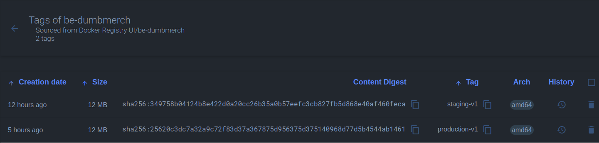
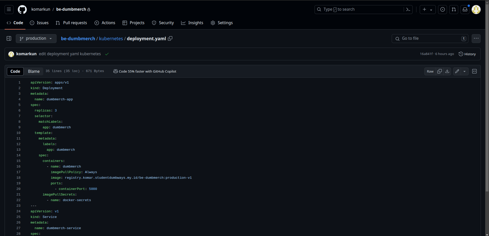
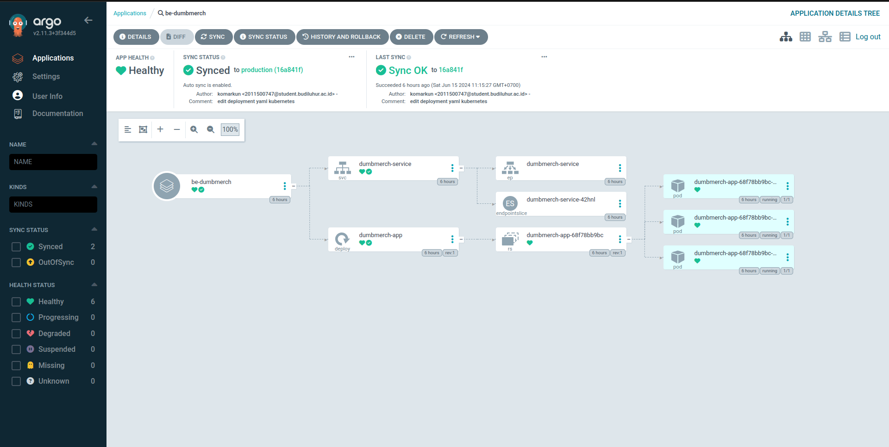

# Deployment

**Requirements**

- Deployments on top Docker
- Frontend : [fe-dumbmerch](https://github.com/demo-dumbways/fe-dumbmerch)
- Backend : [be-dumbmerch](https://github.com/demo-dumbways/be-dumbmerch)

**Instructions**

[ *Database* ]

- App database using _PostgreSQL_
- Deploy postgresql on top docker
- Set the volume location in `/home/$USER/`
- Allow database to remote from another server

[ *Application* ]

- Create a Docker image for frontend & backend
- Staging: A lightweight docker image (as small as possible)
- Production: Deploy a production ready app
- Building Docker image on every environment using docker multistage build
- Create load balancing for frontend and backend

## Database Setup menggunakan Elephant Postgres SQL untuk Local dan eazy Test

tinggal taruh data yang ada di .env aplikasi backend



## Database Setup menggunakan Docker Compose untuk Staging

Tree

```
.
└── postgresql/
    ├── .env
    ├── docker-compose.yaml
    └── init-db.sh
```

docker-compose.yaml

```yaml
services:
  postgres:
    image: postgres:15-alpine
    container_name: postgres
    env_file:
      - .env
    volumes:
      - db_data:/var/lib/postgresql/data
      - ./init-db.sh:/docker-entrypoint-initdb.d/init-db.sh
    ports:
      - "5432:5432"
volumes:
  db_data:
```

init-db.sh

```sh
#!/bin/bash
set -e

psql -v ON_ERROR_STOP=1 --username "$POSTGRES_USER" <<-EOSQL
    CREATE DATABASE $POSTGRES_DB1;
    CREATE DATABASE $POSTGRES_DB2;
EOSQL

```

.env

```
POSTGRES_USER=komarganteng
POSTGRES_PASSWORD=komargantengbanget
POSTGRES_DB1=dumbmerch
POSTGRES_DB2=sonarqube
```



## Database Setup menggunakan ArgoCD (Kubernetes) untuk Production

Wajib banget buat namespace dan kind Secret untuk credential di jalankan diawal

secret-postgres.yaml

```yaml
---
apiVersion: v1
kind: Namespace
metadata:
  name: database

---
apiVersion: v1
kind: Secret
metadata:
  name: postgres-secret
  namespace: database
type: Opaque
data:
  postgres_db: cG9fdszdfdsfdsdyZXM=
  postgres_user: cG9zdGdsfdyZXfdsM=
  postgres_password: a29tfdsYXgfdJnYW50ZW5n
```

Buat github repository Privat terpisah supaya aman saja. dan masukan deployment.yaml ke repo agar nanti bisa di jalankan pakai argoCD

deployment.yaml

```yaml
apiVersion: v1
kind: PersistentVolumeClaim
metadata:
  name: postgres-pvc
  namespace: database
spec:
  accessModes:
    - ReadWriteOnce
  resources:
    requests:
      storage: 10Gi

---
apiVersion: apps/v1
kind: Deployment
metadata:
  name: postgres
  namespace: database
spec:
  selector:
    matchLabels:
      app: postgres
  strategy:
    type: Recreate
  template:
    metadata:
      labels:
        app: postgres
    spec:
      containers:
        - image: postgres:15-alpine3.20
          name: postgres
          env:
            - name: POSTGRES_DB
              valueFrom:
                secretKeyRef:
                  name: postgres-secret
                  key: postgres_db
            - name: POSTGRES_USER
              valueFrom:
                secretKeyRef:
                  name: postgres-secret
                  key: postgres_user
            - name: POSTGRES_PASSWORD
              valueFrom:
                secretKeyRef:
                  name: postgres-secret
                  key: postgres_password
          ports:
            - containerPort: 5432
          volumeMounts:
            - name: postgres-storage
              mountPath: /var/lib/postgresql/data
      volumes:
        - name: postgres-storage
          persistentVolumeClaim:
            claimName: postgres-pvc
---
apiVersion: v1
kind: Service
metadata:
  name: postgres
  namespace: database
spec:
  type: LoadBalancer
  ports:
    - port: 5432
      targetPort: 5432
  selector:
    app: postgres
```

Setelah semua requirement ada kita bisa deploy aplikasi tersebut lewat argocd UI daftarkan repositorynya di menu setting sesuai yang dibutuhkan



lalu masuk ke menu aplication dan tambahkan aplikasinya





## Deploy backend

buat terlebih dahulu dockerfile nya karena aplikasi berjalan di atas docker

```Dockerfile
FROM golang:1.18-alpine AS build

WORKDIR /app

COPY go.mod go.sum ./

RUN go mod tidy

COPY . .

RUN CGO_ENABLED=0 GOOS=linux go build -o backend .

FROM alpine:3.18

WORKDIR /app

COPY --from=build /app/backend .

COPY .env .env

RUN apk --no-cache add ca-certificates tzdata

EXPOSE 5000

ENTRYPOINT ["/app/backend"]

```

kita bisa build dulu dan di jalankan di server atau local supaya bisa kita cek berjalan atau tidak aplikasinya.

```bash
docker build -t registry.komar.studentdumbways.my.id/be-dumbmerch:staging
```

size image hanya 12 MB an saja tidak sampai 15 MB



untuk menjalankan aplikasi bisa banyak cara.

```bash
# cara langsung
docker run -d -p 5000:5000 --name be-dumbmerch registry.komar.studentdumbways.my.id/be-dumbmerch:staging

# cara docker compose
docker compose up -d

```

contoh docker-compose.yaml

```yaml
version: "3.8"

services:
  be-dumbmerch:
    image: registry.komar.studentdumbways.my.id/be-dumbmerch:staging
    container_name: be-dumbmerch
    ports:
      - "5000:5000"
    restart: unless-stopped
```

kita bisa mendeploy aplikasi tersebut di kubernetes cluster tentunya dengan mensetup argocd dan menginstallnya terlebih dahulu lalu buat github repository untuk mendeploy aplikasi tersebut.




lalu masuk ke menu aplication dan tambahkan aplikasinya



