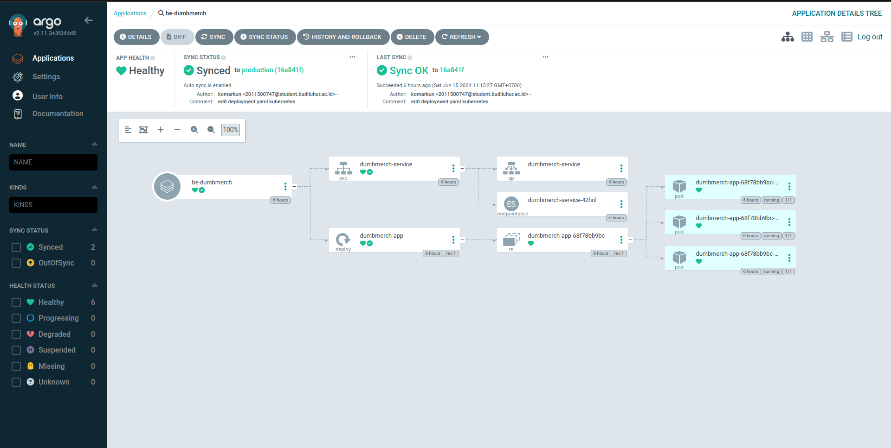

# CICD JENKINS AND ARGOCD

**Requirements**

- CI/CD with Jenkins

**Instructions**

[ *CI/CD* ]

- Using Jenkins, create a pipeline running:
  - Repository pull
  - Image build
  - Testing
  - Push Image into your own docker registry private
  - SSH into your biznet server
  - Pull image from docker registry private
  - Redeploy your deployment apps

# Staging Environment

CICD di tahap staging ini saya menggunakan Jenkins sebagai tools nya, ada 1 server yang bertindak sebagai Jenkins Master untuk mengatur semua CICD pipeline dan configuration, dan ada 2 server yang bertindak sebagai Jenkins Agent yang bertugas mengengeksekusi pipeline, 1 agent untuk BE-Dumbmerch dan 1 lagi untuk FE-Dumbmerch. Tahapan jenkin pipeline untuk staging semua proses dari pull code from scm (Github) sampai proses deployment akan di di lakukan di masing-masing agent node.

## Setup GitHUb Repository Private

- Backend


- Frontend


## Jenkins Pipeline (Multibranch Pipeline)

Buat Multi branch pipeline untuk CICD dari github branch staging dan juga production


Jenkinsfile

```groovy
pipeline {
    agent {
        label 'agent0'
    }
    tools {
        jdk 'jdk17'
    }
    environment {
        SCANNER_HOME = tool 'sonar-scanner'
        GITHUB_APP_URL = credentials('github-ulr-be')
        DOCKER_PRIVATE_URL = credentials('docker-url')
    }
    stages {
        stage('Initialize Variables') {
            steps {
                script {
                    namebuild = 'be-dumbmerch'
                    tag = 'staging-v1'
                }
            }
        }
        stage('Clean Workspace') {
            steps {
                cleanWs()
                sh 'pwd'
            }
        }
        stage('Checkout from SCM') {
            steps {
                git branch: 'staging', credentialsId: 'github', url: "${GITHUB_APP_URL}"
            }
        }
        stage('SonarQube Analysis') {
            steps {
                withSonarQubeEnv('sonar-server') {
                    sh """
                    ${SCANNER_HOME}/bin/sonar-scanner \
                        -Dsonar.projectName=be-dumbmerch-staging \
                        -Dsonar.projectKey=be-dumbmerch-staging
                    """
                }
            }
        }

        stage('Trivy Scan Code') {
            steps {
                sh 'trivy fs .'
            }
        }
        stage('OWASP Dependency Check') {
            steps {
                dependencyCheck additionalArguments: '--scan ./ --disableYarnAudit --disableNodeAudit', odcInstallation: 'DP-Check'
                dependencyCheckPublisher pattern: '**/dependency-check-report.xml'
            }
        }
        stage('Docker Build') {
            steps {
                script {
                    sh "docker build -t ${DOCKER_PRIVATE_URL}/${namebuild}:${tag} ."
                }
            }
        }
        stage('Trivy Scan Image') {
            steps {
                script {
                    sh "trivy image ${DOCKER_PRIVATE_URL}/${namebuild}:${tag}"
                }
            }
        }
        stage('Test Start Docker Container') {
            steps {
                script {
                    sh "docker run -d -p 5005:5000 --name test-be-dumbmerch ${DOCKER_PRIVATE_URL}/${namebuild}:${tag}"
                    sleep 30
                }
            }
        }
        stage('Scan with Wget Spider') {
            steps {
                script {
                    sh """
                    if wget --spider -q --server-response http://127.0.0.1:5005/ 2>&1 | grep '404 Not Found'; then
                        echo "Wget spider success"
                    else
                        echo "Webserver is not responding with expected 404, stopping the process."
                        exit 1
                    fi
                    """
                }
            }
        }
        stage('Stop Docker Container') {
            steps {
                script {
                    sh 'docker stop test-be-dumbmerch'
                    sh 'docker rm test-be-dumbmerch'
                    sh 'docker stop be-dumbmerch'
                    sh 'docker rm be-dumbmerch'
                }
            }
        }
        stage('Login to Private Registry') {
            steps {
                script {
                    withCredentials([usernamePassword(credentialsId: "docker-auth", passwordVariable: 'DOCKER_PASSWORD', usernameVariable: 'DOCKER_USERNAME')]) {
                        sh "echo $DOCKER_PASSWORD | docker login ${DOCKER_PRIVATE_URL} -u $DOCKER_USERNAME --password-stdin"
                    }
                }
            }
        }
        stage('Push to Docker Private Registry') {
            steps {
                script {
                    sh "docker push ${DOCKER_PRIVATE_URL}/${namebuild}:${tag}"
                }
            }
        }
        stage('Deploy staging application') {
            steps {
                script {
                    sh "docker run -d -p 5000:5000 --name be-dumbmerch ${DOCKER_PRIVATE_URL}/${namebuild}:${tag}"
                }
            }
        }
    }
    post {
        always {
            cleanWs()
        }
    }
}

```

- Manage jenkins credential


- Sonar Qube Scanner


- Trivy code Security


# Production Environment (Kubernetes with Argocd)

Jenkins di bagian production environment hanya bertindak sambai CI saja atau hanya Contonous Intregration, testing dan push image ke private registry sedangkan untuk Continous Delivery disini saya memakai argo cd untuk production Environment. argocd sudah harus di install terlebih dahulu di cluster kubernetes


Jenkinsfile Production

```groovy
pipeline {
    agent {
        label 'agent0'
    }
    tools {
        jdk 'jdk17'
    }
    environment {
        SCANNER_HOME = tool 'sonar-scanner'
        GITHUB_APP_URL = credentials('github-ulr-be')
        DOCKER_PRIVATE_URL = credentials('docker-url')
    }
    stages {
        stage('Initialize Variables') {
            steps {
                script {
                    namebuild = 'be-dumbmerch'
                    tag = 'production-v1'
                }
            }
        }
        stage('Clean Workspace') {
            steps {
                cleanWs()
                sh 'pwd'
            }
        }
        stage('Checkout from SCM') {
            steps {
                git branch: 'production', credentialsId: 'github', url: "${GITHUB_APP_URL}"
            }
        }
        stage('SonarQube Analysis') {
            steps {
                withSonarQubeEnv('sonar-server') {
                    sh """
                    ${SCANNER_HOME}/bin/sonar-scanner \
                        -Dsonar.projectName=be-dumbmerch-production \
                        -Dsonar.projectKey=be-dumbmerch-production
                    """
                }
            }
        }

        stage('Trivy Scan Code') {
            steps {
                sh 'trivy fs .'
            }
        }
        stage('OWASP Dependency Check') {
            steps {
                dependencyCheck additionalArguments: '--scan ./ --disableYarnAudit --disableNodeAudit', odcInstallation: 'DP-Check'
                dependencyCheckPublisher pattern: '**/dependency-check-report.xml'
            }
        }
        stage('Docker Build') {
            steps {
                script {
                    sh "docker build -t ${DOCKER_PRIVATE_URL}/${namebuild}:${tag} ."
                }
            }
        }
        stage('Trivy Scan Image') {
            steps {
                script {
                    sh "trivy image ${DOCKER_PRIVATE_URL}/${namebuild}:${tag}"
                }
            }
        }
        stage('Login to Private Registry') {
            steps {
                script {
                    withCredentials([usernamePassword(credentialsId: "docker-auth", passwordVariable: 'DOCKER_PASSWORD', usernameVariable: 'DOCKER_USERNAME')]) {
                        sh "echo $DOCKER_PASSWORD | docker login ${DOCKER_PRIVATE_URL} -u $DOCKER_USERNAME --password-stdin"
                    }
                }
            }
        }
        stage('Push to Docker Private Registry') {
            steps {
                script {
                    sh "docker push ${DOCKER_PRIVATE_URL}/${namebuild}:${tag}"
                }
            }
        }
    }
    post {
        always {
            cleanWs()
        }
    }
}

```

setelah semua CI selesai dan sudah beres kita tinggal siapkan saja deployment.yaml yang akan di push ke git hub sesuai dengan aplikasi yang kita inginkan lalu kita deploy nantinya pakai argocd.


tambahkan repo link github ke argocd supaya bisa dikenali


tinggal deploy saja lewat web ui argocd untuk aplikasi kita





## Alerting ke telegram

buat bot nya di telegram (BotFather)

dan dapatkan api token nya serta chart id nya juga buat kirim message dari bot


tambah kan ke pipe line di paling bawah untuk deklaratif post

```groovy

# tambahkan di paling bawah Jenkins pipeline untuk mendapat push notif
    post {
        always {
            cleanWs()
        }
        success {
          sh 'curl -X POST -H "Content-Type: application/json" -d \'{"chat_id": "14353467284", "text": "[😎SUCCESS😎] dumbmerch api build success😍😍😍!", "disable_notification": false}\' "https://api.telegram.org/bot7327449276:AAGCTA_VMyk-NR04h56565F9nHm8w/sendMessage"'
        }
        failure {
          sh 'curl -X POST -H "Content-Type: application/json" -d \'{"chat_id": "15435437284", "text": "[💀FAILED💀] dumbmerch api build failed😭😭😭!", "disable_notification": false}\' "https://api.telegram.org/bot732744943565776VMyk-NR04hQcdMbi0gnzhF9nHm8w/sendMessage"'
        }
    }

```

cek notifikasinya di telegram


