# Monitoring

**Requirements**

- Deployments on top Docker

**Instructions**

- Create Basic Auth into your Prometheus
- Monitor resources for _Appserver & Gateway & Registry server_
- Create a fully working dashboard in Grafana
  - Disk
  - Memory Usage
  - CPU Usage
  - VM Network
  - Monitoring all of container resources on VM
- Grafana Alert/Prometheus Alertmanager for:
  - Send Notification to Telegram
  - CPU Usage
  - RAM Usage
  - Free Storage
  - Network I/O (NGINX Monitoring)

# Setup Aplikasi monitoring (grafana, prometheus, node_exporte, cAdvisor) di Kubernetes pakai helm chart

## Requirement

- Wajib sudah terinstall helm dan tambahkan repo prometheus

```bash
helm repo add prometheus-community https://prometheus-community.github.io/helm-charts
helm repo update
```

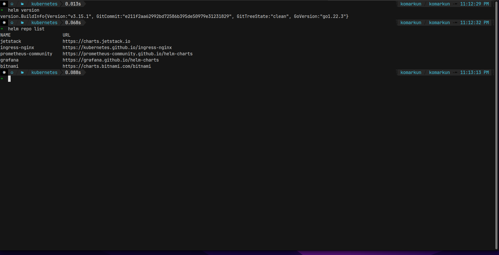

- Install Prometheus

untuk installasi bisa memakai repository dari kube-pormetheus-stack karena sangat komplit dan semua tools monitoring sudah include termasuk grafana, cadvisor, prometheus dll. install stack aplikasi di namespace monitoring

```bash
helm install kube-prometheus-stack prometheus-community/kube-prometheus-stack --namespace monitoring --create-namespace

```

kita juga bisa melakukan customisasi jika kita sudah expert menggunakan kubernetes, caranya:

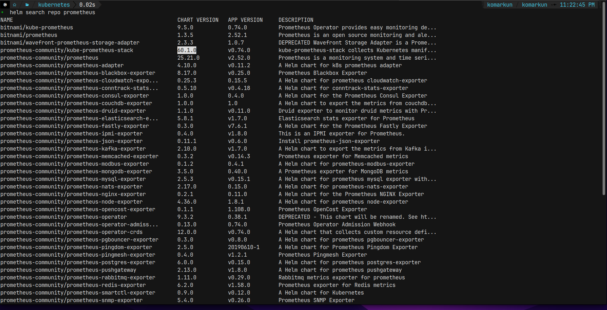

```bash
# pull file tar promethe
helm pull prometheus-community/kube-prometheus-stack

# extract file tersebut
tar xvf prometheus-60.1.0.tgz

# Edit Valuse.yaml sesuai kebutuhan
```

periksa installasi monitoring di kubernetes nya.

```bash
kubectl get -n monitoring all
```

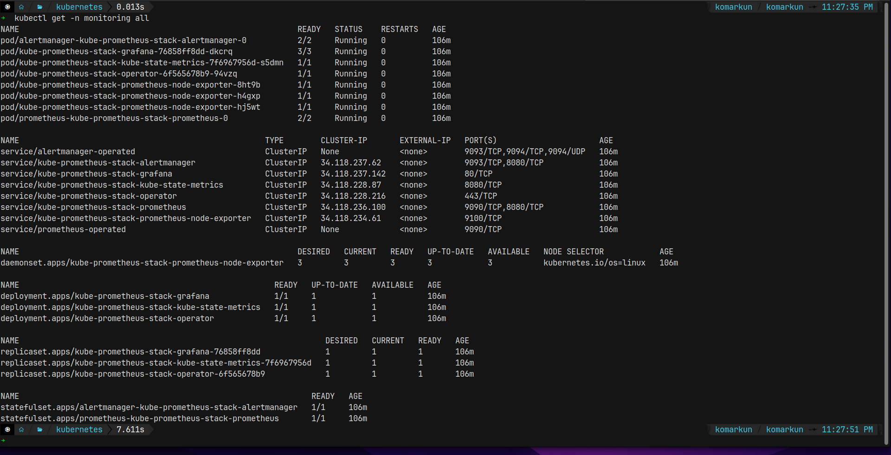

setelah selesai di install kita bisa buat ingress supaya aplikasinya bisa di akses keluar dan kita juga bisa punya https dan juga domain yang sudah terverivikasi ssl certificate nya pakai certmanager. dan cukup service grafana saja yang dibuatkan ssl nya karena masih dalam 1 cluster jadi semua bisa terhubung.

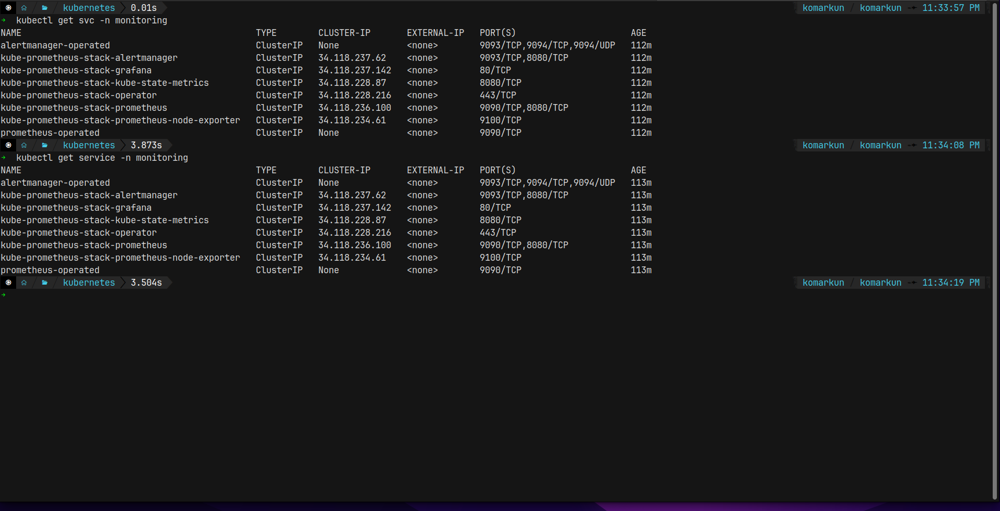

monitoring ingress

```yaml
apiVersion: networking.k8s.io/v1
kind: Ingress
metadata:
  name: monitoring-server-ingress
  namespace: monitoring
spec:
  ingressClassName: nginx
  tls:
    - hosts:
        - "monitoring.finaltask-komar.studentdumbways.my.id"
      secretName: certificates
  rules:
    - host: monitoring.finaltask-komar.studentdumbways.my.id
      http:
        paths:
          - path: /
            pathType: Prefix
            backend:
              service:
                name: kube-prometheus-stack-grafana
                port:
                  number: 80
```

untuk login ke grafana dashboard default username nya adalah admin dan untuk dapat password nya pakai perintah berikut.

```bash
kubectl get secret kube-prometheus-stack-grafana -n monitoring -o jsonpath="{.data.admin-password}" | base64 --decode ; echo
```

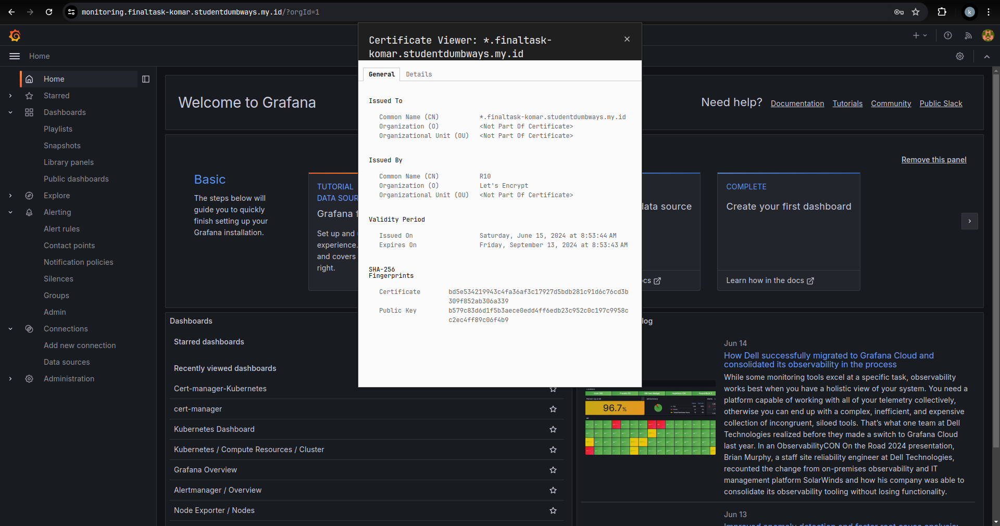

data source prometheus by default akan muncul disini

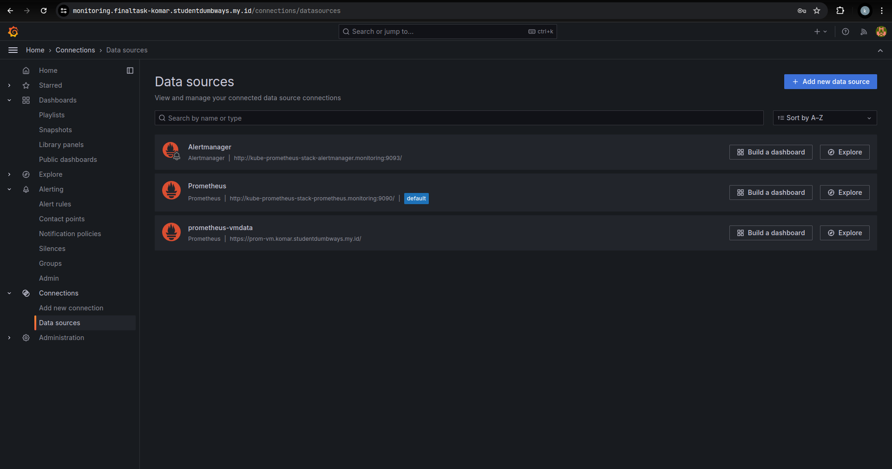

## Setup monitoring cara docker compose

siapkan docker-compose.yaml

```yaml
services:
  prometheus:
    image: prom/prometheus:latest
    container_name: prometheus
    restart: unless-stopped
    volumes:
      - ./prometheus:/etc/prometheus/

    command:
      - "--config.file=/etc/prometheus/prometheus.yml"
      - "--web.config.file=/etc/prometheus/web.yml"
      - "--storage.tsdb.path=/prometheus"
      - "--web.console.libraries=/etc/prometheus/console_libraries"
      - "--web.console.templates=/etc/prometheus/consoles"
      - "--web.enable-lifecycle"
    ports:
      - 9090:9090
  node-exporter:
    image: prom/node-exporter:latest
    container_name: node-exporter
    restart: unless-stopped
    volumes:
      - /proc:/host/proc:ro
      - /sys:/host/sys:ro
      - /:/rootfs:ro
    command:
      - "--path.procfs=/host/proc"
      - "--path.rootfs=/rootfs"
      - "--path.sysfs=/host/sys"
      - "--collector.filesystem.mount-points-exclude=^/(sys|proc|dev|host|etc)($$|/)"
    ports:
      - 9100:9100
```

siapkan juga prometheus.yaml nya

```yaml
global:
  scrape_interval: 15s
  evaluation_interval: 15s
  scrape_timeout: 10s

scrape_configs:
  - job_name: "jenkins"
    metrics_path: /prometheus/
    static_configs:
      - targets: ["jenkins.komar.studentdumbways.my.id"]

  - job_name: "appserver"
    metrics_path: /metrics
    static_configs:
      - targets: ["103.127.134.76:9100"]

  - job_name: "gateway"
    static_configs:
      - targets: ["103.127.132.193:9100"]

  - job_name: "alibaba"
    metrics_path: /metrics
    static_configs:
      - targets: ["47.237.87.31:9100"]
      - targets: ["47.237.87.31:8081"]

  - job_name: "vmutils"
    metrics_path: /metrics
    static_configs:
      - targets: ["34.19.21.196:9100"]
```

siapkan juga basic auth nya atau web.yaml
password dalam bcrypt format

```yaml
basic_auth_users:
  komarganteng: $43ds2b$12fds$3rthNf2lSsxffdm0.i4a.IB51VRjgBUyv6kdnyTlgWj81Ay
```

test basic auth prometheus cek di browser

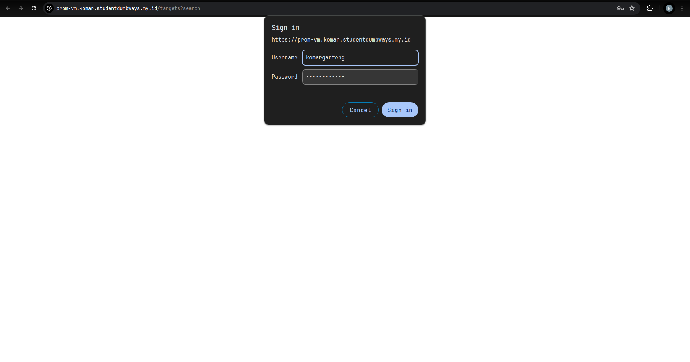

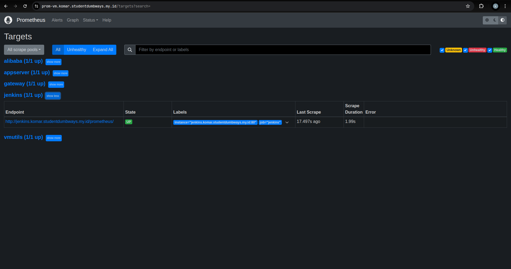

# Setup dashboard

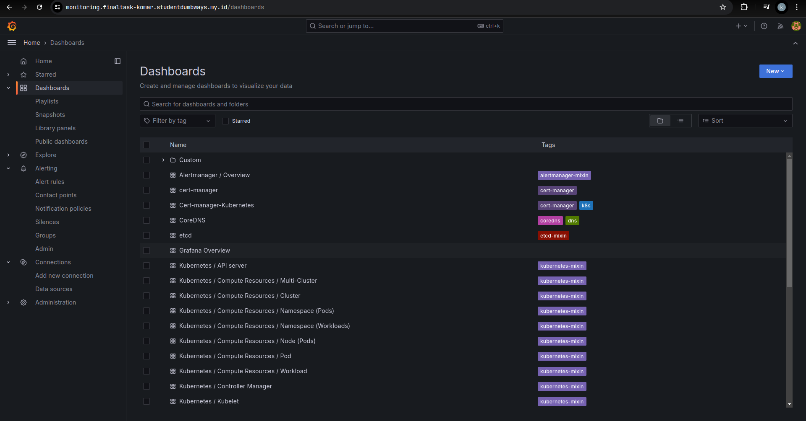

dashboard kubernetes

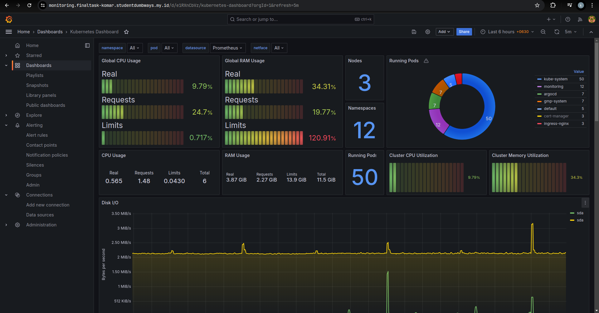

dashboard node vm biasa

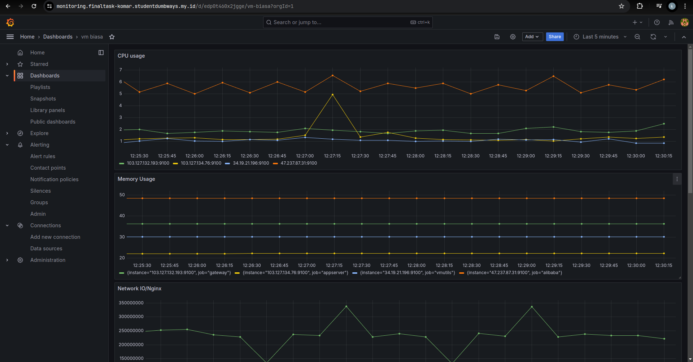

rumus promql

```promql
# CPU usage
  100 - (avg by(instance)(irate(node_cpu_seconds_total{mode="idle"}[1h]))*100)

# Memory Usage
 100  *  (  1  -  ((avg_over_time(node_memory_MemFree_bytes[10m])  +  avg_over_time(node_memory_Cached_bytes[10m])+  avg_over_time(node_memory_Buffers_bytes[10m]))  /  avg_over_time(node_memory_MemTotal_bytes[10m])))

 # disk usage
 (1 - (avg(node_filesystem_free_bytes) by (instance) / avg(node_filesystem_size_bytes) by (instance))) * 100

# container monitoring
 sum  (rate  (container_cpu_usage_seconds_total{image!=""}[5m]))  by (name)

# nginx network monitoring
 sum by (name) (rate(container_network_receive_bytes_total{name="nginx"} [1m] ) ) *  sum by (name) (rate(container_network_transmit_bytes_total{name="nginx"} [1m] ) )
```

# setup alert via telegram

kita buat terlebih dahulu bot nya supaya dapat api key

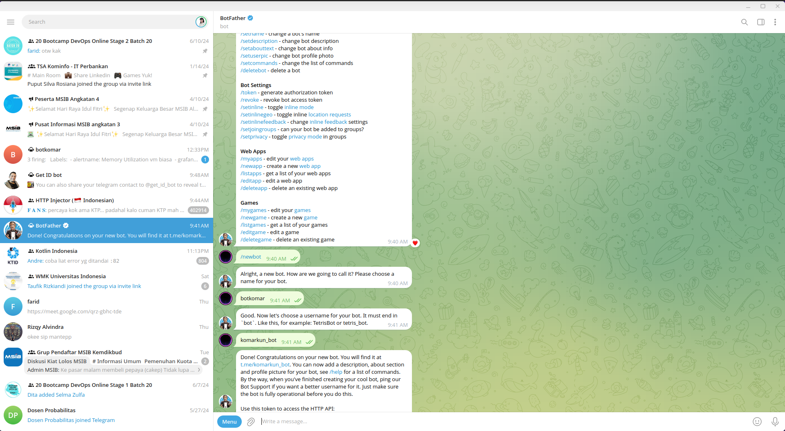

masukan di contact poin dan tambahkan notification policy nya

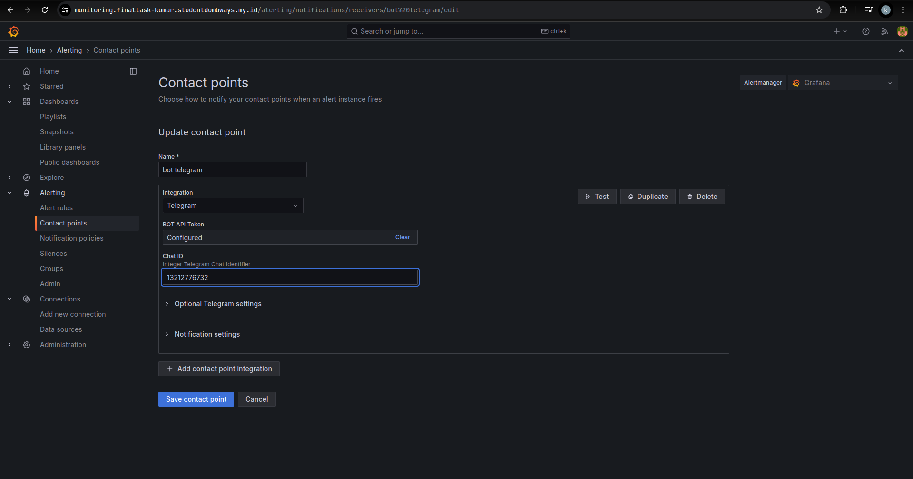

buat allerting rule yg sesuai dengan apa yg mau kita monitor

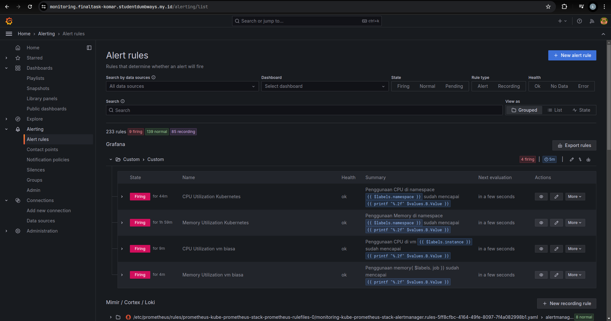

buat custom notification templates

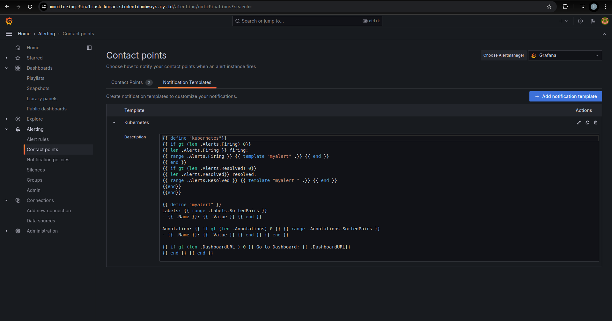

cek notifikasi nya di telegram bot

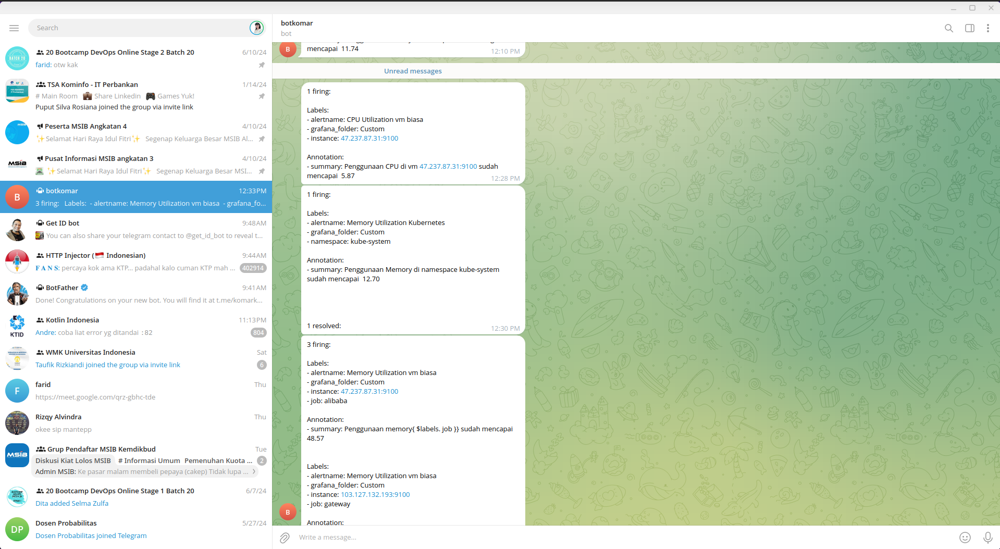
