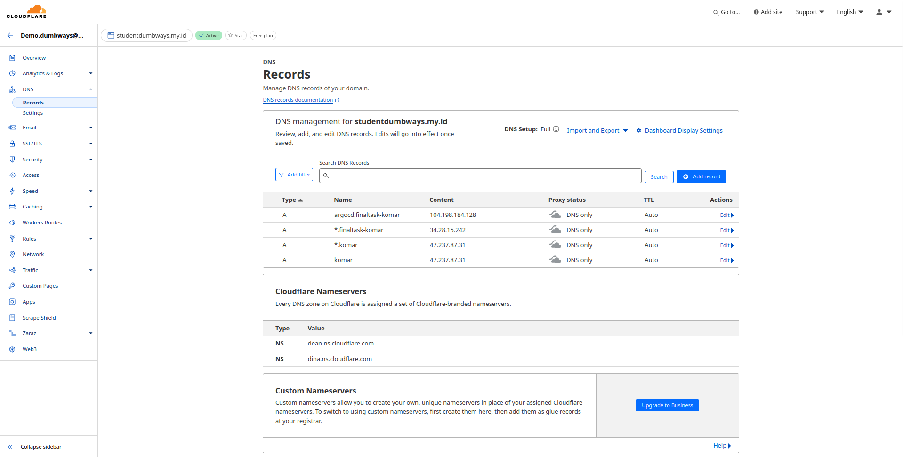
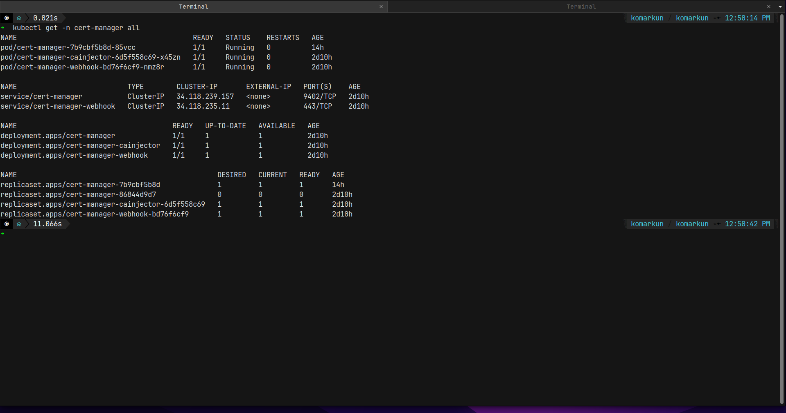
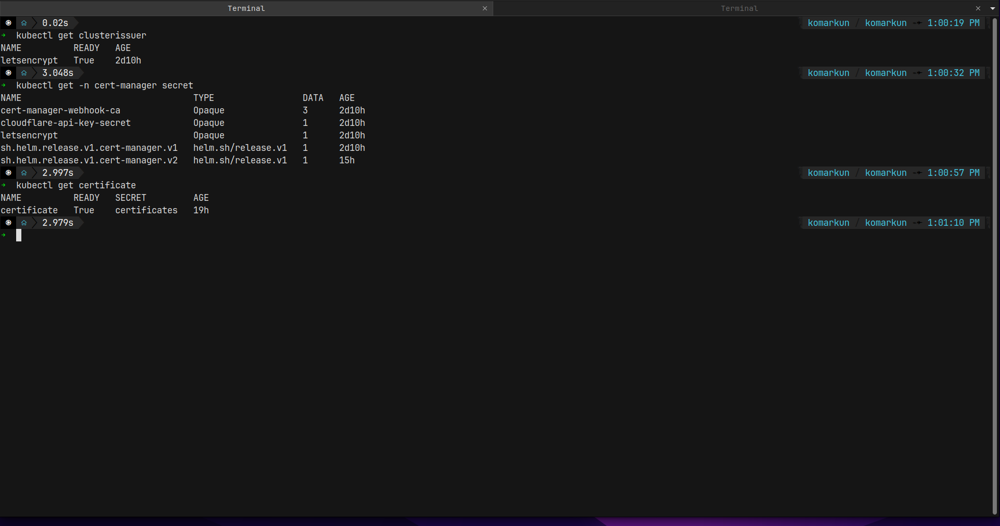
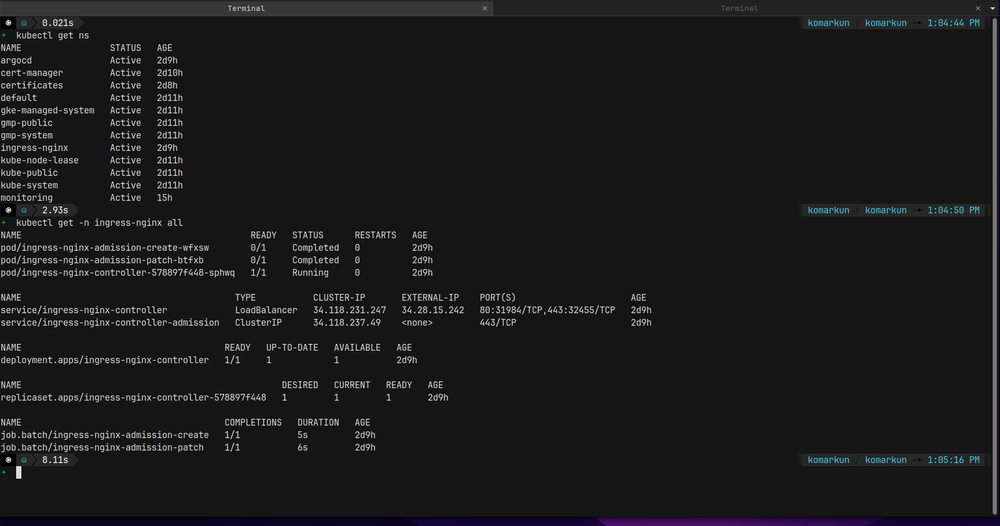
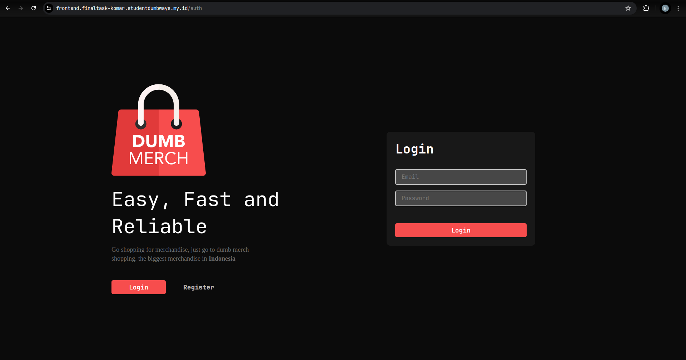
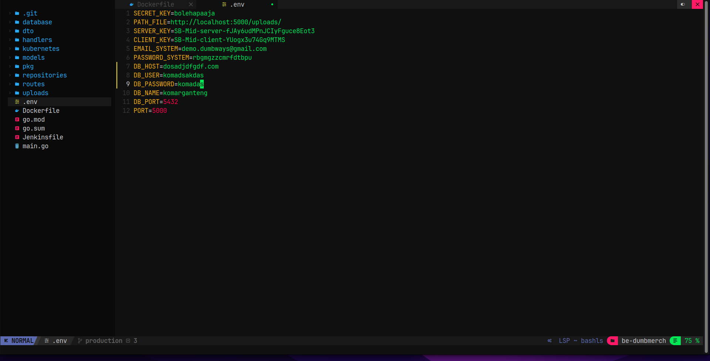

# Webserver

# Setup DNS di cloudflare

supaya bisa menggunakan wild card ssl certificate buat subdomainnya pakai tanda \*



Khusus Kubernetes Pointing IP address wajib ke external ip yg ada di google cloud provider atau kita juga bisa pointing ke nginx ingress controller nya

contoh

```
# untuk Staging Environment pakai nginx dan certbot biasa
*.komar.studentdumbways.my.id

# untuk Production Environment pakai cermanager dan nginx ingress
*.finaltask-komar.studentdumbways.my.id
```

## Webserver di Kubernetes Pakai Cert-Manager dan wild card SSL dari cloudflare

untuk menggunakan cert-manager kita bisa pakai helm untuk melakukan installasi nya tersebut.

```bash
helm repo add jetstack https://charts.jetstack.io
helm repo update
helm install \
  cert-manager jetstack/cert-manager \
  --namespace cert-manager \
  --create-namespace \
  --version v1.11.0 \
  --set installCRDs=true
```

periksa status installasi nya di kubernetes pakai perintah:

```bash
kubectl get -n cert-manager all
```



selah itu kita buat secret nya terlebih dahulu untuk menyimpan token cloudflare atau api key cloudflare

cert-manager-secret.yaml

```yaml
apiVersion: v1
kind: Secret
metadata:
  name: cloudflare-api-key-secret
  namespace: cert-manager
type: Opaque
stringData:
  # API Key:
  api-key: afsdfj23ruewjfoieu2r98wfkdsh
  # - or -
  # Token:
  # api-token: your-api-token
```

jalankan secret tersebut

```bash
kubectl apply -f cert-manager-secret.yaml
```

langkah selanjutnya adalah membuat issuer atau cluster issuer, jika kita membuat cluster issuer kita bisa menggunakannya untuk di semua namespace yg mau kita generate ssl certificate nya, kalau issuer biasa kita hanya bisa di satu namespace yang sama

cluster-issurt.yaml

```yaml
apiVersion: cert-manager.io/v1
kind: ClusterIssuer
metadata:
  name: letsencrypt
  namespace: cert-manager
spec:
  acme:
    email: komarganteng@gmail.com
    server: https://acme-v02.api.letsencrypt.org/directory
    privateKeySecretRef:
      name: letsencrypt
    solvers:
      - dns01:
          cloudflare:
            email: komarganteng@gmail.com
            apiKeySecretRef:
              name: cloudflare-api-key-secret
              key: api-key
```

jika sudah ada cluster issuer kita bisa langusung generate ssl certificate sesuai dengan namespace yang ingin memakai certificate tersebut

```yaml
apiVersion: cert-manager.io/v1
kind: Certificate
metadata:
  name: certificates
  namespace: default
spec:
  secretName: certificates
  issuerRef:
    name: letsencrypt
    kind: ClusterIssuer
  dnsNames:
    - "*.finaltask-komar.studentdumbways.my.id"
```



langkah selanjutnya kita tinggal install nginx ingress controller bisa pakai helm atau manifest

```bash
helm repo add ingress-nginx https://kubernetes.github.io/ingress-nginx

helm install my-ingress-nginx ingress-nginx/ingress-nginx --version 4.10.1
```



setelah semuanya sudah tersetup langkah selanjutnya adalah kita tinggal buat spesicfic ingress sesuai dengan kebutuhan aplikasi apasaja yang mau kita buat https dan menggunakan certificate yang valid dari letsencript menggunakan certmanager dan juga wild card ssl dari cloudflare

```yaml
apiVersion: networking.k8s.io/v1
kind: Ingress
metadata:
  name: frontend-server-ingress
spec:
  ingressClassName: nginx
  tls:
    - hosts:
        - "frontend.finaltask-komar.studentdumbways.my.id"
      secretName: certificates
  rules:
    - host: frontend.finaltask-komar.studentdumbways.my.id
      http:
        paths:
          - path: /
            pathType: Prefix
            backend:
              service:
                name: dumbmerch-service-fe
                port:
                  number: 80
```



cek certificate nya


