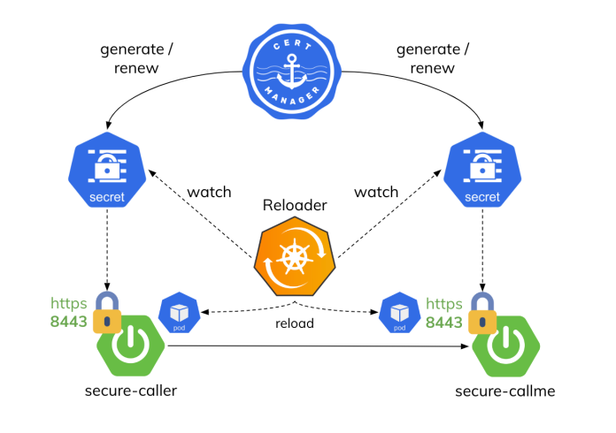
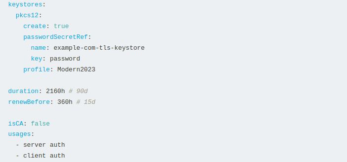
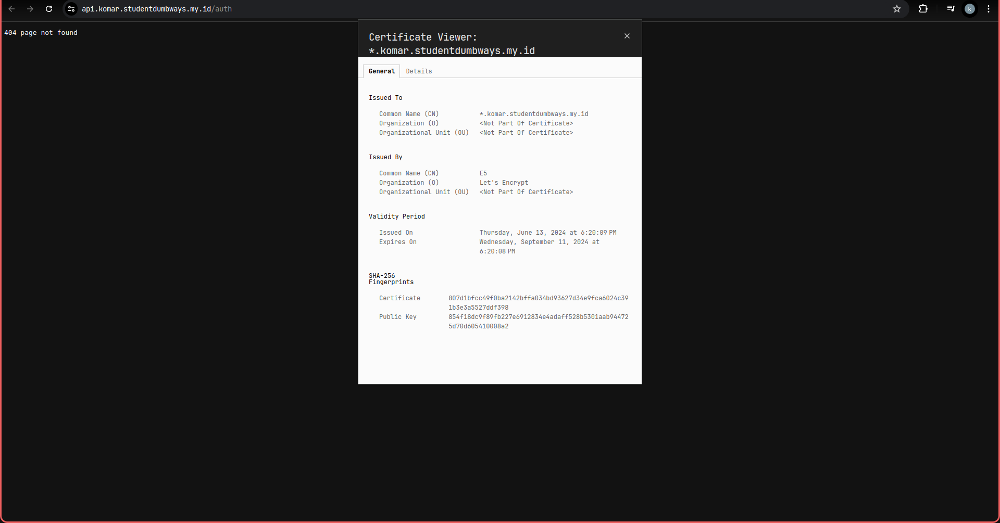
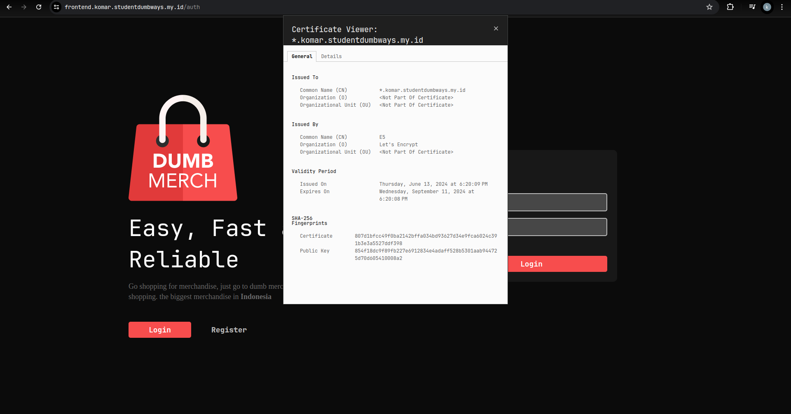

# Webserver

# Setup DNS di cloudflare

supaya bisa menggunakan wild card ssl certificate buat subdomainnya pakai tanda \*


Khusus Kubernetes Pointing IP address wajib ke external ip yg ada di google cloud provider atau kita juga bisa pointing ke nginx ingress controller nya

contoh

```
# untuk Staging Environment pakai nginx dan certbot biasa
*.komar.studentdumbways.my.id

# untuk Production Environment pakai cermanager dan nginx ingress
*.finaltask-komar.studentdumbways.my.id
```

## Webserver di Kubernetes Pakai Cert-Manager dan wild card SSL dari cloudflare

untuk menggunakan cert-manager kita bisa pakai helm untuk melakukan installasi nya tersebut.

```bash
helm repo add jetstack https://charts.jetstack.io
helm repo update
helm install \
  cert-manager jetstack/cert-manager \
  --namespace cert-manager \
  --create-namespace \
  --version v1.11.0 \
  --set installCRDs=true
```

periksa status installasi nya di kubernetes pakai perintah:

```bash
kubectl get -n cert-manager all
```


selah itu kita buat secret nya terlebih dahulu untuk menyimpan token cloudflare atau api key cloudflare

cert-manager-secret.yaml

```yaml
apiVersion: v1
kind: Secret
metadata:
  name: cloudflare-api-key-secret
  namespace: cert-manager
type: Opaque
stringData:
  # API Key:
  api-key: afsdfj23ruewjfoieu2r98wfkdsh
  # - or -
  # Token:
  # api-token: your-api-token
```

jalankan secret tersebut

```bash
kubectl apply -f cert-manager-secret.yaml
```

langkah selanjutnya adalah membuat issuer atau cluster issuer, jika kita membuat cluster issuer kita bisa menggunakannya untuk di semua namespace yg mau kita generate ssl certificate nya, kalau issuer biasa kita hanya bisa di satu namespace yang sama

cluster-issurt.yaml

```yaml
apiVersion: cert-manager.io/v1
kind: ClusterIssuer
metadata:
  name: letsencrypt
  namespace: cert-manager
spec:
  acme:
    email: komarganteng@gmail.com
    server: https://acme-v02.api.letsencrypt.org/directory
    privateKeySecretRef:
      name: letsencrypt
    solvers:
      - dns01:
          cloudflare:
            email: komarganteng@gmail.com
            apiKeySecretRef:
              name: cloudflare-api-key-secret
              key: api-key
```

jika sudah ada cluster issuer kita bisa langusung generate ssl certificate sesuai dengan namespace yang ingin memakai certificate tersebut

```yaml
apiVersion: cert-manager.io/v1
kind: Certificate
metadata:
  name: certificates
  namespace: default
spec:
  secretName: certificates
  issuerRef:
    name: letsencrypt
    kind: ClusterIssuer
  dnsNames:
    - "*.finaltask-komar.studentdumbways.my.id"
```


langkah selanjutnya kita tinggal install nginx ingress controller bisa pakai helm atau manifest

```bash
helm repo add ingress-nginx https://kubernetes.github.io/ingress-nginx

helm install my-ingress-nginx ingress-nginx/ingress-nginx --version 4.10.1
```


setelah semuanya sudah tersetup langkah selanjutnya adalah kita tinggal buat spesicfic ingress sesuai dengan kebutuhan aplikasi apasaja yang mau kita buat https dan menggunakan certificate yang valid dari letsencript menggunakan certmanager dan juga wild card ssl dari cloudflare

```yaml
apiVersion: networking.k8s.io/v1
kind: Ingress
metadata:
  name: frontend-server-ingress
spec:
  ingressClassName: nginx
  tls:
    - hosts:
        - "frontend.finaltask-komar.studentdumbways.my.id"
      secretName: certificates
  rules:
    - host: frontend.finaltask-komar.studentdumbways.my.id
      http:
        paths:
          - path: /
            pathType: Prefix
            backend:
              service:
                name: dumbmerch-service-fe
                port:
                  number: 80
```


cek certificate nya


# auto renewal di cert-manager

certmanager akan selalu merenewall secara otomatis certificatenya jika sudah mau habis waktu nya



atau kita juga bisa mengacu pada documentasi langung certmanager untuk membuat renewal certtificate

https://cert-manager.io/docs/usage/certificate/

contoh dari dockumentasi

```yaml
apiVersion: cert-manager.io/v1
kind: Certificate
metadata:
  name: example-com
  namespace: sandbox
spec:
  # Secret names are always required.
  secretName: example-com-tls

  # secretTemplate is optional. If set, these annotations and labels will be
  # copied to the Secret named example-com-tls. These labels and annotations will
  # be re-reconciled if the Certificate's secretTemplate changes. secretTemplate
  # is also enforced, so relevant label and annotation changes on the Secret by a
  # third party will be overwriten by cert-manager to match the secretTemplate.
  secretTemplate:
    annotations:
      my-secret-annotation-1: "foo"
      my-secret-annotation-2: "bar"
    labels:
      my-secret-label: foo

  privateKey:
    algorithm: RSA
    encoding: PKCS1
    size: 2048

  # keystores allows adding additional output formats. This is an example for reference only.
  keystores:
    pkcs12:
      create: true
      passwordSecretRef:
        name: example-com-tls-keystore
        key: password
      profile: Modern2023

  duration: 2160h # 90d
  renewBefore: 360h # 15d

  isCA: false
  usages:
    - server auth
    - client auth

  subject:
    organizations:
      - jetstack
  # The use of the common name field has been deprecated since 2000 and is
  # discouraged from being used.
  commonName: example.com

  # The literalSubject field is exclusive with subject and commonName. It allows
  # specifying the subject directly as a string. This is useful for when the order
  # of the subject fields is important or when the subject contains special types
  # which can be specified by their OID.
  #
  # literalSubject: "O=jetstack, CN=example.com, 2.5.4.42=John, 2.5.4.4=Doe"

  # At least one of commonName (possibly through literalSubject), dnsNames, uris, emailAddresses, ipAddresses or otherNames is required.
  dnsNames:
    - example.com
    - www.example.com
  uris:
    - spiffe://cluster.local/ns/sandbox/sa/example
  emailAddresses:
    - john.doe@cert-manager.io
  ipAddresses:
    - 192.168.0.5
  # Needs cert-manager 1.14+ and "OtherNames" feature flag
  otherNames:
    # Should only supply oid of ut8 valued types
    - oid: 1.3.6.1.4.1.311.20.2.3 # User Principal Name "OID"
      utf8Value: upn@example.local

  # Issuer references are always required.
  issuerRef:
    name: ca-issuer
    # We can reference ClusterIssuers by changing the kind here.
    # The default value is Issuer (i.e. a locally namespaced Issuer)
    kind: Issuer
    # This is optional since cert-manager will default to this value however
    # if you are using an external issuer, change this to that issuer group.
    group: cert-manager.io
```

kita cukup fokus pada bagian renewal before untuk mengatur waktu certificate nya



## Webserver cara biasa (docker compose pakai nginx dan juga certbot)

buat dirctory structure nya

```sh
.
└── webserver/
    ├── certbot/
    │   ├── certbot.ini
    │   ├── www/
    │   └── conf/
    ├── nginx/
    │   └── conf/
    │       ├── backend.conf
    │       ├── frontend.conf
    │       ├── sonarqube.conf
    │       ├── jenkins.conf
    │       ├── prometheus.conf
    │       └── grafana.conf
    └── docker-compose.yaml
```

docker-compose.yaml

```yaml
services:
  webserver:
    container_name: nginx
    image: nginx:alpine
    ports:
      - "80:80"
      - "443:443"
    restart: always
    volumes:
      - ./nginx/conf:/etc/nginx/conf.d
      - ./certbot/www/:/var/www/certbot
      - ./certbot/conf/:/etc/letsencrypt
    depends_on:
      - certbot
    networks:
      - webserver

  certbot:
    container_name: certbot
    image: certbot/dns-cloudflare:latest
    volumes:
      - ./certbot/certbot.ini:/etc/letsencrypt/renewal/renewal.conf:ro
      - ./certbot/www/:/var/www/certbot
      - ./certbot/conf/:/etc/letsencrypt
    command:
      [
        "certonly",
        "--non-interactive",
        "--dns-cloudflare",
        "--dns-cloudflare-credentials",
        "/etc/letsencrypt/renewal/renewal.conf",
        "--email",
        "komarganteng@gmail.com",
        "--agree-tos",
        "--no-eff-email",
        "--server",
        "https://acme-v02.api.letsencrypt.org/directory",
        "--domain",
        "*.komar.studentdumbways.my.id",
        "--domain",
        "komar.studentdumbways.my.id",
      ]
    networks:
      - webserver
networks:
  webserver:
```

certbot.ini

```
dns_cloudflare_email = "komarganteng@gmail.com"
dns_cloudflare_api_key = "23kjnkds91fd9bfcfsdc619815b074fdsjas33"
server = https://acme-v02.api.letsencrypt.org/directory
```

contoh congifgurasi conf untuk ssl dan https di nginx pakai certbot

backend.conf

```conf
upstream be_servers {
    # server https://be-dumbmerch-zvp67cp4ra-uc.a.run.app;
    server 35.239.196.64;
    server 34.127.43.16:5000;
    server 103.127.134.76:5000;
}

server {
    listen 80;
    server_name api.komar.studentdumbways.my.id;

    location /.well-known/acme-challenge/ {
        root /var/www/certbot;
    }

    location / {
        return 301 https://$host$request_uri;
    }
}

server {
    listen 443 ssl;
    server_name api.komar.studentdumbways.my.id;

    ssl_certificate /etc/letsencrypt/live/komar.studentdumbways.my.id/fullchain.pem;
    ssl_certificate_key /etc/letsencrypt/live/komar.studentdumbways.my.id/privkey.pem;

    location / {
        proxy_pass http://be_servers;
        proxy_set_header Host $host;
        proxy_set_header X-Real-IP $remote_addr;
        proxy_set_header X-Forwarded-For $proxy_add_x_forwarded_for;
        proxy_set_header X-Forwarded-Proto $scheme;
        proxy_ssl_server_name on;
        proxy_ssl_protocols TLSv1.2 TLSv1.3;
        proxy_ssl_ciphers HIGH:!aNULL:!MD5;
    }
}
```

periksa aplikasi nya running dan pakai https dari cloudflare dan nginx & certbot





untuk renewal certificate cara biasa bisa jalankan perintah

```sh
# restart certbot supaya generate ssl baru
docker compose restart certbot

# restart juga nginx nya
docker composer restrart webserver
```

bisa juga kita buat crontab

buat dulu file misal webserver.sh

```sh
#!/bin/bash
docker compose restart certbot
docker composer restrart webserver
```

ubah permission nya supaya bisa jadi executable

```sh
chmod +x /home/finaltask-komarhidayat0/docker-compose/webserver/webserver.sh
```

masuk ke crontab

crontab -e

isikan data berikut di crontab

```sh
0 0 1 * * /home/finaltask-komarhidayat0/docker-compose/webserver/webserver.sh
```

maka akan mengenerate kan secara otomatis sslnya selama setiap 1 bulan sekali pakai crontab
