# Kubernetes

**Requirements**

- k3s/ Vanilla /Docker Swarm
- Kubernetes Engine (VKE, GKE or EKS)

**Instructions**

- No 5 (Deployment) app runs inside a kubernetes cluster (include frontend, backend, and database)
- Apps running 100% with backend and db integration

## Requirement

Kubernetes Google cloud

untuk menggunakan kubernetes kita bisa membuatnya secara lewat UI ataupun bisa juga pakai terraform yang ada di file 1.Provisioning.md

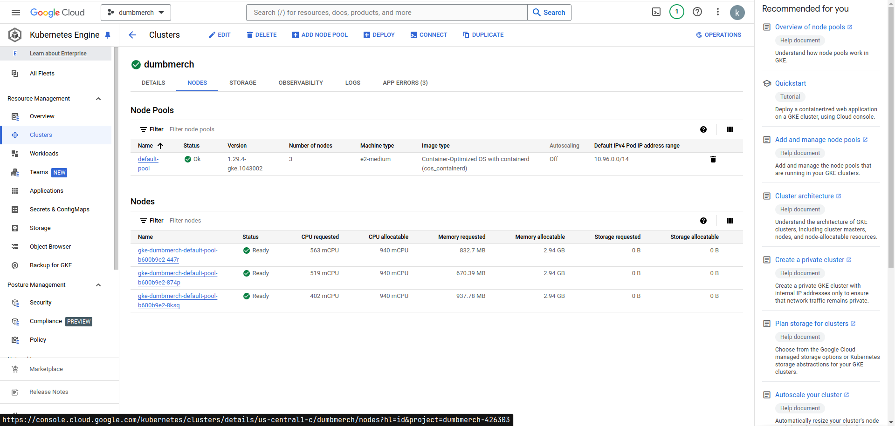

setelah ada kubernetes nya kita juga bisa tambahkan opsi untuk mengatur kubernetes cluster kita di local seperti kita wajib menginstall kan kubectl dan juga google cloud console dan google cloud sdk dan juga helm untuk package manager dari untuk kubernetes

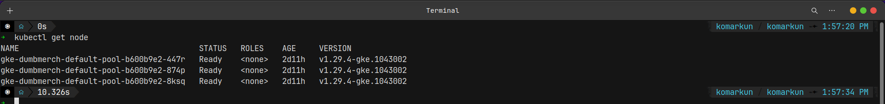

Untuk Deployment sendiri lebih sangat enak menggunakan argocd karena dia juga sekaligus continous delivery. jadi cukup kita install argocd dan argocd akan mneghandle deployment aplikasi kita di kubernetes yang tentunya kita wajib push deployment.yaml nya tersebut ke github karena jika kita menggunakan argocd ini juga termasuk ke dalam gitops (git operations) yang dalam kata lain ini juga termasuk continous delivery


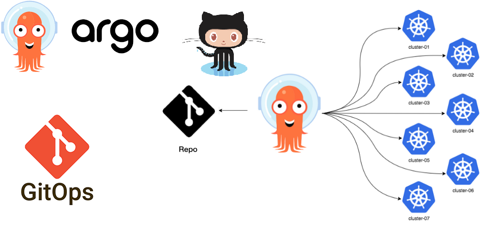

## installasi argocd untuk deployment di kubernetes

kita bisa menggunakan helm untuk meninstall argocd kita atau kita juga bisa pakai manifest.yaml untuk melakukan installasinya tersebut

```bash
# buat namespace
kubectl create namespace argocd

# isntall manifests dari github argocd langsung
kubectl apply -n argocd -f https://raw.githubusercontent.com/argoproj/argo-cd/stable/manifests/install.yaml

# ubah type menjadi LoadBalancer
kubectl patch svc argocd-server -n argocd -p '{"spec": {"type": "LoadBalancer"}}'

# fetch password argocd
kubectl -n argocd get secret argocd-initial-admin-secret -o jsonpath="{.data.password}" | base64 -d
```

cek installasi argocd

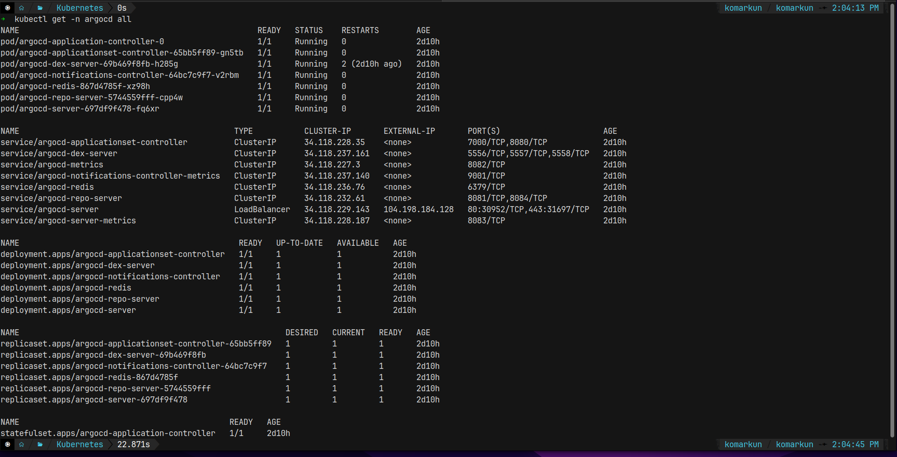

setelah installasi selesai kita bisa buat ingress nya supaya https dan aman argocd kita

ingress-argocd.yaml

```yaml
apiVersion: networking.k8s.io/v1
kind: Ingress
metadata:
  name: argocd-server-ingress
  namespace: argocd
  annotations:
    cert-manager.io/cluster-issuer: letsencrypt
    kubernetes.io/ingress.class: nginx
    kubernetes.io/tls-acme: "true"
    nginx.ingress.kubernetes.io/ssl-passthrough: "true"
    nginx.ingress.kubernetes.io/backend-protocol: "HTTPS"
spec:
  tls:
    - hosts:
        - "*.finaltask-komar.studentdumbways.my.id"
      secretName: argocd-secret
  rules:
    - host: argocd.finaltask-komar.studentdumbways.my.id
      http:
        paths:
          - path: /
            pathType: Prefix
            backend:
              service:
                name: argocd-server
                port:
                  name: https
```

setelah di apply kita bisa masuk ke web argocd tentunya dengan status web nya sudah https dan secure

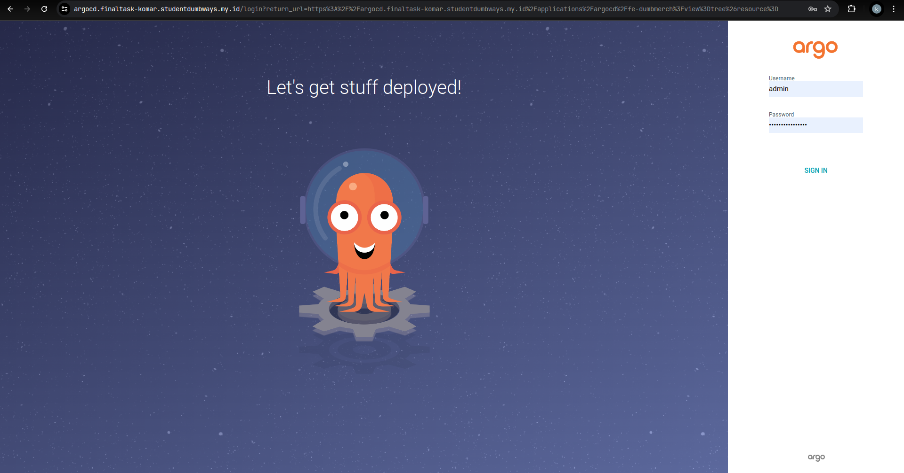

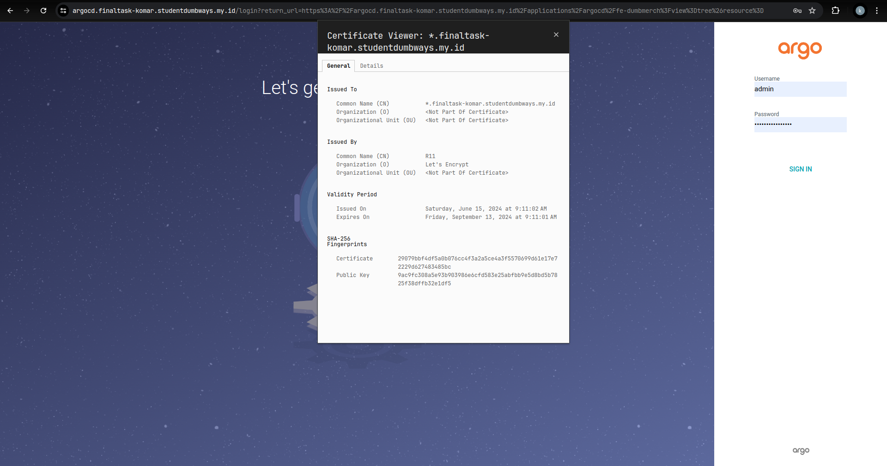

setelah success kita tinggal login saja ke argocd nya dan langkah selanjutnya adalah kita menyiapkan repository github yang berisi deployment yaml untuk kebutuhan aplikasi kita

masukan deployment yaml nya dan push ke github repository

```yaml
apiVersion: v1
kind: PersistentVolumeClaim
metadata:
  name: postgres-pvc
  namespace: database
spec:
  accessModes:
    - ReadWriteOnce
  resources:
    requests:
      storage: 10Gi

---
apiVersion: apps/v1
kind: Deployment
metadata:
  name: postgres
  namespace: database
spec:
  selector:
    matchLabels:
      app: postgres
  strategy:
    type: Recreate
  template:
    metadata:
      labels:
        app: postgres
    spec:
      containers:
        - image: postgres:15-alpine3.20
          name: postgres
          env:
            - name: POSTGRES_DB
              valueFrom:
                secretKeyRef:
                  name: postgres-secret
                  key: postgres_db
            - name: POSTGRES_USER
              valueFrom:
                secretKeyRef:
                  name: postgres-secret
                  key: postgres_user
            - name: POSTGRES_PASSWORD
              valueFrom:
                secretKeyRef:
                  name: postgres-secret
                  key: postgres_password
          ports:
            - containerPort: 5432
          volumeMounts:
            - name: postgres-storage
              mountPath: /var/lib/postgresql/data
      volumes:
        - name: postgres-storage
          persistentVolumeClaim:
            claimName: postgres-pvc
---
apiVersion: v1
kind: Service
metadata:
  name: postgres
  namespace: database
spec:
  type: LoadBalancer
  ports:
    - port: 5432
      targetPort: 5432
  selector:
    app: postgres
```

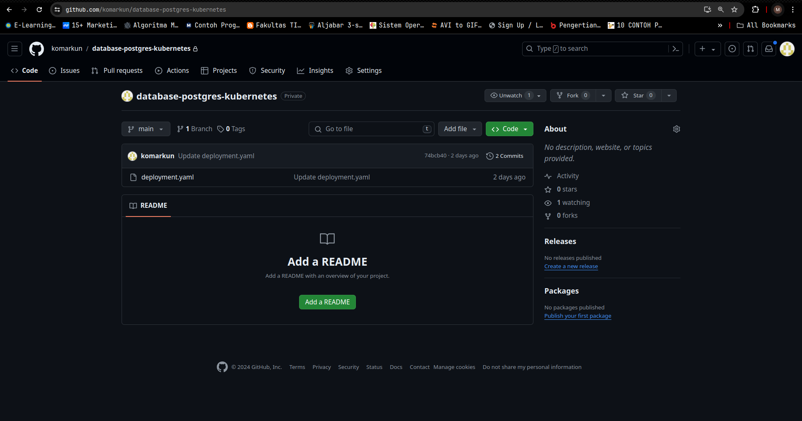

balik lagi ke argocd dan kita bisa masuk ke setting untuk mendaftarkan reponya tadi supaya argocd bisa mendeploy aplikasi tersebut

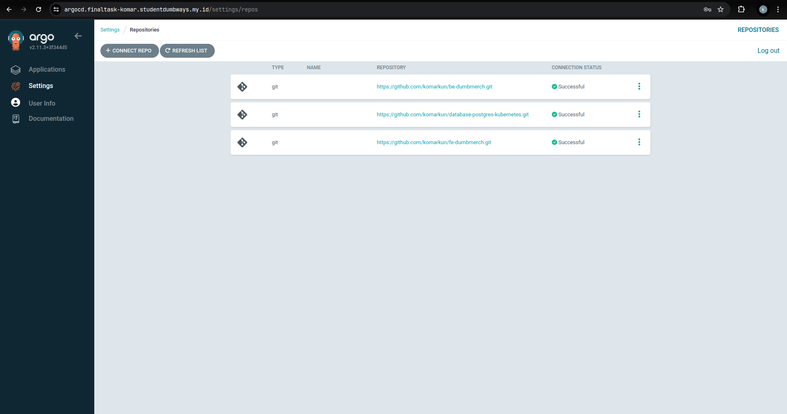

setelah ada repository yang sudah di butuhkannya kita bisa masuk ke menu aplication untuk langsung masuk membuat deployment aplikasi di kubernetes nya

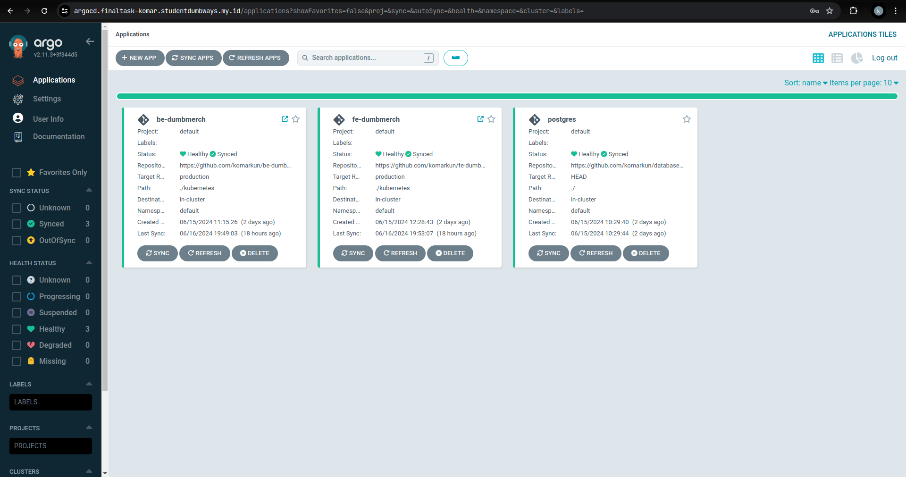

cek deployment aplikasinya yg dilakukan oleh argocd

database

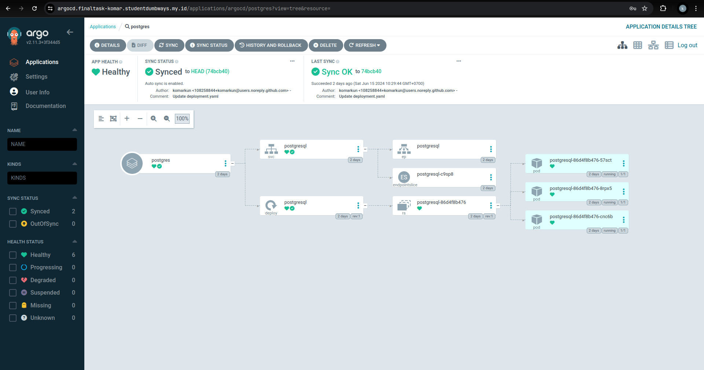

backend


frontend

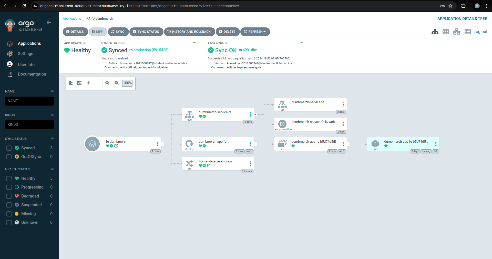

cek juga aplikasinya sudah jalan atau tidak biar kita tahu proses deployment oleh argocd nya berhasil atau tidak

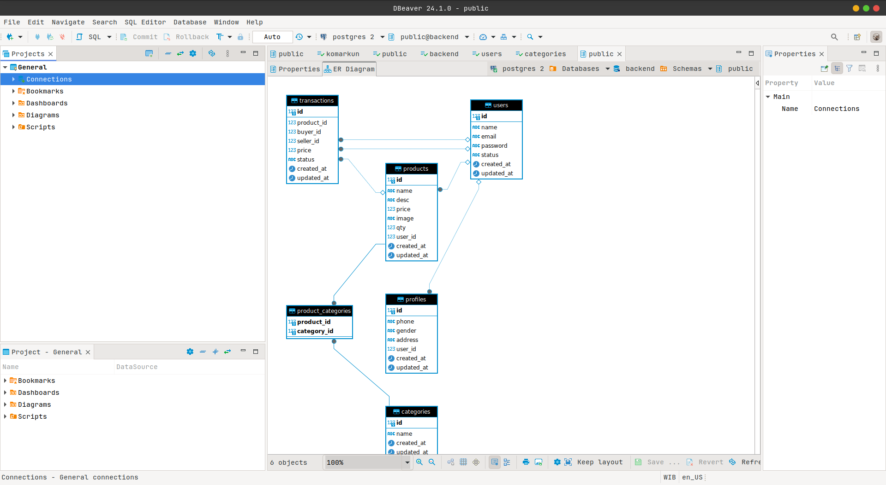

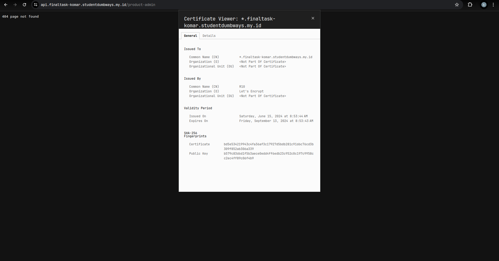

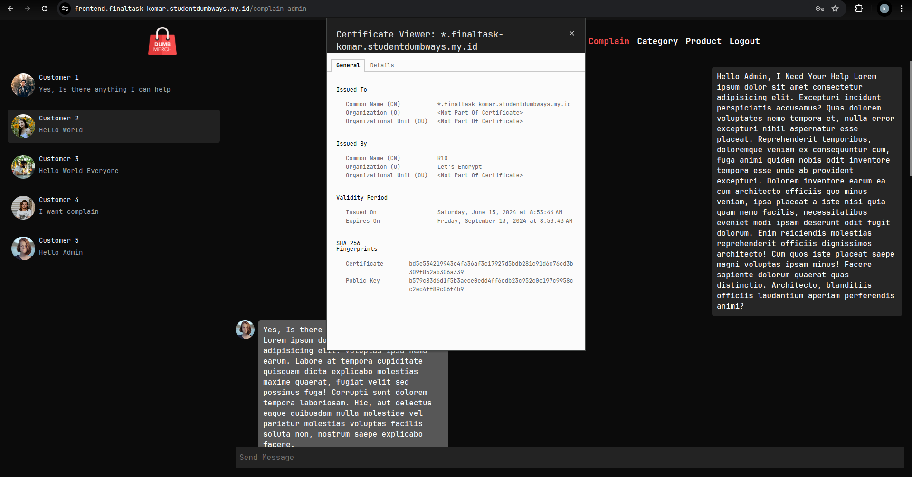
