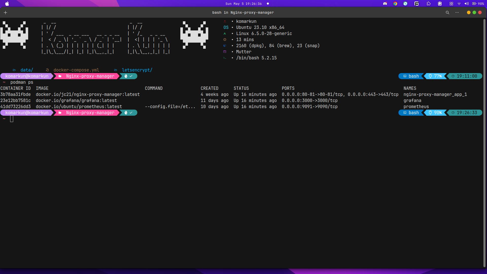

# Tugas devops Dumbways Week 1 Stage 2

Repository :
[Dumbflix Frontend](https://github.com/dumbwaysdev/dumbflix-frontend)

Tasks :

- Jelasakan langkah-langkah pembuatan VM di BiznetGio
- Setelah server sudah terbuat, buatlah suatu user baru lalu implementasikan penggunaan ssh-key pada server tersebut.
- Deploy aplikasi Dumbflix-Frontend menggunakan nodejs versi 14.x
- Clone repository Dumbflix-frontend lalu deploy aplikasinya menggunakan PM2

Tasks :

- Install nginx
- Buatlah reverse proxy dan gunakan domain dengan nama kalian (ex. amanda.studentdumbways.my.id)
- untuk Installation Certbot ada banyak cara (salah 1 nya seperti pada saat di kelas), atau kalau kalian menemukan cara lain untuk melakukan installation certbot atau tools yang lain yang digunakan untuk melakukan generate ssl feel free to use yaa.
- Generate SSL untuk reverse proxy kalian.
- Happy Explore :)

## Jawaban Task 1

### Langkah-langkah pembuatan VM di BiznetGio

1. Login Terlebih dahulu ke website biznetGionya.
   [BiznetGio Login](https://portal.biznetgio.com/user/login)


2. Setelah Login bisa klik tombol Quick Create lalu pilih variannya (Neo lite)


3. Beri nama server nya dan isi data yang di butuhkan


4. set up juga SSH nya, sshnya adalah public key yang sudah di buat di host machine misalnya atau bisa dari manapun bebas, lalu klik create (next)


5. Tunggu sampai selasai lalu periksa vm yg sudah di buat di menu dashboard nanti ada list VM yg sudah di buat nya.


### Membuat user baru lalu implementasikan penggunaan ssh-key pada server

1. Connect dulu ke VM nya pakai ssh key yg sudah di daftarkan di biznet gionya atau bisa lewat openconsole supaya bisa langsung masuk ke vm

```bash
ssh -i ~/.ssh/biznet komar@192.168.1.1
```


opsi lain, saya biasa pakai Makefile di host machine saya. konfigurasinya

```Makefile
biznet:
   @ssh -i ~/.ssh/biznet komar@192.168.1.1
```

untuk running nya di bash shell kita tinggal masukan perintah "make biznet" supaya dia nanti login ke ssh, jadi kita tidak perlu panjang2 menulis di terminal, cukup define sekali aja di Makefile nanti bisa simple dalam memanggilnya.

2. setelah masuk ke vm nya kita langsung bisa membuat user

```bash
# command untuk menambah user
sudo adduser komarkun

# command untuk menambahkan sudo (super user do)
sudo usermod -aG sudo komar

# command untuk switch user
su - komar
```


3. untuk implementasi ssh-key nya bisa banyak cara, cara yg menurut saya paling simple adalah dengan mencopy public key yang sudah kita buat di host machine atau di manapun lalu copy isi file nya tersebut ke authorize key yang ada di user yg mau kita ssh (~/.ssh/authorized_keys) bisa pake vim atau nano habis itu di save


ubah juga permission file nya pakai chmod 400 authorize_keys


setelah itu kita bisa uji coba login pakai ssh di manapun (host machine yang sudah ada privat key "ssh-keygen")


### Deploy aplikasi Dumbflix-Frontend menggunakan nodejs versi 14.x

Siapkan dulu semua tools yang di butuhkan untuk menjalankan aplikasi, karena ini adalah aplikasi react JS maka wajib di install adalah NVM, Node JS, NPM, dan pm2

install dulu node version managernya (NVM) setelah selesai lalkukan perintah "exec bash"


Setelah itu kita bisa install node JS dan NPM yg diinginkan dengan NVM


setelah itu install pm2 dengan NPM supaya kita bisa running di background dan bisa di monitoring juga


### Clone repository Dumbflix-frontend lalu deploy aplikasinya menggunakan PM2

setelah semua tools siap kita bisa mulai cloning aplikasinya dari github repositorinya ke vm kita dengan perintah git clone lalu pergi ke direktori tersebut dan lakukan npm install


kita bisa buat file ecosystem dari pm2 untuk merunning aplikasinya di background


running pm2 (aplikasi wayshub kita)


untuk menguji aplikasi running bisa pergi ke web browser lalu masukan ipaddress:port contoh 192.168.1.1:3000


## Jawaban Task 2

### Install nginx

installasi nginx dan juga cerbot serta install juga python3-certbot-nginx

```bash
sudo apt-get update && sudo apt-get upgrade
sudo apt-get install -y nginx certbot python3-cerbot-nginx
```


### Buatlah reverse proxy dan gunakan domain dengan nama kalian (ex. komar.studentdumbways.my.id)

check dulu di browser nginx nya


set up dulu cloudflare dns record nya di web cloudflare dan tambahkan dns record dan isi data ipv4 nya dengan ip address dari virtual machine nya


untuk membuat file reverse proxy saya biasanya menghapus dulu configurasi default dari si nginx nya ini


setelah di delete kita tinggal buat baru saja file nginx configurasinya, saya biasanya membuat file configurasi di /etc/nginx/site-available/komar.studentdumbways.my.id dan file tersebut kita link dengan perintah sudo "ln -s" ke bagian /etc/nginx.site-enable/

```bash
sudo ln -s /etc/nginx/site-available /etc/nginx/site-enable
```


ini adalah konfigurasi simple di nginx nya


lalu setelah itu kita bisa cek dulu configurasi nginx nya dengan perintah "sudo nginx -t"


setelah itu kita bisa check aplikasi kita di browser tapi ini langsung pakai nama domain kitanya aja tapi ini masih http belum https


### Installation Certbot

saya menggunakan cara saya sendiri untuk installasi dan configurasi certbot nya. cara ini saya dapat waktu saya magang dan di ajari oleh senior saya.

1. setelah install nginx kita wajib install juga certbot dan sebuah package lain yang bernama python3-certbot-nginx

```bash
sudo apt-get update; sudo apt-get -y upgrade

sudo apt-get install certbot

sudo apt-get install python3-certbot-nginx
```


2. setelah selesai di install certbot dan nginx configurasinya juga sudah kita konfigurasi seperti di atas kita bisa mengaktifkan ssl sertifikat kita dengan perintah

```bash
sudo certbot --nginx -d "komar.studentdumbways.my.id"
```


kalau sudah sukses bisa langsung aja cek di browser dan nanti website kita akan berubah jadi https dan ssl sertificate untuk apliskasi web kita akan terpasang dan provider nya adalah lestencript


## Set UP SSL With Nginx Proxy Manager

### Require Tools

```text
# Containerization Tools
1. Docker with (docker-compose)
2. Podman with (podman-compose)
```

### Instalasi

docker-compose.yaml

```yaml
version: "3.8"

secrets:
  # Secrets are single-line text files where the sole content is the secret
  # Paths in this example assume that secrets are kept in local folder called ".secrets"
  DB_ROOT_PWD:
    file: .secrets/db_root_pwd.txt
  MYSQL_PWD:
    file: .secrets/mysql_pwd.txt

services:
  app:
    image: "docker.io/jc21/nginx-proxy-manager:latest"
    restart: unless-stopped
    ports:
      # Public HTTP Port:
      - "80:80"
      # Public HTTPS Port:
      - "443:443"
      # Admin Web Port:
      - "81:81"
    environment:
      # These are the settings to access your db
      DB_MYSQL_HOST: "db"
      DB_MYSQL_PORT: 3306
      DB_MYSQL_USER: "npm"
      # DB_MYSQL_PASSWORD: "npm"  # use secret instead
      DB_MYSQL_PASSWORD__FILE: /run/secrets/MYSQL_PWD
      DB_MYSQL_NAME: "npm"
      # If you would rather use Sqlite, remove all DB_MYSQL_* lines above
      # Uncomment this if IPv6 is not enabled on your host
      # DISABLE_IPV6: 'true'
    volumes:
      - ./data:/data
      - ./letsencrypt:/etc/letsencrypt
    secrets:
      - MYSQL_PWD
    depends_on:
      - db

  db:
    image: docker.io/jc21/mariadb-aria
    restart: unless-stopped
    environment:
      # MYSQL_ROOT_PASSWORD: "npm"  # use secret instead
      MYSQL_ROOT_PASSWORD__FILE: /run/secrets/DB_ROOT_PWD
      MYSQL_DATABASE: "npm"
      MYSQL_USER: "npm"
      # MYSQL_PASSWORD: "npm"  # use secret instead
      MYSQL_PASSWORD__FILE: /run/secrets/MYSQL_PWD
      MARIADB_AUTO_UPGRADE: "1"
    volumes:
      - ./mysql:/var/lib/mysql
    secrets:
      - DB_ROOT_PWD
      - MYSQL_PWD
```

Running Container Aplication

```bash
# with docker
sudo docker-compose up -d

# with podman
podman-compose up -d
```

```note
# Docker Official run on daemon in root sudo (wajib) | unofficial package sudo (tidak wajib)
# Docker lebih berat

# Podman run on daemonless tidak perlu pakai root
# podman lebih cepat
# podman lebih aman (secure)
```

Check Running container

```bash
# with docker
sudo docker ps

# with podman
podman ps
```




Login to admin UI | localhost:81 | ipaddress:81


```text
Email       : admin@example.com
Password : changeme
```

Dashboard UI


Create SSL UI


Create Reverse Proxy in Proxy Hosts UI


