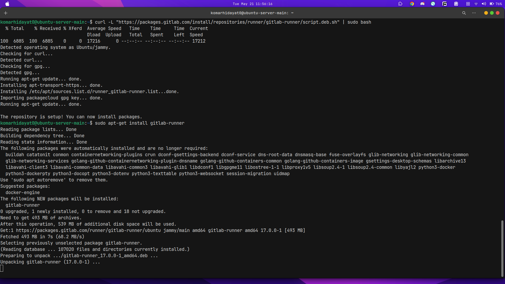
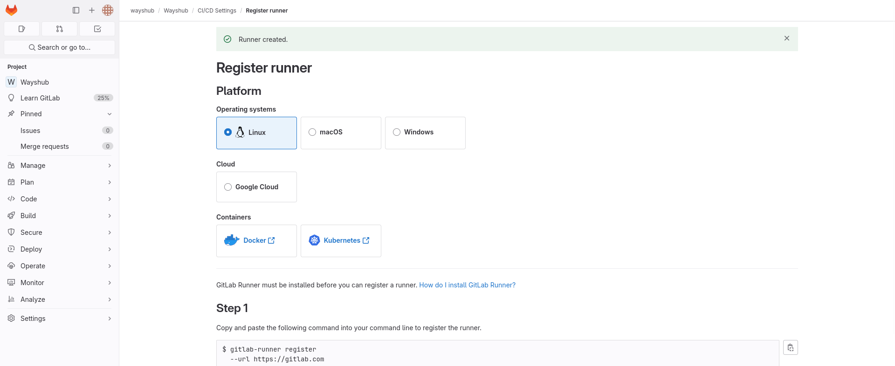
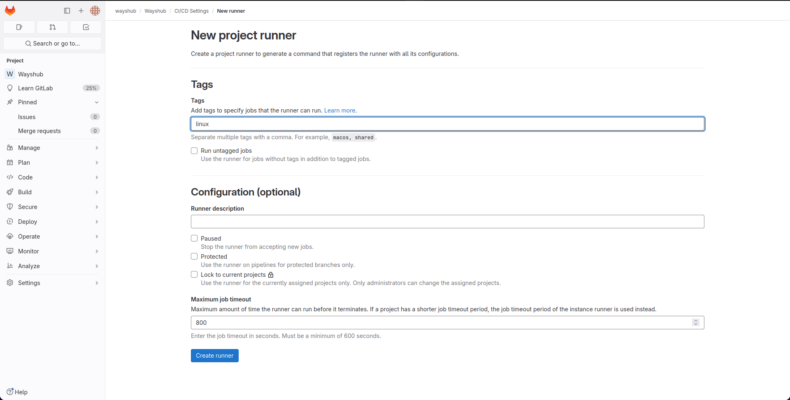
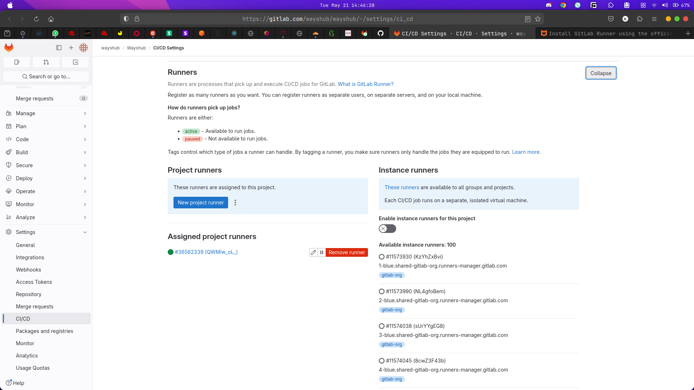
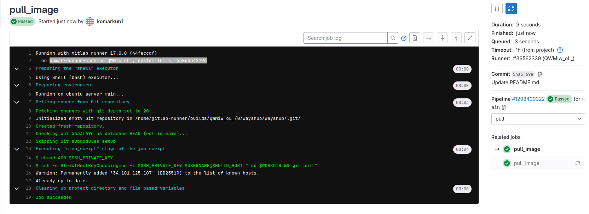

### Challenge Week2 Gitlab Runner on self hosted Machine

untuk melakukan implementasi gitlab runner di projek CI/CD kita, hal pertama yang perlu dilakukan adalah menginstall gitlab runner nya di server yang mau kita jadikan selfhosted oleh si gitlab nya. dan kita wajib melihat ke dokumentasi resmi untuk installasi tersebut.

server ubuntu/debian :

```bash
curl -L "https://packages.gitlab.com/install/repositories/runner/gitlab-runner/script.deb.sh" | sudo bash


sudo apt-get install gitlab-runner
```



setelah terinstall/ langkah selanjutnya adalah kita registrasi runner tersebut, buka terlebih dahulu di web site gitlab runner nya lalu masuk ke projek yang telah kita upload dan masuk ke settingan gitlab runner.



setelah itu kita masukan step by step yg ada di server yg sudah terinstall gitlab runner.

```bash
sudo gitlab-runner register

# Masukan Link url gitlab dan masukan juga aitorize token yg sudah di generate di gitlabnya
```

Kita bisa centang run untag runner supaya lebih eazy peazy lagi, karena jika di centang maka artinya semua tag nya nanti akan di jalankan. dan jangan lupa pilih executor nya (shell) atau apapun bebas sesuai yang ada di pipeline



setelah semua sudah komplit kita bisa run ulang pipeline


dan wajib sekali kita matikan runner bawaannya supaya nanti menggunakan runner yg sudah kita setup



jangan lupa cek kembali dengan lebih detail apakah pipeline kita sudah running dengan menggunakan gitlab runner atau tidak dengan mengecek lebih detail lagi ke dalam.



untuk di case saya nama runner instance nya adalah komar-runner-machine artinya runner tersebut berhasil kita jalankan
