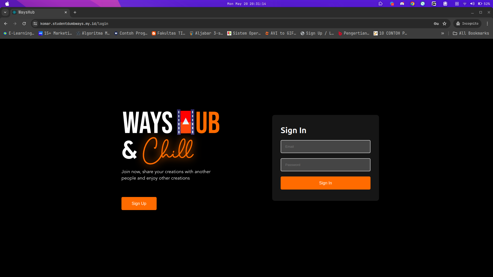
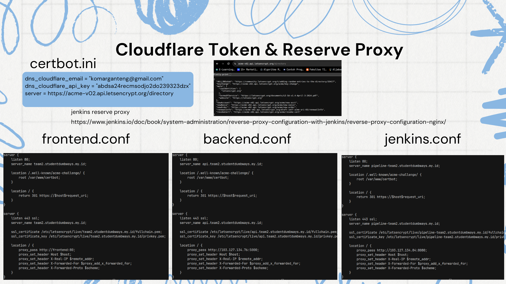
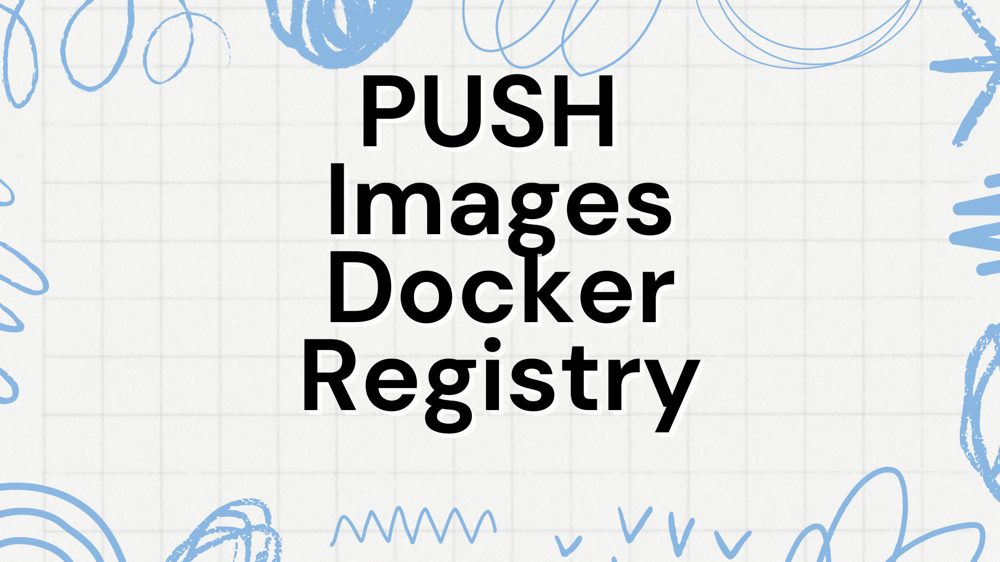

# Tugas devops Dumbways Mandiri Project Week 2 Stage 2 (Cara 2)

## DAY 1 Docker & Docker Compose

Tasks :
[ Docker ]

- Deploy aplikasi Web Server, Frontend, Backend, serta Database on top `docker compose` SEMUANYA DOCKER COMPOSE
  - Buat suatu docker compose yang berisi beberapa service kalian
    - Web Server
    - Frontend
    - Backend
    - Database
  - Di dalam docker-compose file buat suatu custom network dengan nama **team kalian**, lalu pasang ke setiap service yang kalian miliki.
  - Deploy database terlebih dahulu menggunakan mysql dan jangan lupa untuk pasang volume di bagian database.
  - Untuk building image frontend dan backend sebisa mungkin buat dockerized dengan image sekecil mungkin. dan jangan lupa untuk sesuaikan configuration dari backend ke database maupun frontend ke backend sebelum di build menjadi docker images.
  - Untuk Web Server buatlah configurasi reverse-proxy menggunakan nginx on top docker.
    - **SSL CLOUDFLARE OFF!!!**
    - Gunakan docker volume untuk membuat reverse proxy
    - SSL sebisa mungkin gunakan wildcard
    - Untuk DNS bisa sesuaikan seperti contoh di bawah ini
      - Frontend komar.studentdumbways.my.id
      - Backend api.komar.studentdumbways.my.id
  - Push image ke docker registry kalian masing".
- Aplikasi dapat berjalan dengan sesuai seperti melakukan login/register.

## JAWABAN CARA 2 (SEMUA DOCKER COMPOSE)

Untuk Mendeploy aplikasi baik frontend maupun backend menggunakan docker compose, terlebih dahulu kita harus punya source codenya bisa dari github, gitlab ataupun scm manapun, lalu kita wajib menginstall docker engine di server maupun di local machine kita sesuai kebutuhan. dan kita juga harus sudah menyiapkan server yang akan kita gunakan.


Ex wayshub-backend:


Ex wayshhub-fronend:


Setelah punya source code dari aplikasi kita buat dulu Dockerfile biasa supaya kita bisa membuat image yang nantinya bisa kita pakai untuk me running aplikasi di dalam kontainer. Dockerfile merupakan blueprint atau serangkaian perintah untuk menjalankan aplikasi kita yang nantinya akan berjalan di kontainer docker tentunya.

Ex Dockerfile Frontend:


Ex Dockerfile Backend:


setelah Dockerfilenya ada kita bisa buat images dulu dengan perintah:

```bash
# di frontend directory
docker build -t komarkun/wayshub-frontend:latest .

# di backend directory
docker build -t komarkun/wayshub-backend:latest .
```

setelah image dan semua bahannya ada kita bisa langsung buat docker compose nya di masing2 server sesuai kebutuhan.

docker-compose.yaml

```
Server1 = (nginx & certbot)

Server2 = (wayshub-frontend)

Server3 = (wayshub-backend)
```

docker-compose.yaml di server1

```yaml
services:
  webserver:
    container_name: nginx
    image: nginx:alpine
    ports:
      - "80:80"
      - "443:443"
    restart: always
    volumes:
      - ./nginx/conf:/etc/nginx/conf.d
      - ./certbot/www/:/var/www/certbot
      - ./certbot/conf/:/etc/letsencrypt
    depends_on:
      - certbot
    networks:
      - team2

  certbot:
    container_name: certbot
    image: certbot/dns-cloudflare:latest
    volumes:
      - ./certbot/certbot.ini:/etc/letsencrypt/renewal/renewal.conf:ro
      - ./certbot/www/:/var/www/certbot
      - ./certbot/conf/:/etc/letsencrypt
    command:
      [
        "certonly",
        "--non-interactive",
        "--dns-cloudflare",
        "--dns-cloudflare-credentials",
        "/etc/letsencrypt/renewal/renewal.conf",
        "--email",
        "komarhidayat0@gmail.com.com",
        "--agree-tos",
        "--no-eff-email",
        "--server",
        "https://acme-v02.api.letsencrypt.org/directory",
        "--domain",
        "*.komar.studentdumbways.my.id",
        "--domain",
        "komar.studentdumbways.my.id",
      ]
    networks:
      - team2
networks:
  team2:
```

docker-compose.yaml di server2

```yaml
services:
  frontend:
    container_name: wayshub-frontend-prod
    image: komarkun/wayshub-frontend-prod:latest
    stdin_open: true
    ports:
      - "3000:80"
    networks:
      - team2

networks:
  team2:
```

docker-compose.yaml di server3

```yaml
services:
  database:
    image: mysql:latest
    container_name: database
    restart: always
    environment:
      MYSQL_ROOT_PASSWORD: komarganteng
      MYSQL_DATABASE: wayshub
      MYSQL_USER: komarganteng
      MYSQL_PASSWORD: komarganteng
    ports:
      - "3306:3306"
    volumes:
      - ./mysql/data:/var/lib/mysql
    networks:
      - team2
    healthcheck:
      test: ["CMD", "mysqladmin", "ping", "-h", "localhost"]
      interval: 30s
      timeout: 10s
      retries: 5
  backend:
    image: komarkun/wayshub-backend-prod
    container_name: wayshub-backend-prod
    restart: always
    stdin_open: true
    ports:
      - "5000:5000"
    depends_on:
      database:
        condition: service_healthy
    networks:
      - team2
networks:
  team2:
```

setelah docker-compose.yaml siap di semua server langkah selanjutnya adalah kita tiggal jalan kan konfigurasi tersebut di masing masing server untuk menjalankan aplikasi tersebut:

```bash
docker compose up -d
```

lalu tinggal cek saja di browser



Untuk building image frontend dan backend sebisa mungkin buat dockerized dengan image sekecil mungkin. dan jangan lupa untuk sesuaikan configuration dari bac9kend ke database maupun frontend ke backend sebelum di build menjadi docker images.


Untuk menconfigurasi reserve proxy dan wild card SSL sertificate kita wajib buat terlebih dahulu cloudflare DNS Record nya


setelah itu kita buat file reserve proxy nya dan token api keys nya juga dari cloudflare



Setelah itu ita jalankan service yang ada di docker compose nya di vm yang sudah di pointing ip adddress nya di cloudflare


jika sudah selesai kita bisa memnjalankan aplikasi kita tapi bedanya sekarang adalah sudah https dan juga wildcard ssl sertificate nya juga pasti berjalan juga





