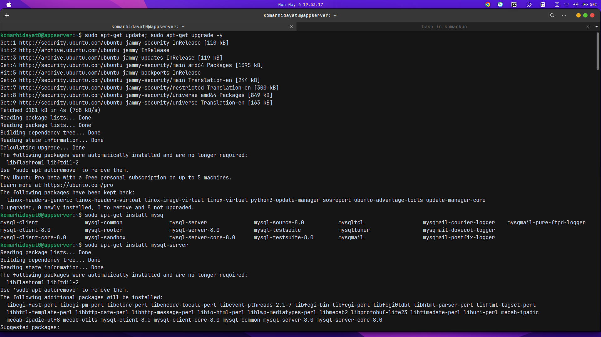
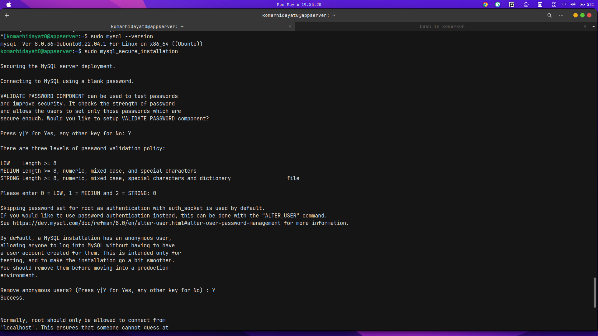
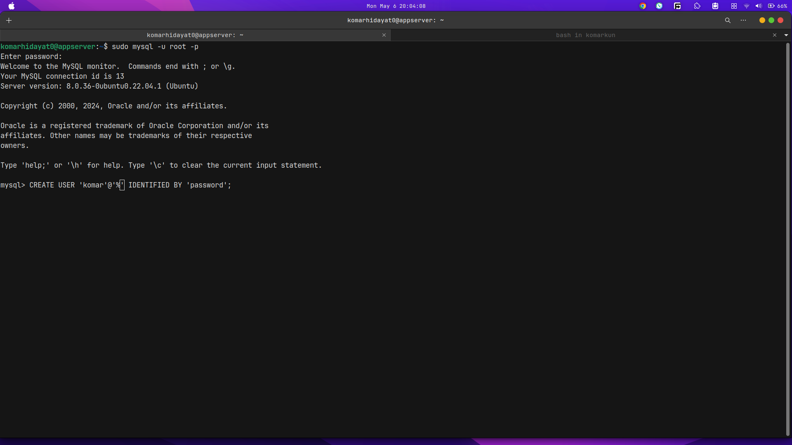
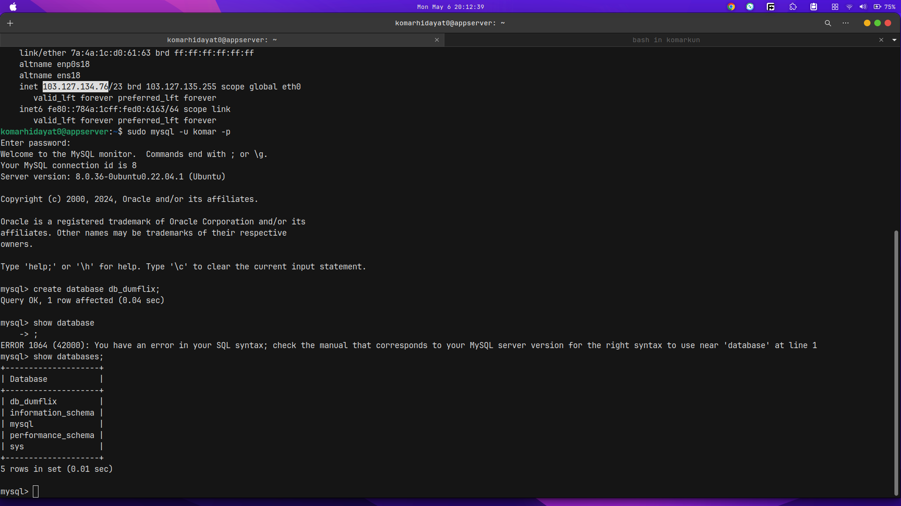
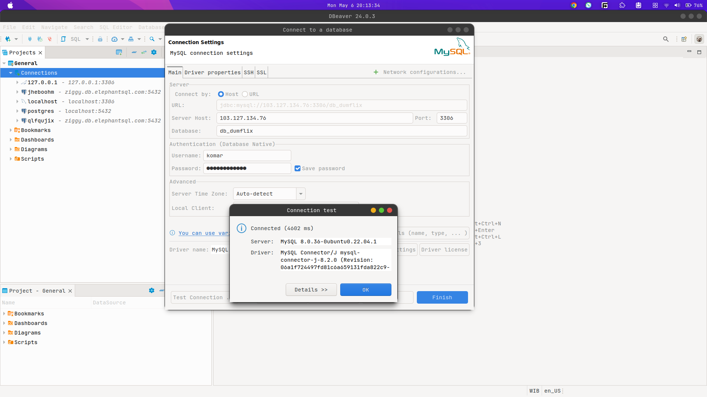
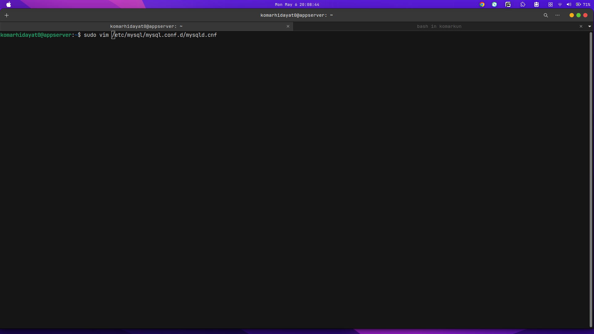
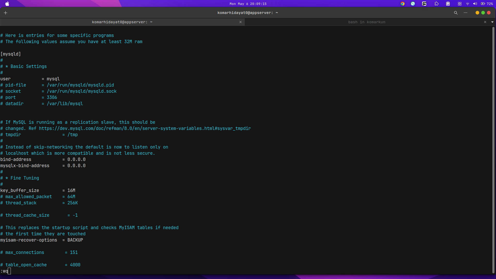
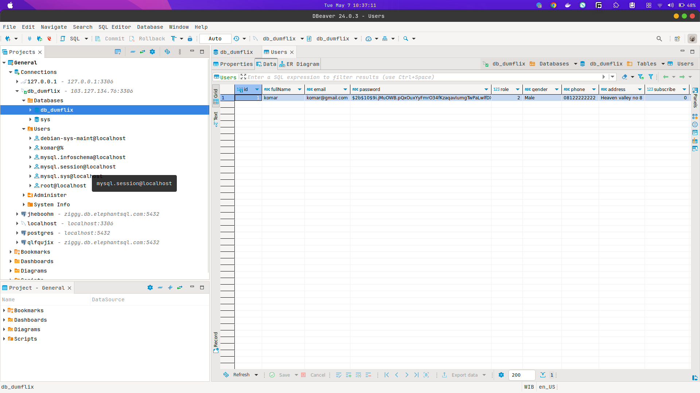

# Tugas devops Dumbways Week 2 Stage 2

Repository :
[Dumbflix Backend](https://github.com/dumbwaysdev/dumbflix-backend)

Tasks :

- Deploy database mysql
  - Setup secure_installation
  - Add password for `root` user
  - Create new user for mysql
  - Create new database
  - Create privileges for new users so they can access the database you created
  - Dont forget to change the mysql bind address on `/etc/mysql/mysql.conf.d/mysqld.cnf`
  - Try to remote your database from your local computer or gateway server
- Deploy aplikasi Wayshub-Backend
  - Clone wayshub backend application
  - Use Node Version 14
  - Dont forget to change configuration on `wayshub-backend/config/config.json` and then adjust it to your database.
  - Install sequelize-cli
  - Running migration
  - Deploy apllication on Top PM2

# Jawaban Tugas

## Deploy database mysql

### Setup secure_installation

Untuk menggunakan database mysql kita perlu install database mysql nya dulu di terminal linux nya dengan perintah:

```bash
# update repository apt supaya security nya terbaru
sudo apt-get update

# upgrade repository apt yg tersedia (jika ada)
sudo apt-get -y upgrade

# install mysql-server untuk menggunakan databases
sudo apt-get install -y mysql-server

# cek instalation mysql
sudo mysql --version
```



Untuk secure installation bisa menggunakan perintah:

```bash
sudo mysql_secure_installation
```



### Add password for `root` user

untuk mengubah password root yang default nya adalah kosong atau tampa password bisa menggunakan perintah di terminal mysql :

```mysql
# command to set password root
SET PASSWORD FOR 'root'@'localhost' = PASSWORD('mypass');

# command to reload mysql
FLUSH PRIVILEGES;
```

setelah password di setup kita bisa login di terminal bash linux dengan password baru :

```bash
sudo mysql -u root -p
```

### Create new user for mysql

untuk membuat user baru kita masuk ke terminal mysql dan wajib login pakai root lalu masukan perintah:

```
# untuk buat user dengan ip localhost saja
CREATE USER 'komar'@'localhost'IDENTIFIED BY 'password';

# untuk buat user dengan allow semua ip
CREATE USER 'komar'@'%'IDENTIFIED BY 'password';
```



setelah kita buat user kita juga perlu tambahkan privileges supaya si user baru bisa menjalankan perintah sesuai harapan yang di inginkan seperti membuat table, database, dll dengan perintah:

```
# mengizinkan user menggunakan database dan table
GRANT PRIVILEGE ON database.table TO 'username'@'host';

# mengizinkan user menggunakan beberapa privileges
GRANT CREATE, ALTER, DROP, INSERT, UPDATE, DELETE, SELECT, REFERENCES, RELOAD on *.* TO 'komar'@'localhost' WITH GRANT OPTION;

# mengizinkan semua privileges ke user
GRANT ALL PRIVILEGES ON *.* TO 'komar'@'localhost' WITH GRANT OPTION;
```

setelah privileges di setup kita bisa login dengan user tersebut ke mysql nya. dan untuk login bisa dengan method biasa atau kita juga bisa menggunakan aplikasi lain seperti DB-eaver CE untuk login ke database dan menjalankan mysql secara GUI

login seperti biasa

```bash
sudo mysql -u komar -p
```



login menggunakan DB-eaver CE


### Create new database

untuk membuat database baru di terminal mysql bisa menggunakan perintah:

```
CREATE DATABASE db_dumbflix;
```

### Create privileges for new users so they can access the database you created

karena user saya (komar) sudah di GRANT all privileges jadi user juga sudah bisa membuat database langsung

```
# mengizinkan user menggunakan database dan table
GRANT PRIVILEGE ON database.table TO 'username'@'host';

# mengizinkan user menggunakan beberapa privileges
GRANT CREATE, ALTER, DROP, INSERT, UPDATE, DELETE, SELECT, REFERENCES, RELOAD on *.* TO 'komar'@'localhost' WITH GRANT OPTION;

# mengizinkan semua privileges ke user
GRANT ALL PRIVILEGES ON *.* TO 'komar'@'localhost' WITH GRANT OPTION;
```

### change the mysql bind address on `/etc/mysql/mysql.conf.d/mysqld.cnf`

Agar database kita bisa di akses oleh aplikasi yang berjalan di luar server kita misalnya, kita harus mengubah beberapa konfigurasi yang berada di file /etc/mysql/mysql.conf.d/mysqld.cnf





Konfigurasi yang di ubah:

```
bind-address = 0.0.0.0
mysql-bind-address = 0.0.0.0
```

ini supaya kita bisa login dimanapun dengan ip yang lain atau di vm machine yang lain ip nya, dan ip 0.0.0.0 ini supaya kita bisa allow from anywhere ini mirip seperti yang ada di mongodb atlas.

### Try to remote your database from your local computer or gateway server

untuk remote ke database kita karena kita sudah atur konfigurasi dari mysql nya kita bisa login atau remote ke database tersebut dari mana saja. disini saya mencontohkan login memakai aplikasi DB-eaver CE agar kita bisa mengtur database secara Graphical User Interface.


tinggal masukan saja server host, username, password, port dan nama database nya


## Deploy aplikasi Wayshub-Backend
