# Tugas devops Dumbways Week 3 Stage 2

## DAY 3 CI/CD with Gitlab

Tasks :
[ Gitlab ]

- Buat akun di gitlab.com
- push SCM kalian dari local-server ke gitlab
- Buatlah beberapa Job menggunakan gitlabci untuk aplikasi kalian
  - Job Frontend
  - Untuk script CICD atur flow pengupdate an aplikasi se freestyle kalian dan harus mencangkup
    - Pull dari repository
    - Dockerize/Build aplikasi kita
    - push image ke docker hub
    - Test application
    - pull new image
    - Deploy application
- GitlabCI notification to discord

## JAWABAN

### Buat akun di gitlab.com

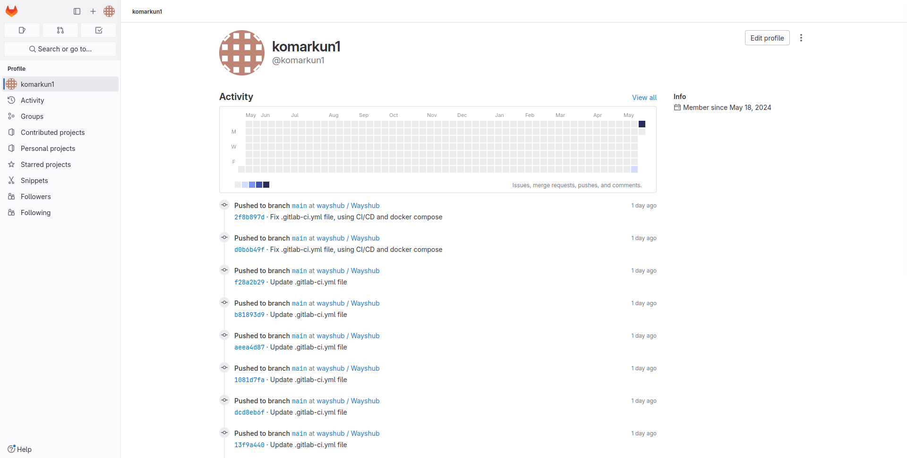

### push SCM kalian dari local-server ke gitlab

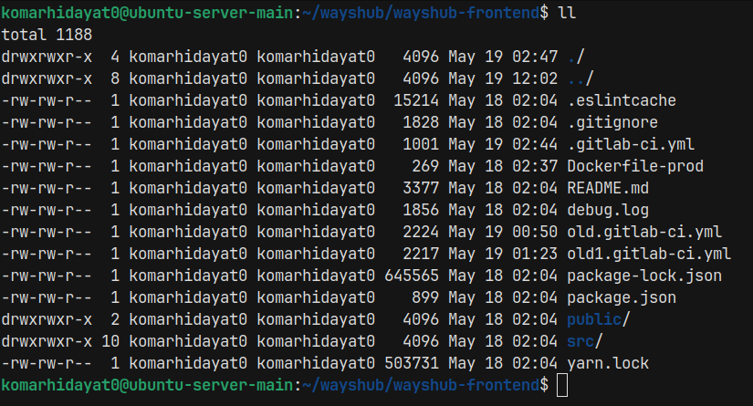

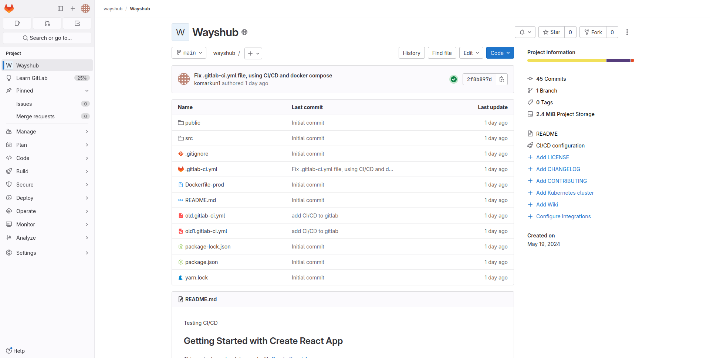

### Buatlah beberapa Job menggunakan gitlabci untuk aplikasi kalian Job Frontend

```yaml
stages:
  - pull
  - build
  - test
  - deploy
  - push

pull_image:
  stage: pull
  before_script:
    - chmod 400 $SSH_PRIVATE_KEY
  script:
    - ssh -o StrictHostKeyChecking=no -i $SSH_PRIVATE_KEY $USERNAME@$BUILD_HOST "
      cd $WORKDIR &&
      git pull"

build_image:
  stage: build
  before_script:
    - chmod 400 $SSH_PRIVATE_KEY
  script:
    - ssh -o StrictHostKeyChecking=no -i $SSH_PRIVATE_KEY $USERNAME@$BUILD_HOST "
      cd $WORKDIR &&
      docker build -t $DOCKER_IMAGE -f Dockerfile-prod . "

test_images:
  stage: test
  before_script:
    - chmod 400 $SSH_PRIVATE_KEY
  script:
    - ssh -o StrictHostKeyChecking=no -i $SSH_PRIVATE_KEY $USERNAME@$BUILD_HOST "
      docker run -d -p 3005:80 --name testconn $DOCKER_IMAGE &&
      if wget -q --spider http://127.0.0.1:3005/; then echo 'Website up'; else echo 'Website down'; fi &&
      docker stop testconn &&
      docker rm testconn"

deploy:
  stage: deploy
  before_script:
    - chmod 400 $SSH_PRIVATE_KEY
  script:
    - ssh -o StrictHostKeyChecking=no -i $SSH_PRIVATE_KEY $USERNAME@$BUILD_HOST "
      cd $DEPLOY_DIR &&
      docker compose -f docker-compose-frontend.yaml down &&
      docker compose -f docker-compose-frontend.yaml up -d"

push_image:
  stage: push
  image: docker:latest
  services:
    - docker:dind
  variables:
    DOCKER_TLS_CERTDIR: "/certs"
  before_script:
    - docker login -u $DOCKER_REGISTRY_USERNAME -p $DOCKER_REGISTRY_PASSWORD
  script:
    - docker build -t $DOCKER_IMAGE -f Dockerfile-prod .
    - docker push $DOCKER_IMAGE
```

setiap ada perubahan code maka akan langsung ke auto trigger kalau di gitlab CI/CD dan langsung akan menjalankan pipeline

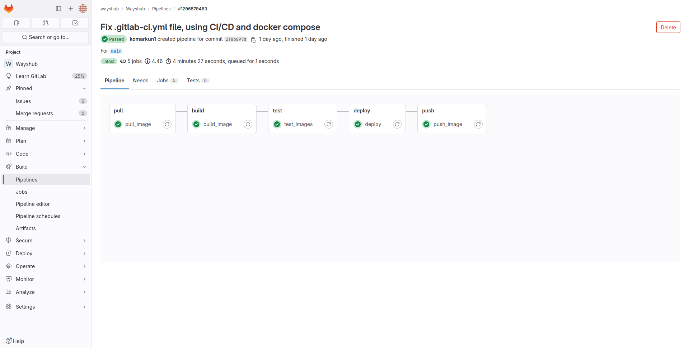

### Penjelasan pipeline

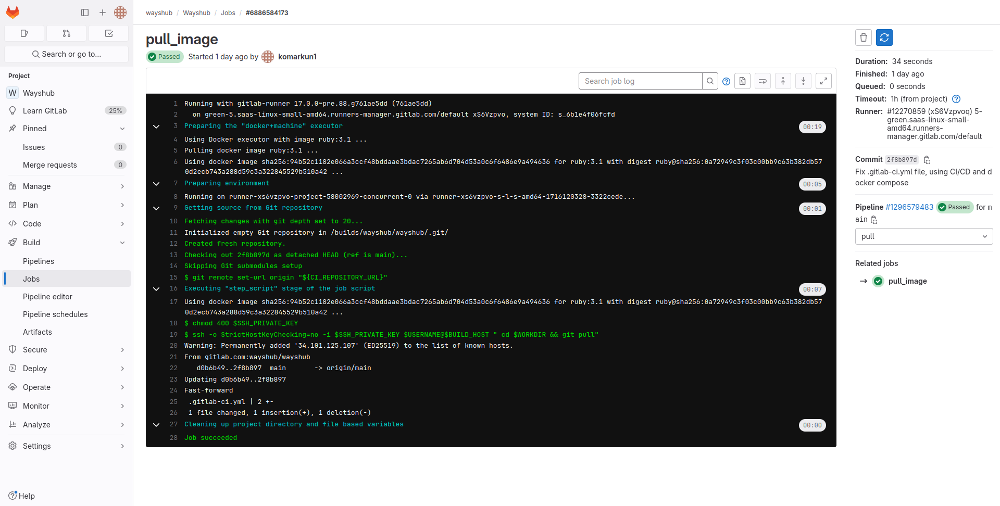
Pull dari repository

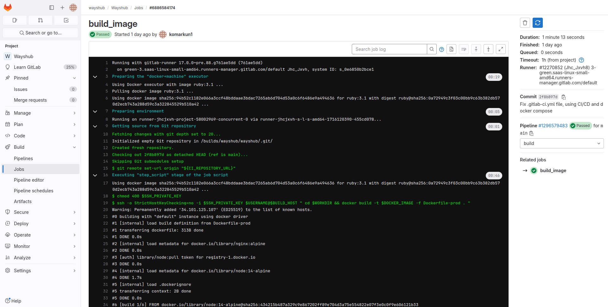
Dockerize/Build aplikasi kita

Test application
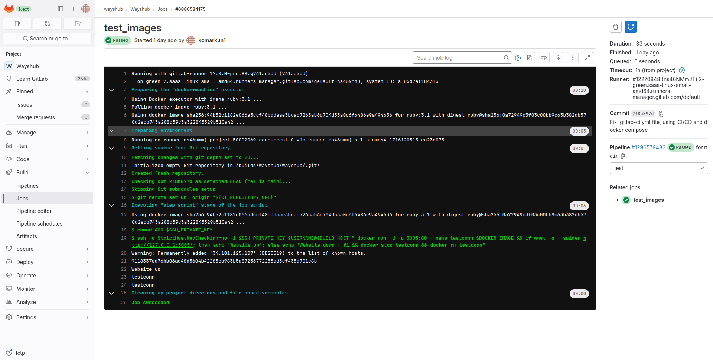

Deploy application
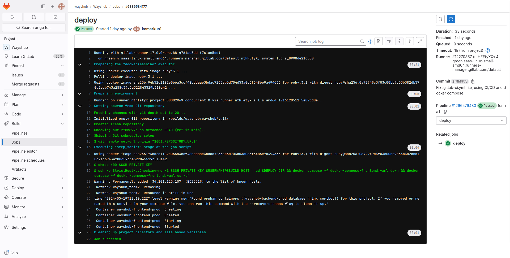

push image ke docker hub
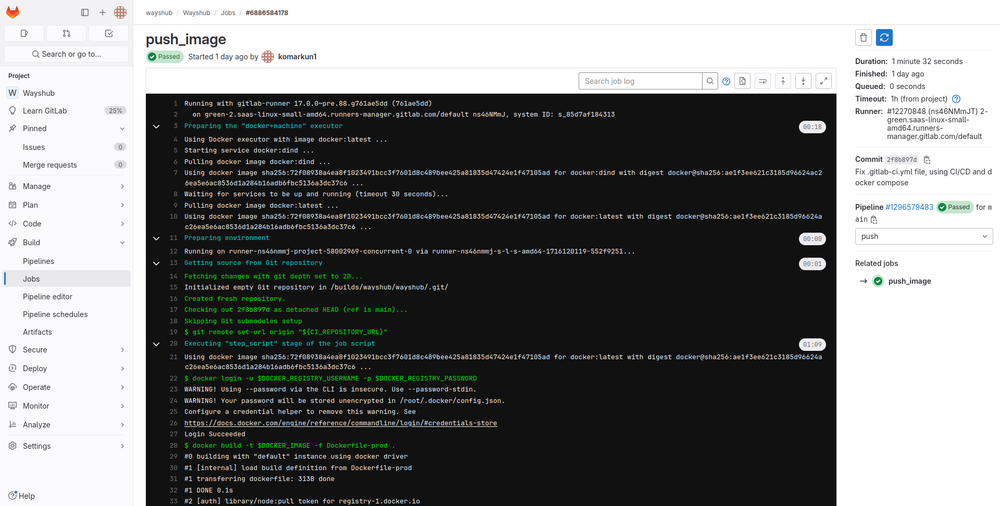

### GitlabCI notification to discord

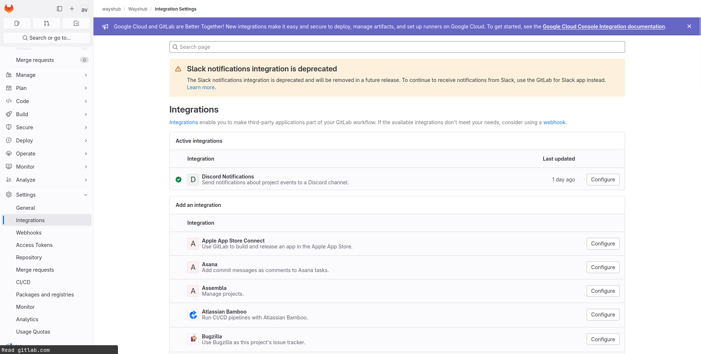

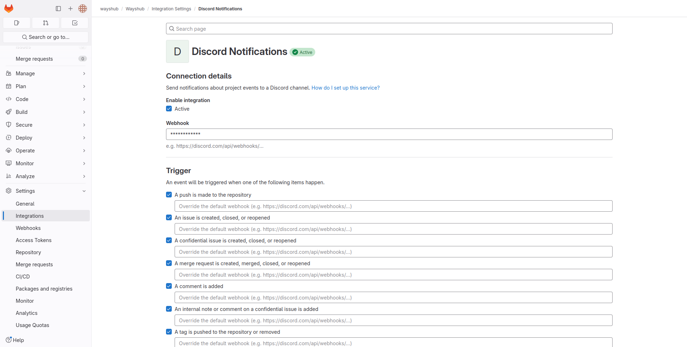

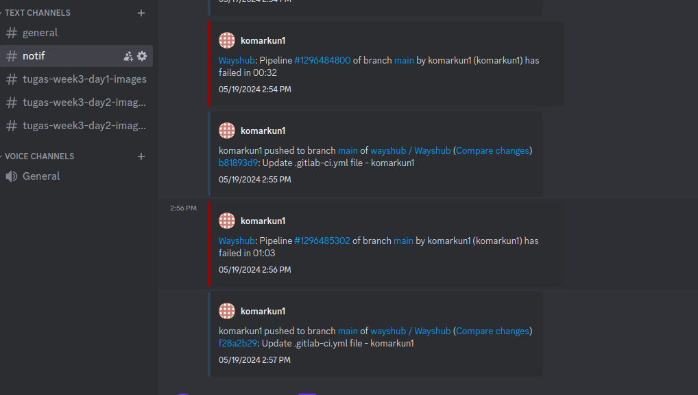
