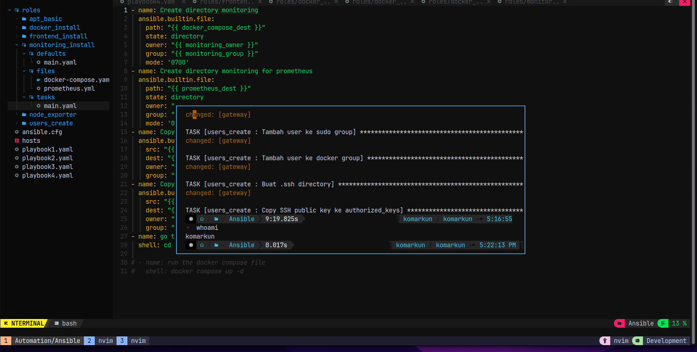
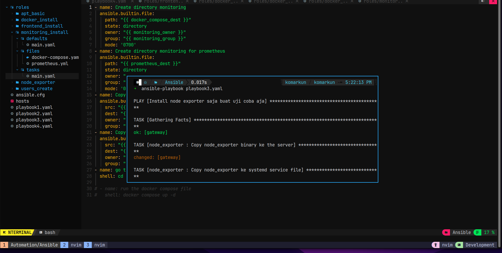
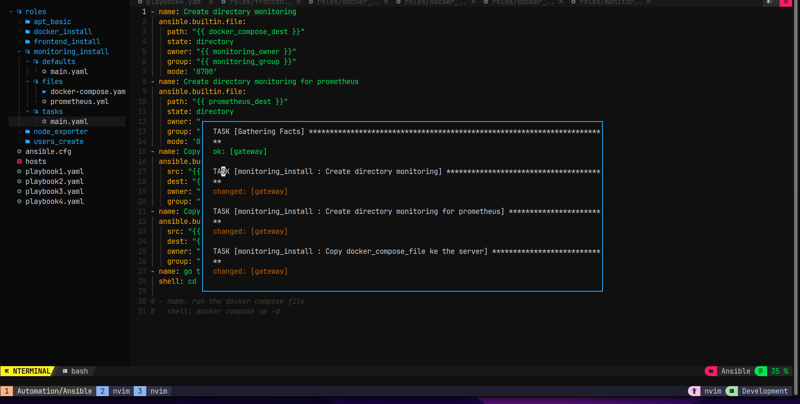
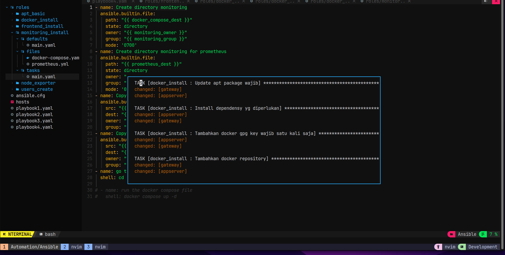

# Tugas Devops dumbways Week 4 day 3 Ansible & Ansible playbook

[Local]
Buat konfigurasi Ansible & sebisa mungkin maksimalkan penggunaan ansbile untuk melakukan semua setup dan se freestyle kalian

[ansible]
Buatlah ansible untuk :

- Membuat user baru beserta generate ssh-key nya, lalu test masuk ke user tersebut.
- Instalasi Docker
- Deploy application frontend yang sudah kalian gunakan sebelumnya menggunakan ansible.
- Instalasi Monitoring Server (node exporter, prometheus, grafana)
- Setup reverse-proxy
- Generated SSL certificate
- dan yang paling penting make your own kind ansible script dengan rapi dan jelas. dan sebisa mungkin jangan **MENCONTEK** milik teman lain karena script akan terlihat sekali perbedaan nya di materi ansible ini.
- agar script terlihat rapi, implementasikan penggunaan variable di script kalian.
- simpan script kalian ke dalam github dengan format tree sebagai berikut:

```sh
  Automation
  |
  | Terraform
  └─|  └── main.tf
    Ansible
    ├── ansible.cfg
    ├── lolrandom1.yaml
    ├── group_vars
    │ └── all
    ├── Inventory
    ├── lolrandom2.yaml
    └── lolrandom3.yaml
```

# JAWABAN

Untuk menggunakan Ansible dan ansible playbook, kita perlu menginstall aplikasinya dulu bisa di local komputer kita atau pun diserver manapun. disini saya untuk penginstallan sendiri menggunakan homebrew.


setelah ansibel sudah di siapkan aplikasinya, kita langusng siapkan saja directory nya. structur dirctory yg saya buat disini adalah sebagai berikut.

i
Membuat user baru beserta generate ssh-key nya, lalu test masuk ke user tersebut.

Instalasi Docker


Deploy application frontend yang sudah kalian gunakan sebelumnya menggunakan ansible.


Instalasi Monitoring Server (node exporter, prometheus, grafana)


contoh running the ansible books







# Untuk Semua Script lihat saja di folder Automation yang ada di week 4
