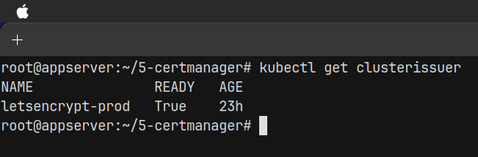

# Tugas Devops dumbways Week 4 Kubernetes

**Kubernetes Tasks**

1. Buatlah sebuah cluster menggunakan k3s yang berisikan 2 node as a master and worker.
2. Install ingress nginx using helm or manifest
3. Deploy frontend, Backend kalian ke kubernetes. (bebas menggunakan apps apa)
4. Setup persistent volume on k3s config
5. Deploy database mysql with statefullset and use secrets

# Jawaban

## Create cluster

Untuk membuat cluster K3s kita wajib lihat dokumentasi resmi dari k3s nya untuk instalasi master node terlebih dahulu, setelah master node dibuat tinggal kita lakukan join saja untuk para worker node nya dengan menggunakan ip address dari master dan juga token khusus dari master node.

```bash
# command install K3S master
curl -sfL https://get.k3s.io | sh -

# Get token
sudo cat /var/lib/rancher/k3s/server/node-token

# Get IP address
hostname -I

# command Join K3S worker node to master node
curl -sfL https://get.k3s.io | K3S_URL=https://myserver:6443 K3S_TOKEN=mynodetoken sh -
```

example cluster master telah dibuat dan berhasil join dengan para workernya


## Install Nginx using helm

untuk menggunakan helm kita wajib install dulu aplikasinya merujuk dokumentasi resminya tentunya.

```bash
# Ubuntu

curl https://baltocdn.com/helm/signing.asc | gpg --dearmor | sudo tee /usr/share/keyrings/helm.gpg > /dev/null

sudo apt-get install apt-transport-https --yes

echo "deb [arch=$(dpkg --print-architecture) signed-by=/usr/share/keyrings/helm.gpg] https://baltocdn.com/helm/stable/debian/ all main" | sudo tee /etc/apt/sources.list.d/helm-stable-debian.list

sudo apt-get update

sudo apt-get install helm
```


install nginx nya pakai helm

```bash
# add repo nginx
helm repo add ingress-nginx https://kubernetes.github.io/ingress-nginx
helm repo update

# install
helm install ingress-nginx ingress-nginx/ingress-nginx

# verify
kubectl get pods -n default -l app.kubernetes.io/name=ingress-nginx
```

## setup secrets

untuk menyimpan variable secara aman kita wajib menggunakan fitur kubernetes secret. variable nya terlebih dahulu kita encode base64 sebelum kita menaruhnya di file secret.yaml nya.


```yaml
apiVersion: v1
kind: Secret
metadata:
  name: mysql-secret
type: Opaque
data:
  mysql-root-password: cGFzc3dvcmQ= # base64 encoded 'password'
  mysql-user: dXNlcg== # base64 encoded 'user'
  mysql-password: cGFzc3dvcmQ= # base64 encoded 'password'
```

setelah variable sudah siap kita jalankan perintah kubectl untuk menggaplikasikan secret service tersebut

```bash
# apply
kubectl apply -f secret.yaml

# cek
kubectl get -n namespace secret
```


## setup PV & PVC

untuk membuat pv dan pvc kita bisa mendefine kan yaml configuration untuk hal tersebut.

```yaml
apiVersion: v1
kind: PersistentVolume
metadata:
  name: pv
spec:
  capacity:
    storage: 1Gi
  accessModes:
    - ReadWriteOnce
  hostPath:
    path: "/data/my-pv"
---
apiVersion: v1
kind: PersistentVolumeClaim
metadata:
  name: pvc
spec:
  accessModes:
    - ReadWriteOnce
  resources:
    requests:
      storage: 1Gi
```

kita langusng apply saja sama seperti sebelumnya.


kita cek juga data nya di hostkita


## setup Mysql

untuk setup mysql kita bisa menggunakan kind yg bertipe statefullstate

```yaml
apiVersion: apps/v1
kind: StatefulSet
metadata:
  name: mysql
spec:
  serviceName: "mysql"
  replicas: 1
  selector:
    matchLabels:
      app: mysql
  template:
    metadata:
      labels:
        app: mysql
    spec:
      containers:
        - name: mysql
          image: mysql:5.7
          ports:
            - containerPort: 3306
          env:
            - name: MYSQL_ROOT_PASSWORD
              valueFrom:
                secretKeyRef:
                  name: mysql-secret
                  key: mysql-root-password
            - name: MYSQL_USER
              valueFrom:
                secretKeyRef:
                  name: mysql-secret
                  key: mysql-user
            - name: MYSQL_PASSWORD
              valueFrom:
                secretKeyRef:
                  name: mysql-secret
                  key: mysql-password
          volumeMounts:
            - name: mysql-persistent-storage
              mountPath: /var/lib/mysql
  volumeClaimTemplates:
    - metadata:
        name: mysql-persistent-storage
      spec:
        accessModes: ["ReadWriteOnce"]
        resources:
          requests:
            storage: 1Gi
```

kita apply juga dan kita cek konfigurasinya juga


## deploy aplikasi frontend dan backend

```yaml
apiVersion: apps/v1
kind: Deployment
metadata:
  name: backend
spec:
  replicas: 1
  selector:
    matchLabels:
      app: backend
  template:
    metadata:
      labels:
        app: backend
    spec:
      containers:
        - name: backend
          image: your-backend-image:latest
          ports:
            - containerPort: 3000
---
apiVersion: v1
kind: Service
metadata:
  name: backend
spec:
  selector:
    app: backend
  ports:
    - protocol: TCP
      port: 80
      targetPort: 3000
```

tiggal apply saja sama seperti biasanya dan cek pod running nya..


cek juga di browser


```yaml
apiVersion: apps/v1
kind: Deployment
metadata:
  name: backend
spec:
  replicas: 1
  selector:
    matchLabels:
      app: backend
  template:
    metadata:
      labels:
        app: backend
    spec:
      containers:
        - name: backend
          image: your-backend-image:latest
          ports:
            - containerPort: 3000
---
apiVersion: v1
kind: Service
metadata:
  name: backend
spec:
  selector:
    app: backend
  ports:
    - protocol: TCP
      port: 80
      targetPort: 3000
```


## Certmanager

cert manager adalah aplikasi di kubernetes untuk menghasilkan ssl sertificate yang di gunakan untuk mengamankan web kita jadinya akan menjadi https.

isntall dulu cert manager lewat helm

```bash
helm repo add jetstack https://charts.jetstack.io
helm repo update
helm install \
  cert-manager jetstack/cert-manager \
  --namespace cert-manager \
  --create-namespace \
  --version v1.11.0 \
  --set installCRDs=true

```

kita buat juga cluster issuer

```yaml
apiVersion: cert-manager.io/v1
kind: ClusterIssuer
metadata:
  name: letsencrypt-prod
spec:
  acme:
    server: https://acme-v02.api.letsencrypt.org/directory
    email: komarganteng@gmail.com
    privateKeySecretRef:
      name: letsencrypt-prod
    solvers:
      - http01:
          ingress:
```

kita apply cluster issuer nya lasu jika sudah running tinggal buat saja ingress nya



contoh ingress configuration dalam bentuk yaml

```yaml
apiVersion: networking.k8s.io/v1
kind: Ingress
metadata:
  name: backend-ingress
  annotations:
    nginx.ingress.kubernetes.io/rewrite-target: /
spec:
  rules:
    - host: komarganteng.com
      http:
        paths:
          - path: /
            pathType: Prefix
            backend:
              service:
                name: backend
                port:
                  number: 80
```

tinggal di aplly saja nanti aplikasi kita bisa running dan berjalan lancar dengan menggunkan https protokol


