# Tugas devops Dumbways Week 1

## Task :

1. Perbedaan antara IP Private & Public, serta IP Dynamic & Static!
2. Buat penjelasan singkat tentang Virtualization!
3. Buat rancangan sebuah jaringan dengan spesifikasi sebagai berikut! - CIDR Block : 192.168.1.xxx/24 - Subnet : 255.255.255.0 - Gateway : 192.168.1.1
   (Gunakan app.diagrams.net untuk membuat diagramnya, Referensi gambar sudah disertakan)
4. Buat step-by-step untuk menginstall Virutal Machine via VMware, Virtualbox atau VM pilihan kalian!

## Jawaban :

1. Penjelasan IP

### Perbedaan IP Privat & Public

- IP Privat

  Bsiasanya digunakan untuk Router dan Semua Device yang berada di dalam area jangkauannya. atau bisa juga diartikan jaringan privat ini penggunaannya hanya untuk pribadi dan khususuntuk di local saja. karena tidak semua orang dari luar jaringan bisa mengakses ke dalam IP kita, hanya orang dengan IP yang terhubung ke jaringan privat saja (jaringan yg sama) saja yg bisa terhubung satu sama lain di jaringan tersebut.

```
Spesifikasi IP Privat:
1. Class Type C / Default subnet mask (255.255.255.0)
artinya hanya angka 0 saja atau blok ke 4 yg bisa di isi oleh angka ip sesuai
keinginan kita
2.Maksimal Host per network 254 jumlah total host yg bisa di
gunakan terbatas cuma 254
3. slash Notation /24
Contoh: Defauld Route :
192.168.0.1 (class type C (255.255.255.0))
IPv4 Address : 192.168.0.200 (angka 200 bisa di ganti apapun asal dalam range 0 - 254)
```

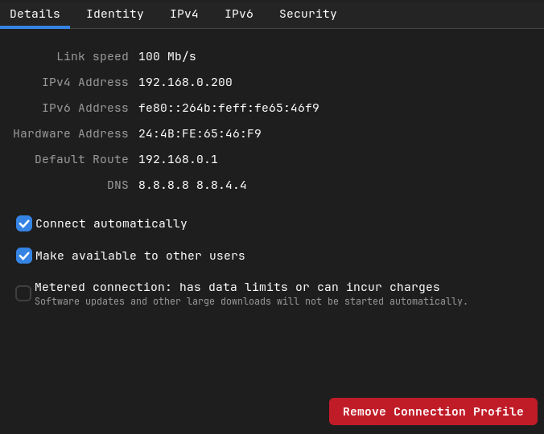

- IP Public

  Biasanya di gunakan untuk umum atau public, contohnya adalah penggunaan mobile data untuk smartphone. saat kita terkonek ke jaringan mobile data nanti ip kita itu akan public dan bisa di akses kapan saja untuk menjelajah internet dan ip nya selalu random saat data dimatikan atau meggunakan mode pesawat. contoh lain untuk public adalah ip untuk domain web site di internet. semua website punya ip nya terendiri termasuk misalnya facebook.com adalah nama domain tapi dia juga punya ip public yaitu 163.70.151.35 ini bisa di akses di internet tapi lebih baik akses ke web site itu pakai domain aja karena kalau mengakses web pakai ip saja tidak direkomendasikan

```
Spesifikasi IP Public:
1. Class Type A / Default subnet mask (255.0.0.0) artinya blok 2 - 3 bisa di ganti apapun angkanya
2. slash notation /8
3. Maksimal host banyak bisa sampai ribuan

contoh:
domain: facebook.com
ip public : 167.70.151.35 ini pakai converter online host to ip
```


### Perbedaan IP Dynamic dan IP Statis

- IP Dynamic atau otomatis adalah IP yang bisa dapat berubah setiap waktu misal dalam kondisi laptop dimatikan atau data eternet/wifi dimatikan maka IP di komputer kita nya akan berubah2 atau dinamic. biasa nya bernama DHCP berasal dari kepanjangan Dynamic Host Configuration Protocol. dan semua configurasi sudah otomatis di buatkan oleh sistem jadi gausah ribet atur sendiri ygy dan siap pake ip nya enjoy aman gausah ribet cuy.

contoh:


- IP Static atau manual adalah IP yg konfigurasinya harus manual dan memasukan data requirement yg dibutuhkan sesuai dengan keinginan kita agar kita bisa memperoleh ip biar bisa connect ke internet, misal subnet mask, gateway, ip adderess, dns dll harus di setting manual. ip ini bersifat static atau tidak akan berubah saat kita sudah mengatur ip configurasinya meskipun kita mematikan komputer atau laptop jaringann ip nya akan tetap sama

contoh:


2. Penjelasan Virtualization

Virtualization adalah metode untuk memvirtualkan atau menanpilkan sesuatu misalnya saja virtual machine adalah proses memvirtualkan atau menampil kan sebuah machine. machine disini memiliki artia bisa saja sebuah alat atau operating system secara lengkap dan utuh. contoh memvirtualkan operasi linux, windows dll menggunakan aplikasi bisa virtialbox bisa juga vmware atau bisa juga dengan cloud platflorm seperti aws EC2 untuk membuat dan menampilkan virtual machine atau google cloude platform (compute engine) yg berfungsi sama seperti aws EC2 tapi dari google aja gitu.

contoh virtualization (virtual machine) di Local pakai VirtualBox
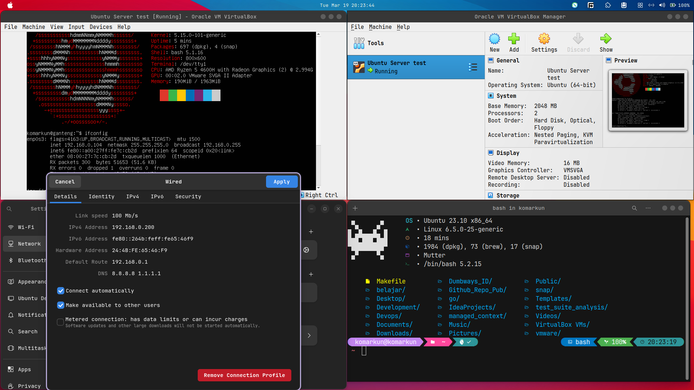

3. Rancangan Jaringan

Contoh EXample Rancangan jaringan di rumah saya INI gat tau benar atau enggak, karena kebenaran hanya milik ALLAH SWT


4. step by step install virtual machine di virtual box

- Install dulu aplikasi virtual box nya di official resme oracle virtual box

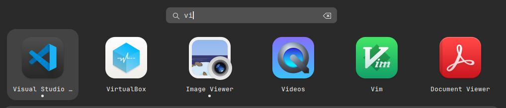

- Create New virtual machine state (Ubuntuserver)
  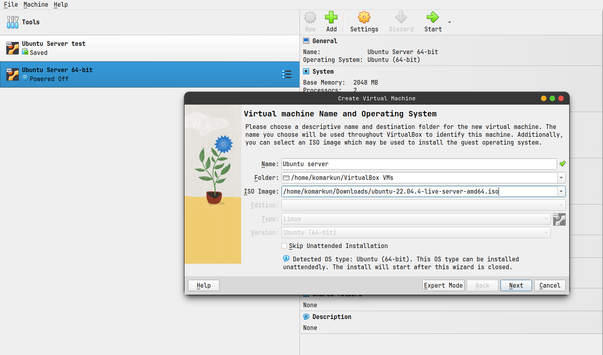

* Buat Username and password buat di virtual boxnya
  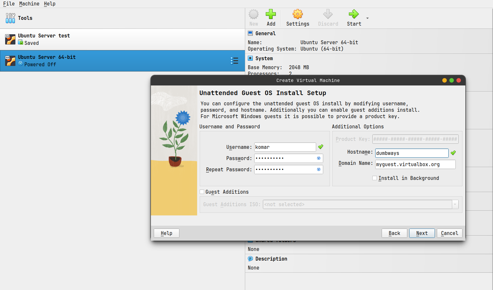
* Atur jumlah memory ram dan prosesor
  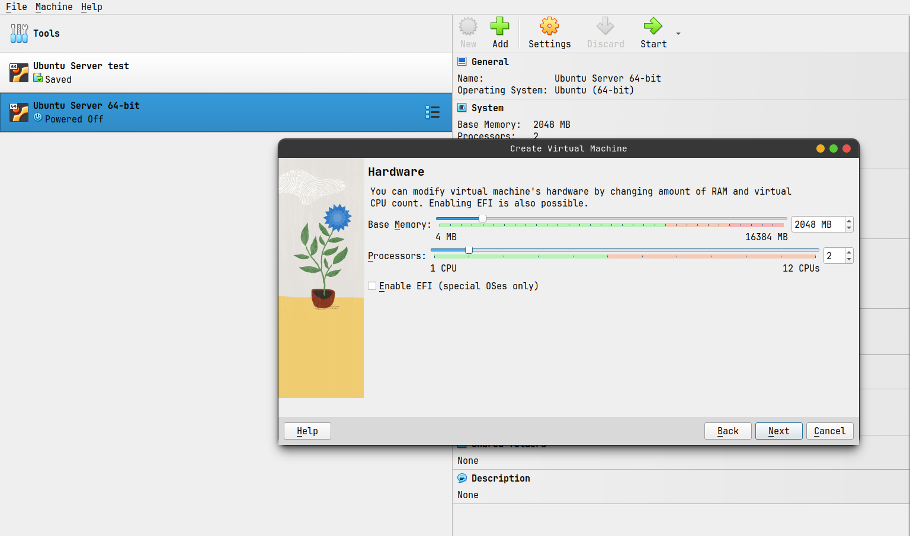
* Tentukan jumlah Virtual storage
  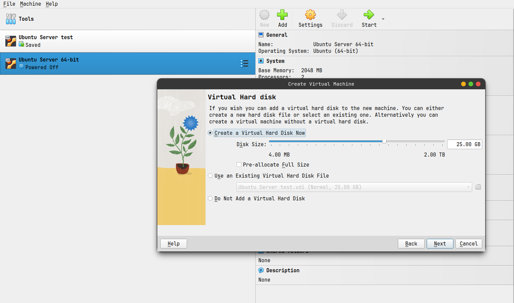
* Check kembali sebelum mulai
  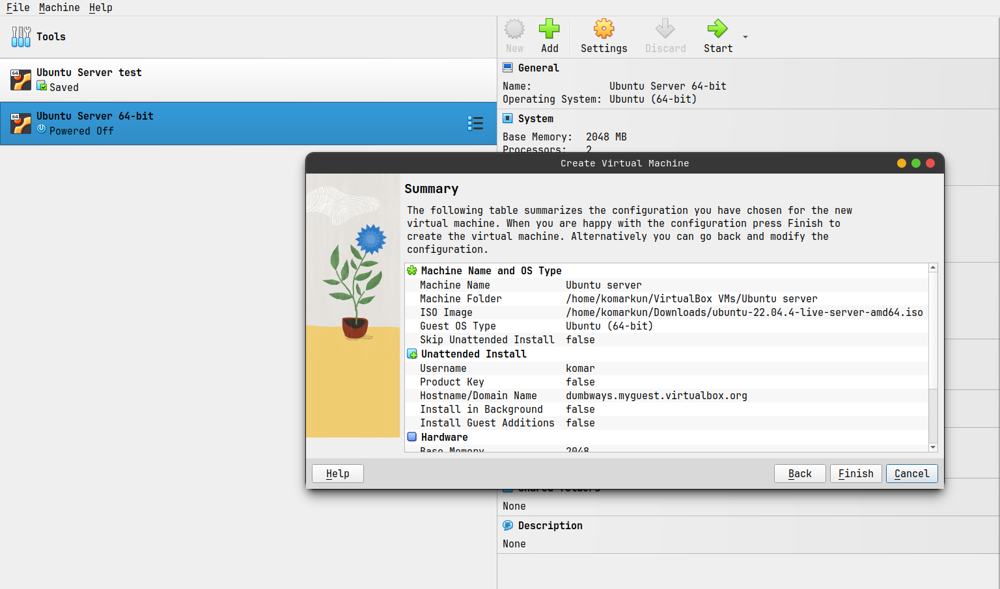
* Setting Network adaptor pilih yang brige connection karena mau di set static IP
  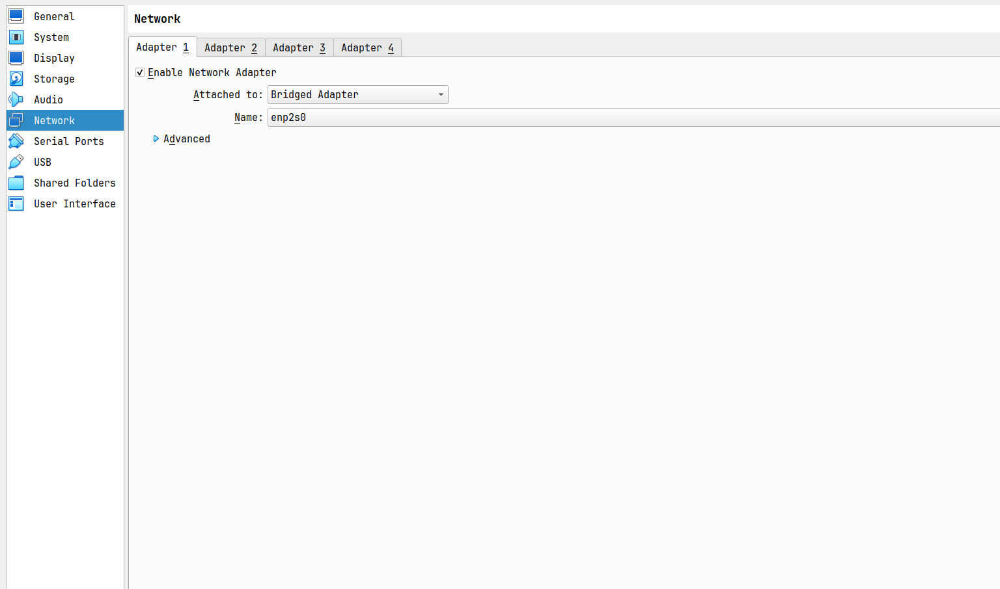
* run virtual machine dan pilih bahasa
  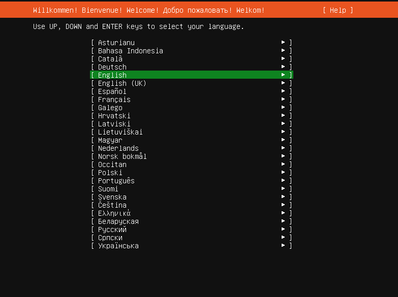
* pilih keyboard layout dan configuration
  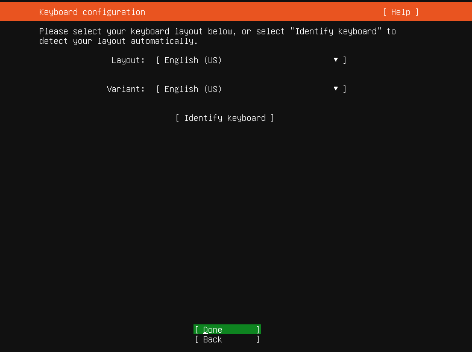
* pilih type install
  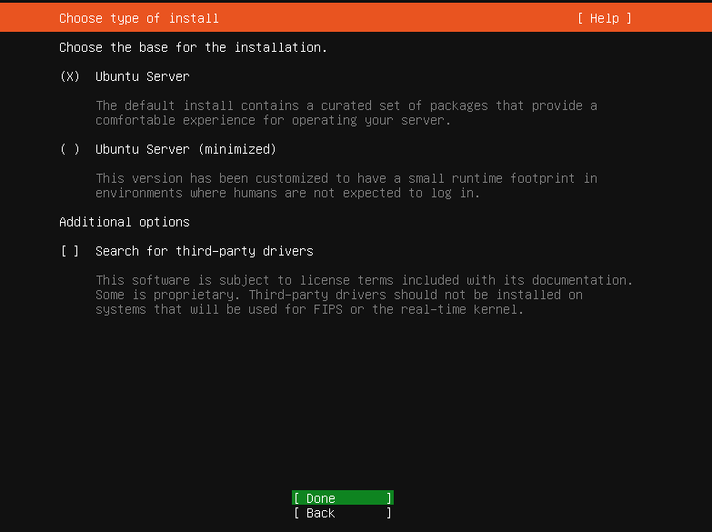
* Atur IPV4 NETWORK supaya static dan pilih manual
  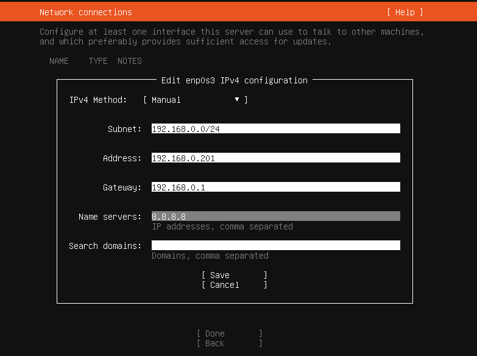
* Check network connection
  
* atur storage ilang ssan nya partisi ext4 "/" 15 gb, partisi "swap" 5gb

* FINAL Hasil
  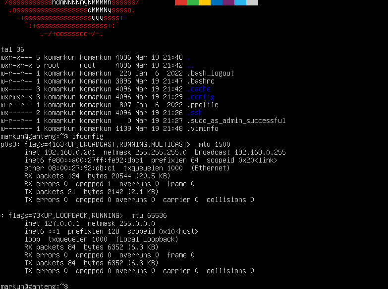
