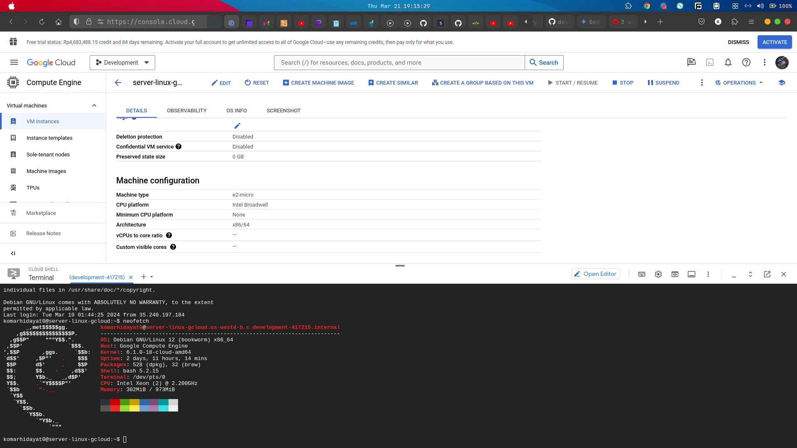

## 1. Perbedaan antara IP Private & Public, serta IP Dynamic & Static!

## 2. Buat penjelasan singkat tentang Virtualization!

## Jawaban :

1. Penjelasan IP

### Perbedaan IP Privat & Public

- IP Privat

  Bsiasanya digunakan untuk Router dan Semua Device yang berada di dalam area jangkauannya. atau bisa juga diartikan jaringan privat ini penggunaannya hanya untuk pribadi dan khususuntuk di local saja. karena tidak semua orang dari luar jaringan bisa mengakses ke dalam IP kita, hanya orang dengan IP yang terhubung ke jaringan privat saja (jaringan yg sama) saja yg bisa terhubung satu sama lain di jaringan tersebut.

```
Spesifikasi IP Privat:
1. Class Type C / Default subnet mask (255.255.255.0)
artinya hanya angka 0 saja atau blok ke 4 yg bisa di isi oleh angka ip sesuai
keinginan kita
2.Maksimal Host per network 254 jumlah total host yg bisa di
gunakan terbatas cuma 254
3. slash Notation /24
Contoh: Defauld Route :
192.168.0.1 (class type C (255.255.255.0))
IPv4 Address : 192.168.0.200 (angka 200 bisa di ganti apapun asal dalam range 0 - 254)
```


- IP Public

  Biasanya di gunakan untuk umum atau public, contohnya adalah penggunaan mobile data untuk smartphone. saat kita terkonek ke jaringan mobile data nanti ip kita itu akan public dan bisa di akses kapan saja untuk menjelajah internet dan ip nya selalu random saat data dimatikan atau meggunakan mode pesawat. contoh lain untuk public adalah ip untuk domain web site di internet. semua website punya ip nya terendiri termasuk misalnya facebook.com adalah nama domain tapi dia juga punya ip public yaitu 163.70.151.35 ini bisa di akses di internet tapi lebih baik akses ke web site itu pakai domain aja karena kalau mengakses web pakai ip saja tidak direkomendasikan

```
Spesifikasi IP Public:
1. Class Type A / Default subnet mask (255.0.0.0) artinya blok 2 - 3 bisa di ganti apapun angkanya
2. slash notation /8
3. Maksimal host banyak bisa sampai ribuan

contoh:
domain: facebook.com
ip public : 167.70.151.35 ini pakai converter online host to ip
```


### Perbedaan IP Dynamic dan IP Statis

- IP Dynamic atau otomatis adalah IP yang bisa dapat berubah setiap waktu misal dalam kondisi laptop dimatikan atau data eternet/wifi dimatikan maka IP di komputer kita nya akan berubah2 atau dinamic. biasa nya bernama DHCP berasal dari kepanjangan Dynamic Host Configuration Protocol. dan semua configurasi sudah otomatis di buatkan oleh sistem jadi gausah ribet atur sendiri ygy dan siap pake ip nya enjoy aman gausah ribet cuy.

contoh:


- IP Static atau manual adalah IP yg konfigurasinya harus manual dan memasukan data requirement yg dibutuhkan sesuai dengan keinginan kita agar kita bisa memperoleh ip biar bisa connect ke internet, misal subnet mask, gateway, ip adderess, dns dll harus di setting manual. ip ini bersifat static atau tidak akan berubah saat kita sudah mengatur ip configurasinya meskipun kita mematikan komputer atau laptop jaringann ip nya akan tetap sama

contoh:


2. Penjelasan Virtualization

Virtualization adalah metode untuk memvirtualkan atau menanpilkan sesuatu misalnya saja virtual machine yang artinya proses memvirtualkan atau menampil kan sebuah machine. machine disini memiliki artia bisa saja sebuah alat atau operating system secara lengkap dan utuh. contoh memvirtualkan operasi linux, windows dll menggunakan aplikasi yang berjalan di local bisa pakai virtualbox bisa juga vmware atau bisa juga dengan cloud platflorm seperti aws EC2 untuk membuat dan menampilkan virtual machine atau google cloude platform (compute engine) yg berfungsi sama seperti aws EC2 tapi dari google.

contoh virtualization (virtual machine) di Local pakai VirtualBox


contoh virtualization (virtual machine) di cloud pakai google cloud


## Tugas pas g-meet

### cari perbedaan linux bukan ubuntu aja tapi yang lainnya

Package Behavior:

    Ubuntu:
        Menawarkan paket .deb yang mudah diinstal dan dihapus.
        Memiliki repositori software resmi yang luas dengan banyak pilihan aplikasi.
        Dukungan untuk PPA (Personal Package Archives) untuk menginstal software yang tidak tersedia di repositori resmi.
    Distribusi Lain:
        Beragam format paket, seperti .rpm, .tar.gz, dan AppImage.
        Repositori software yang bervariasi, beberapa mungkin lebih kecil atau kurang terawat.
        Dukungan untuk PPA mungkin tidak tersedia.

2. Filosofi dan Komunitas:

   Ubuntu:
   Berfokus pada kemudahan penggunaan dan aksesibilitas bagi pengguna baru.
   Memiliki komunitas yang besar dan aktif dengan banyak dokumentasi dan dukungan online.
   Didukung oleh Canonical, perusahaan yang menyediakan infrastruktur dan pengembangan.
   Distribusi Lain:
   Memiliki filosofi dan fokus yang beragam, seperti stabilitas, keamanan, minimalisme, atau privasi.
   Komunitas yang bervariasi dalam ukuran dan keaktifan.
   Dukungan bisa datang dari komunitas, yayasan, atau perusahaan.

3. Pilihan Desktop Environment:

   Ubuntu:
   GNOME sebagai desktop environment default.
   Pilihan untuk menginstal desktop environment lain seperti KDE Plasma, Xfce, dan LXDE.
   Distribusi Lain:
   Menawarkan desktop environment default yang bervariasi, seperti KDE Plasma, Xfce, LXDE, Cinnamon, dan Budgie.
   Pilihan desktop environment yang lebih beragam untuk diinstal.

4. Software Default:

   Ubuntu:
   Menyertakan software default untuk berbagai kebutuhan, seperti LibreOffice, Firefox, Thunderbird, dan GIMP.
   Pilihan software default yang lebih konservatif.
   Distribusi Lain:
   Software default yang bervariasi tergantung pada fokus dan filosofi distribusi.
   Pilihan software default yang lebih beragam dan terfokus.

5. Tingkat Kustomisasi:

   Ubuntu:
   Menawarkan kemudahan kustomisasi melalui GUI dan alat konfigurasi.
   Pengalaman yang lebih terarah dan terkontrol.
   Distribusi Lain:
   Menawarkan tingkat kustomisasi yang lebih tinggi dengan akses ke konfigurasi tingkat lanjut.
   Pengalaman yang lebih fleksibel dan terbuka bagi pengguna yang berpengalaman.

Faktor yang Menyebabkan Perbedaan:

- Filosofi dan fokus distribusi: Setiap distribusi memiliki tujuan dan target penggunanya sendiri.
- Komunitas dan sumber daya: Ukuran dan keaktifan komunitas memengaruhi pengembangan dan dukungan.
- Ketersediaan software: Distribusi yang lebih besar memiliki akses ke lebih banyak software dan repositori.
- Pilihan pengembang: Pengembang memilih software default dan fitur yang akan disertakan.
