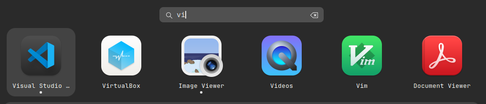
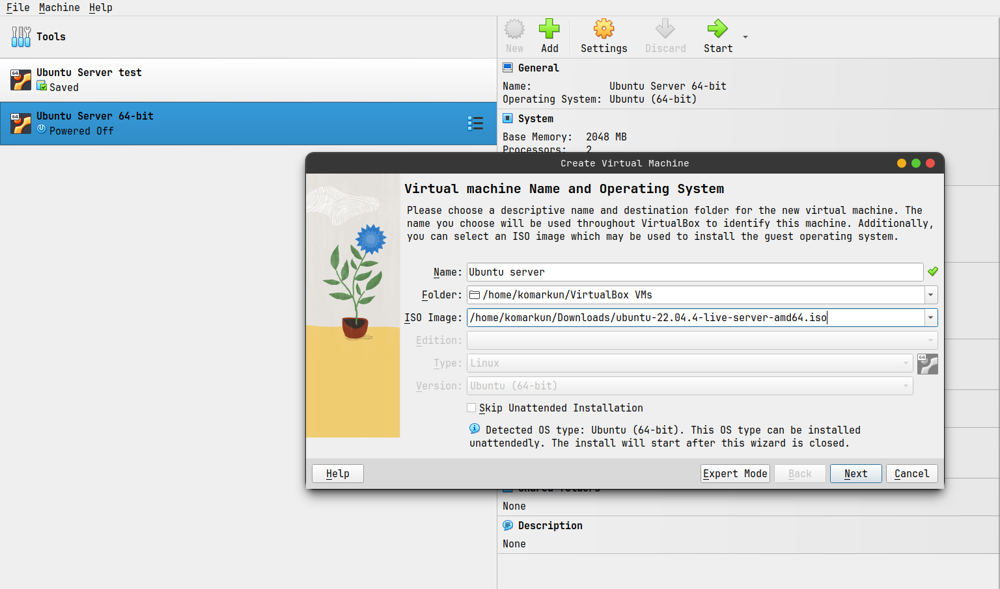
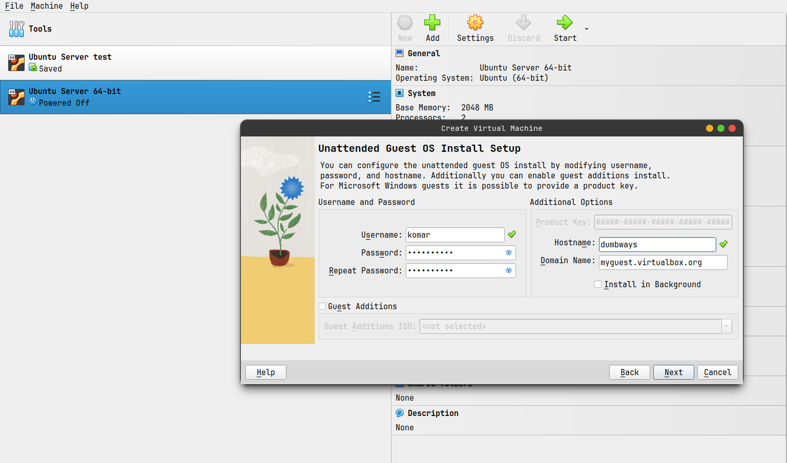
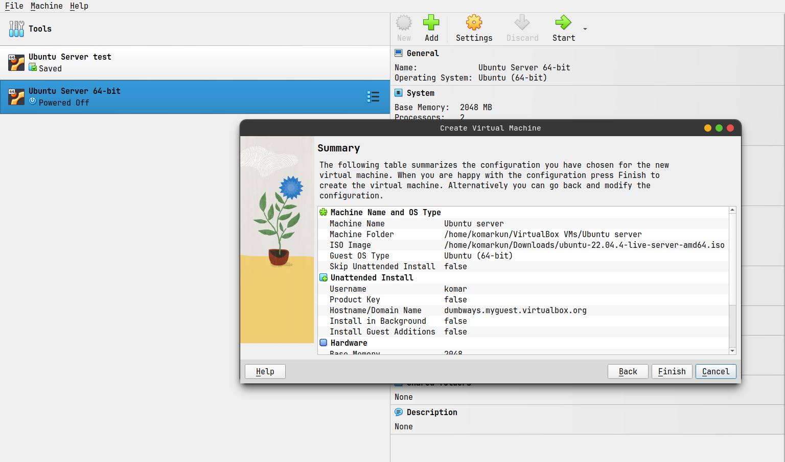
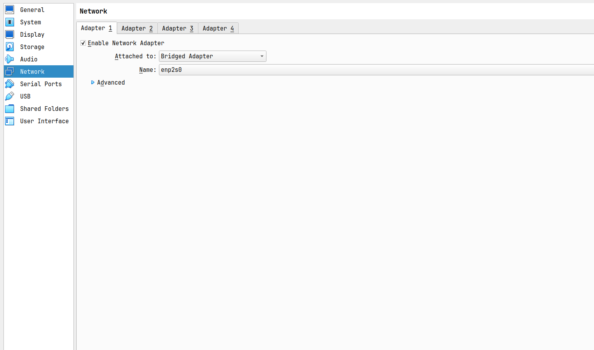
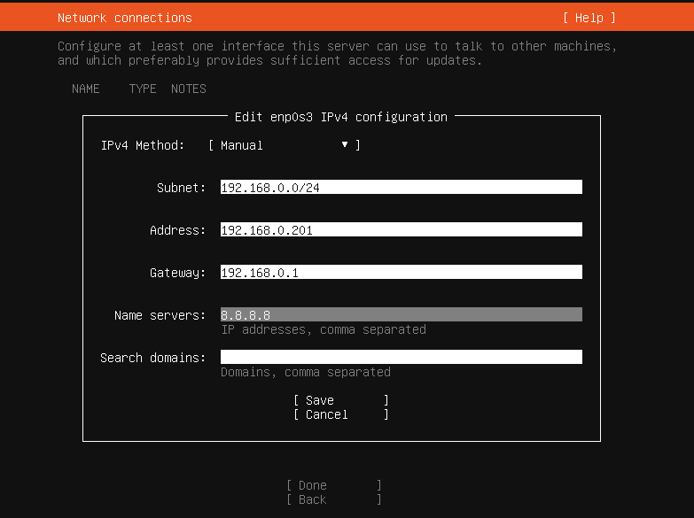
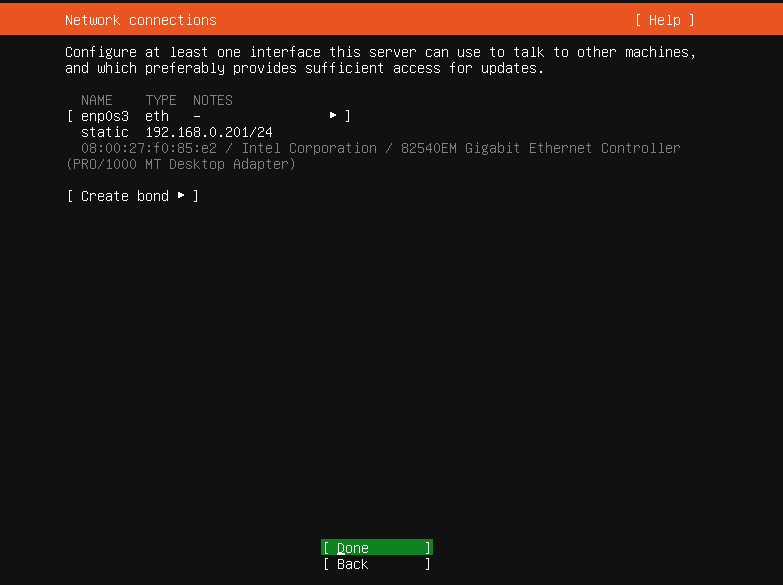
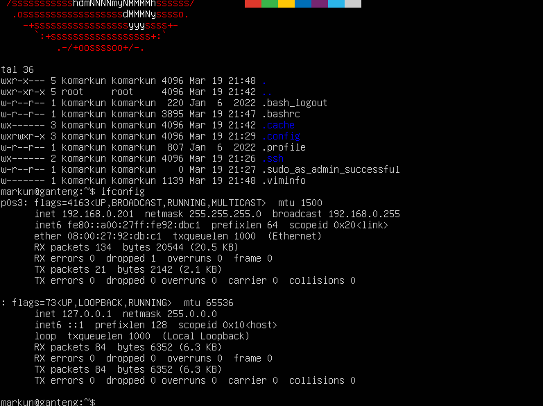

## 3. Buat rancangan sebuah jaringan dengan spesifikasi sebagai berikut! - CIDR Block : 192.168.1.xxx/24 - Subnet : 255.255.255.0 - Gateway : 192.168.1.1

(Gunakan app.diagrams.net untuk membuat diagramnya, Referensi gambar sudah disertakan)

## 4. Buat step-by-step untuk menginstall Virutal Machine via VMware, Virtualbox atau VM pilihan kalian!

## Jawaban

3. Rancangan Jaringan

Contoh EXample Rancangan jaringan di rumah saya INI gat tau benar atau enggak, karena kebenaran hanya milik ALLAH SWT

4. step by step install virtual machine di virtual box

- Install dulu aplikasi virtual box nya di official resme oracle virtual box

- Create New virtual machine state (Ubuntuserver)
  

* Buat Username and password buat di virtual boxnya
  
* Atur jumlah memory ram dan prosesor
  
* Tentukan jumlah Virtual storage
  
* Check kembali sebelum mulai
  
* Setting Network adaptor pilih yang brige connection karena mau di set static IP
  
* run virtual machine dan pilih bahasa
  
* pilih keyboard layout dan configuration
  
* pilih type install
  
* Atur IPV4 NETWORK supaya static dan pilih manual
  
* Check network connection
  
* atur storage ilang ssan nya partisi ext4 "/" 15 gb, partisi "swap" 5gb

* FINAL Hasil
  

## Cheatsheet Ubuntu

Navigasi Direktori:

    cd dir: Ubah direktori ke "dir".
    cd ~: Kembali ke direktori home.
    cd -: Kembali ke direktori sebelumnya.
    pwd: Menampilkan direktori kerja saat ini.
    ls: Menampilkan daftar file dan direktori.
    ls -l: Menampilkan daftar detail file dan direktori (izin, pemilik, ukuran, dll.).

Manajemen File:

    mkdir dir: Membuat direktori baru bernama "dir".
    rmdir dir: Menghapus direktori kosong bernama "dir". (Gunakan dengan hati-hati)
    rm file: Menghapus file. (Gunakan dengan hati-hati)
    cp source destination: Menyalin file "source" ke "destination".
    mv source destination: Memindahkan/menamai ulang file "source" ke "destination".
    touch file: Membuat file kosong bernama "file" (jika belum ada).
    cat file: Menampilkan isi file di terminal.

Izin File:

    chmod mode file: Mengubah izin akses file. (perlu pengetahuan tambahan)
    chown user:group file: Mengubah kepemilikan file ke "user" dan grup ke "group". (perlu pengetahuan tambahan)

Package Management:

    sudo apt update: Memperbarui daftar paket yang tersedia.
    sudo apt upgrade: Memperbarui paket yang sudah terinstal ke versi terbaru.
    sudo apt install package: Menginstal paket baru.
    sudo apt remove package: Menghapus paket terinstal.
    sudo apt search package: Mencari paket di repositori.

Informasi Sistem:

    uname -a: Menampilkan informasi kernel Linux.
    lsb_release -a: Menampilkan informasi tentang distribusi Ubuntu.
    free -m: Menampilkan informasi penggunaan memory (RAM).
    df -h: Menampilkan informasi penggunaan disk.

Proses Manajemen:

    ps aux: Menampilkan daftar proses yang sedang berjalan.
    top: Menampilkan proses yang sedang berjalan secara real-time.
    kill pid: Mengakhiri proses dengan ID "pid". (Gunakan dengan hati-hati)
    htop: Alternatif grafis untuk "top" (perlu diinstal).

Bantuan:

    man command: Menampilkan halaman manual untuk perintah "command".
    help command: Menampilkan informasi bantuan singkat untuk perintah "command" (tidak semua perintah mendukung).

Lain-lain:

    history: Menampilkan riwayat perintah yang diketik.
    clear: Membersihkan tampilan terminal.
    exit: Keluar dari sesi terminal.
    sudo: Menjalankan perintah dengan hak akses administratif (perlu password).
