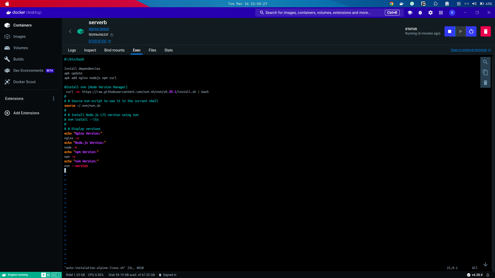
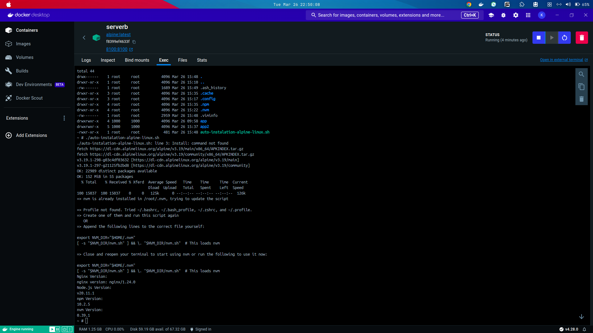
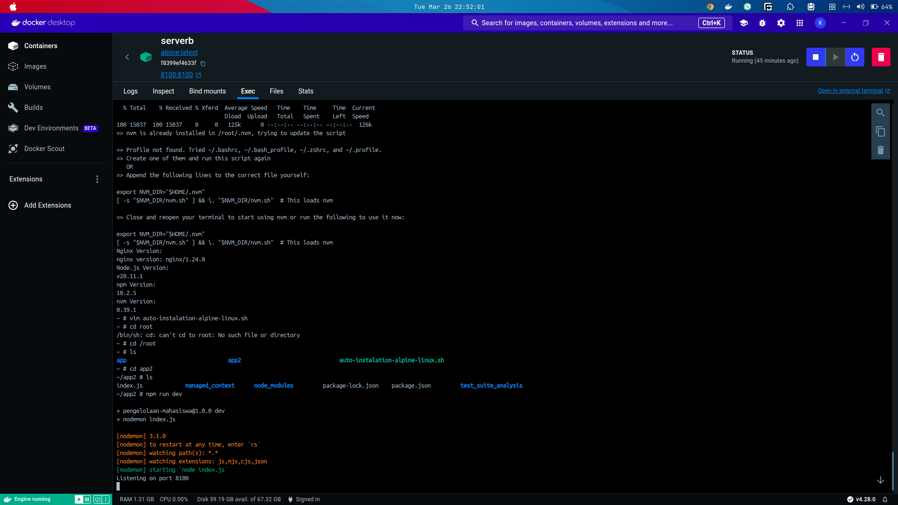
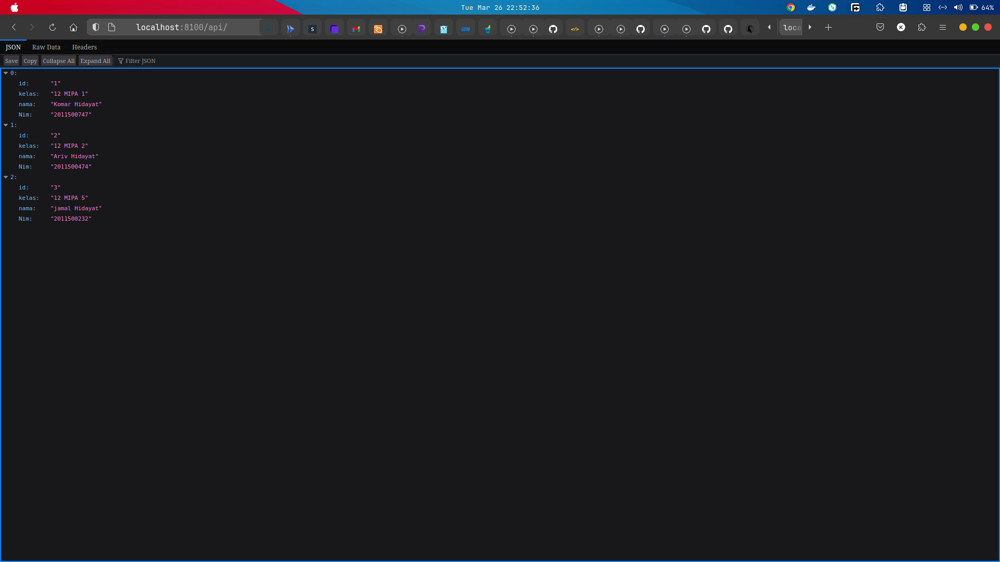
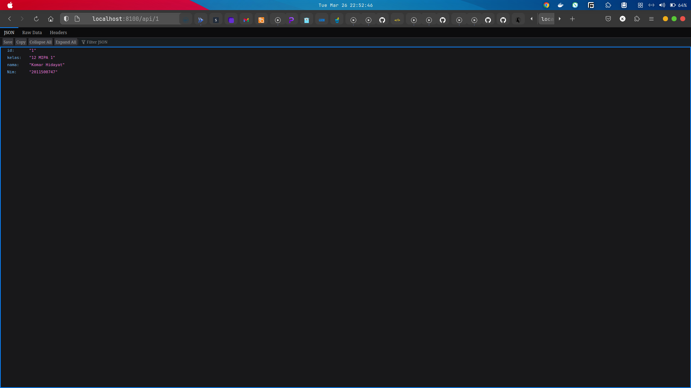
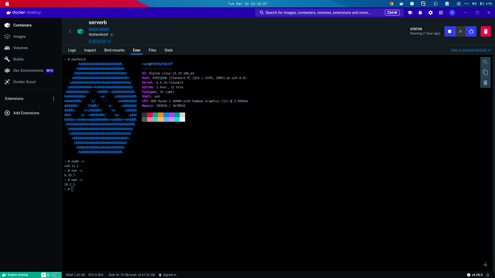

## BASH Script Untuk instalasi Nginx nodeJS, NPM, NVM

### Linux Alphine

command in bash

File name auto-instalation-alpine-linux.sh

```bash
#!/bin/bash

# Install dependencies
apk update
apk add nginx nodejs npm curl

#Install nvm (Node Version Manager)
 curl -o- https://raw.githubusercontent.com/nvm-sh/nvm/v0.39.1/install.sh | bash
#
# # Source nvm script to use it in the current shell
source ~/.nvm/nvm.sh
#
# # Install Node.js LTS version using nvm
# nvm install --lts
#
# # Display versions
echo "Nginx Version:"
nginx -v
echo "Node.js Version:"
node -v
echo "npm Version:"
npm -v
echo "nvm Version:"
nvm --version
```

run the command ./auto-instalation-alpine-linux.sh

Scrennshot:











