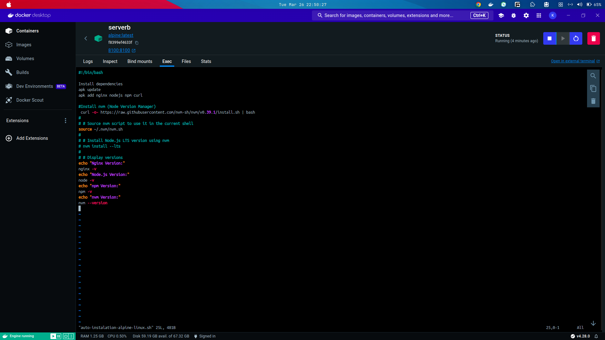
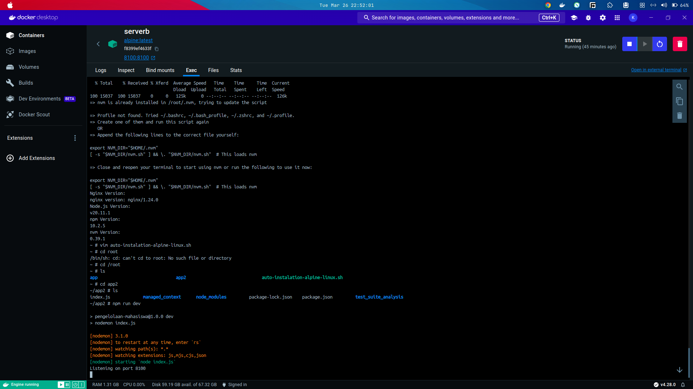

## Syarat tugas :

- Membuat repostiory di GitHub dengan nama "devops20-dumbways-<nama>"
- Membuat folder task per harinya dengan file "README.md" (bisa dibuat per folder/directory)

## Task :

1. Buat 3 directory yang masing-masing berisi 2 file dan rapihkan sebaik mungkin!
2. Penjelasan text manipulation beserta step by step
3. Penjelasan tool htop atau nmon
4. buatlah BASH Script untuk instalasi nginx

## Jawaban

### Penjelasan Text manipulation in linux

Text manipulation di Linux Ubuntu Server adalah proses mengubah, mengedit, atau memanipulasi teks dalam berbagai cara menggunakan perintah dan alat bawaan sistem operasi Linux. Ini sangat penting dalam administrasi sistem, pengelolaan file konfigurasi, dan pemrosesan data di lingkungan server. Berikut ini adalah beberapa perintah dan alat yang umum digunakan untuk melakukan manipulasi teks di Linux Ubuntu Server:

- cat:

Perintah ini digunakan untuk menampilkan isi file teks ke terminal. Contoh penggunaan:

```
cat nama_file.txt
```

- echo:

Digunakan untuk menampilkan teks ke terminal atau menyimpannya dalam file. Contoh:

```
echo "Hello, world!"
```

- grep:

Perintah ini digunakan untuk mencocokkan pola teks dalam satu atau beberapa file. Contoh:

```
grep "pattern" nama_file.txt
```

- sed:

Stream Editor adalah alat yang kuat untuk mengubah teks dalam aliran data. Ini bisa digunakan untuk mencari, mengganti, menghapus, atau memanipulasi teks dalam file. Contoh:

```
sed 's/old_text/new_text/g' nama_file.txt
```

- awk:

Sebuah bahasa pemrograman yang kuat digunakan untuk memanipulasi data dan teks secara umum. Ini sering digunakan untuk memformat data, mengekstraksi informasi, dan melakukan pemrosesan teks lanjutan. Contoh:

```
awk '{print $1}' nama_file.txt
```

- cut:

Digunakan untuk memotong bagian-bagian tertentu dari setiap baris dari suatu file teks. Contoh:

```
cut -d',' -f1 nama_file.csv
```

- tr:

Digunakan untuk mentransformasi atau memodifikasi teks, seperti mengganti karakter atau menghapusnya. Contoh:

```
echo "Hello" | tr '[:lower:]' '[:upper:]'
```

- sort:

Mengurutkan baris dalam file teks. Contoh:

```
sort nama_file.txt
```

- uniq:

Menghapus baris duplikat dari file teks yang telah diurutkan. Contoh:

```
uniq nama_file.txt
```

- wc:

Menghitung jumlah baris, kata, dan byte dalam file teks. Contoh:

```
wc -l nama_file.txt
```

- head dan tail:

Digunakan untuk menampilkan bagian awal (head) atau bagian akhir (tail) dari file teks. Contoh:

```
head -n 10 nama_file.txt
tail -n 10 nama_file.txt
```

- tee:

Digunakan untuk membaca dari standar input dan menulis ke standar output serta file. Contoh:

```
echo "Hello" | tee output.txt
```

### Penjelasan tool htop atau nmon

- htop:

htop adalah alat pemantau sistem interaktif dan manajer proses untuk sistem Linux. Ini merupakan versi lanjutan dari top, sebuah utilitas baris perintah standar yang menampilkan penggunaan sumber daya sistem dan proses yang berjalan. Dibandingkan dengan top, htop menawarkan antarmuka yang lebih ramah pengguna dan menarik secara visual, serta fitur tambahan.

- Fitur utama dari htop meliputi:

1. Antarmuka Interaktif: htop menyediakan antarmuka yang berwarna dan diperbarui secara dinamis yang memungkinkan pengguna memantau sumber daya sistem dan proses secara interaktif.

2. Manajemen Proses: Pengguna dapat dengan mudah mengelola proses langsung dari htop, termasuk menghentikan proses, mengubah prioritasnya, dan lainnya.

3. Tampilan yang Dapat Disesuaikan: Pengguna dapat menyesuaikan informasi apa yang ditampilkan dan bagaimana cara presentasinya, memungkinkan pengalaman pemantauan yang disesuaikan.

4. Tampilan Pohon: htop menawarkan tampilan hierarkis dari proses, membuatnya lebih mudah untuk memahami hubungan antar proses.

5. Bar Sumber Daya: Bar sumber daya di bagian atas antarmuka memberikan representasi visual dari penggunaan CPU, memori, dan swap.

Untuk menginstal htop di Ubuntu Server, Anda dapat menggunakan perintah berikut:

```bash
sudo apt-get install htop
```

Setelah diinstal, jalankan htop dari terminal untuk memulai memantau sistem secara interaktif.

- nmon:

nmon (singkatan dari Nigel's Monitor) adalah alat pemantauan sistem lainnya untuk sistem Linux. Ini menyediakan data kinerja yang luas dalam format yang ringkas, membuatnya sangat berguna untuk analisis kinerja dan pemecahan masalah.

Fitur utama dari nmon meliputi:

1. Pemantauan Komprehensif: nmon mengumpulkan dan menampilkan berbagai data kinerja sistem, termasuk CPU, memori, I/O disk, aktivitas jaringan, dan lainnya.

2. Tampilan Grafis: nmon menampilkan data kinerja dalam format grafis yang mudah dipahami, membuatnya lebih mudah untuk melacak tren dan pola.

## BASH Script Untuk instalasi Nginx nodeJS, NPM, NVM

### Linux Alphine

command in bash

File name auto-instalation-alpine-linux.sh

```bash
#!/bin/bash

# Install dependencies
apk update
apk add nginx nodejs npm curl

#Install nvm (Node Version Manager)
 curl -o- https://raw.githubusercontent.com/nvm-sh/nvm/v0.39.1/install.sh | bash
#
# # Source nvm script to use it in the current shell
source ~/.nvm/nvm.sh
#
# # Install Node.js LTS version using nvm
# nvm install --lts
#
# # Display versions
echo "Nginx Version:"
nginx -v
echo "Node.js Version:"
node -v
echo "npm Version:"
npm -v
echo "nvm Version:"
nvm --version
```

run the command ./auto-instalation-alpine-linux.sh

Scrennshot:






